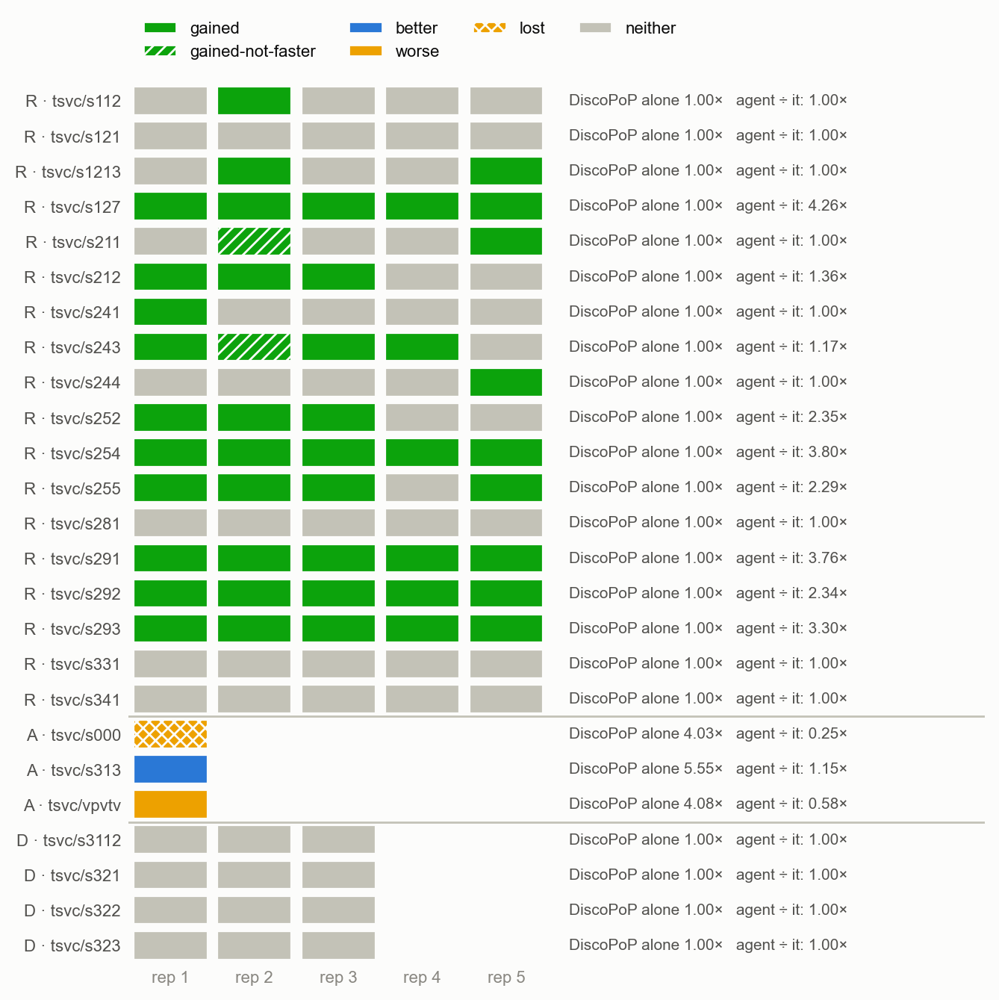
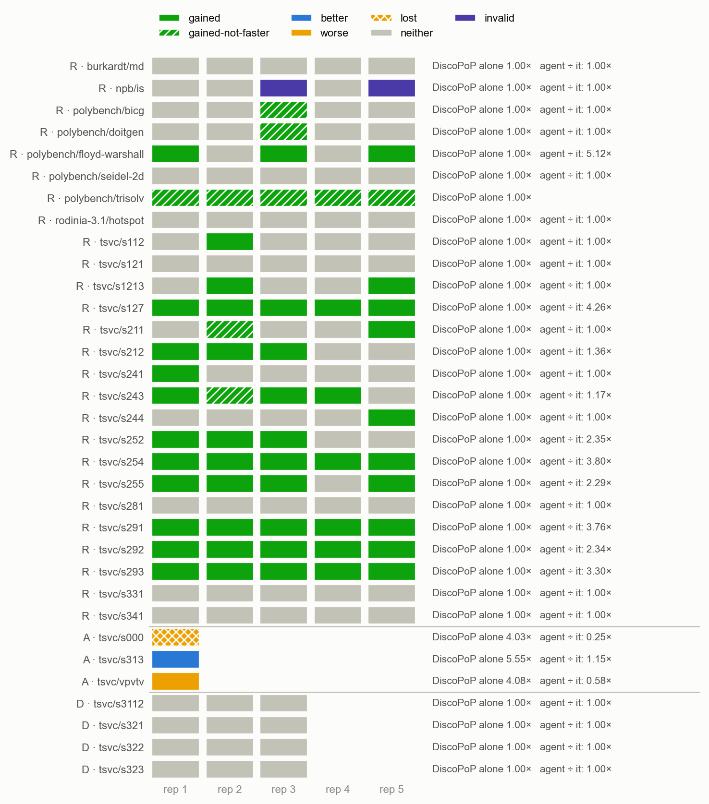

# E1 — the main comparison: DiscoPoP alone vs DiscoPoP + agent

*Generated by `agent/tools/campaign.py reports` from `results/campaign.json` and the experiment record (`agent/THESIS_EXPERIMENTS.md`). Edit those, then regenerate — not this file.*

**Status:** done

## The question

Where DiscoPoP alone reaches no verified parallel program (class R), does the agent — the same DiscoPoP and gate plus a model that restructures — deliver correct speedups? Does it do no harm where DiscoPoP already succeeds (class A), and decline true recurrences (class D)? Does anything wrong get through? (H1, H2, H4)

## Result in one paragraph

TSVC class R: the agent reaches a verified parallel program in 46 of 90 trials and is FASTER in 44; DiscoPoP alone in 0 of 90 (Wilcoxon p = 0.002, Cliff's δ +0.50). 0 unsafe in 288 trials with a verdict. Class D: 12 of 12 correctly declined. Class A: 1 better, 1 worse, 1 lost — the reason for proposal D32.

## Figures

## What is in this folder

- [`analysis/`](analysis/) — the read-out: [`README.md`](analysis/README.md), [`figures.md`](analysis/figures.md), [`main_comparison_stats.md`](analysis/main_comparison_stats.md), [`tsvc/figures.md`](analysis/tsvc/figures.md), [`tsvc/main_comparison_stats.md`](analysis/tsvc/main_comparison_stats.md), [`tsvc/vs_discopop_alone.md`](analysis/tsvc/vs_discopop_alone.md), [`vs_discopop_alone.md`](analysis/vs_discopop_alone.md)
- [`exhibits/`](exhibits/) — 13 case studies, below
- [`runs/`](runs/) — 4 archived run(s): the evidence
- [`checks/`](checks/) — 2 verification(s) made during the read-out
- [`preflight/`](preflight/) — 5 smoke run(s) before the launch

## Runs

| run | where | what it is | status | trials | outcomes |
|---|---|---|---|---:|---|
| `e1_r_a` | [`runs/e1_r_a/`](runs/e1_r_a/) | class R, lane A (NUMA node 0): md, is, bicg, doitgen + 9 TSVC loops × 2 arms × 5 | valid | 130 | AGENT_TIMEOUT 2, FASTER 17, no-change 107, parallel-not-faster 3, parallel-speed-not-measurable 1 |
| `e1_r_b` | [`runs/e1_r_b/`](runs/e1_r_b/) | class R, lane B (node 1): hotspot, seidel-2d, floyd-warshall, trisolv + 9 TSVC loops × 2 arms × 5 | valid | 130 | FASTER 30, no-change 95, parallel-speed-not-measurable 5 |
| `e1_a` | [`runs/e1_a/`](runs/e1_a/) | class A, the no-harm control: s000, s313, vpvtv × 2 arms × 1 | valid | 6 | FASTER 5, no-change 1 |
| `e1_d` | [`runs/e1_d/`](runs/e1_d/) | class D, the must-decline control: s3112, s321, s322, s323 × 2 arms × 3 | valid | 24 | no-change 24 |
| `settle_check` | [`checks/settle_check/`](checks/settle_check/) | the ten programs Settle dropped, rebuilt from their patches and re-verified on the server: all correct, all slower | valid | 10 | parallel-not-faster 10 |
| `e1_smoke` | [`preflight/e1_smoke/`](preflight/e1_smoke/) | pre-flight smoke 1: found stack arrays over the 8 MB limit | pre-flight | 4 | no-change 4 |
| `e1_smoke2` | [`preflight/e1_smoke2/`](preflight/e1_smoke2/) | pre-flight smoke 2: the memory constraint in the prompt | pre-flight | 1 | no-change 1 |
| `e1_smoke3` | [`preflight/e1_smoke3/`](preflight/e1_smoke3/) | pre-flight smoke 3: found Fix 86 (exposed loops filtered out before Phase B) | pre-flight | 2 | no-change 2 |
| `e1_smoke4` | [`preflight/e1_smoke4/`](preflight/e1_smoke4/) | pre-flight smoke 4: found Fix 87 (the re-measurement described the old program) | pre-flight | 4 | no-change 4 |
| `e1_smoke5` | [`preflight/e1_smoke5/`](preflight/e1_smoke5/) | pre-flight smoke 5: the one that passed, one benchmark of every kind | pre-flight | 8 | FASTER 2, no-change 5, parallel-not-faster 1 |

## Exhibits

- [`2mm_default_vs_dp_alone`](exhibits/2mm_default_vs_dp_alone/) — Pre-flight (e1_smoke5): on code DiscoPoP already parallelizes, the model fuses two loops — better than DiscoPoP alone.  
  **better** vs DiscoPoP alone (9.49× → 10.62×) · polybench/2mm, `default`, e1_smoke5 rep 1 · pictures: `before_after.png`, `console.png`
- [`floyd_e1_conditional_write_gained`](exhibits/floyd_e1_conditional_write_gained/) — floyd-warshall: the model writes only on improvement, which frees the rows for a fixed k; DiscoPoP alone 0 of 5, agent 3 of 5 at 5–10×.  
  **gained** vs DiscoPoP alone (1.00× → 5.93×) · polybench/floyd-warshall, `default`, e1_r_b rep 1 · pictures: `before_after.png`, `rejected_attempt.png`, `console.png`
- [`s000_agent_below_dp_alone_lost`](exhibits/s000_agent_below_dp_alone_lost/) — No-harm control, lost: DiscoPoP alone parallelizes the loop (4.03×); the model rewrites the enclosing function with a copy per repetition and Settle's revert takes DiscoPoP's pragma with it.  
  **lost** vs DiscoPoP alone (4.03× → 1.00×) · tsvc/s000, `default`, e1_a rep 1 · pictures: `before_after.png`, `rejected_attempt.png`, `console.png`
- [`s121_memcpy_pragmas_slower`](exhibits/s121_memcpy_pragmas_slower/) — A correct rewrite whose copy costs more than the pragmas save (0.71×/0.73×): Phase B drops both pragmas, Settle the orphaned rewrite.  
  **neither** vs DiscoPoP alone (1.00× → 1.00×) · tsvc/s121, `default`, e1_r_a rep 1 · pictures: `before_after.png`, `console.png`
- [`s127_induction_5of5_faster`](exhibits/s127_induction_5of5_faster/) — An induction variable with two increments, won in all 5 repeats: the model gives the index its closed form.  
  **gained** vs DiscoPoP alone (1.00× → 3.80×) · tsvc/s127, `default`, e1_r_a rep 1 · pictures: `before_after.png`, `rejected_attempt.png`, `console.png`
- [`s211_distributed_dp_annotates_exposed_loop`](exhibits/s211_distributed_dp_annotates_exposed_loop/) — Pre-flight (e1_smoke5): the restructuring path end to end — the model distributes the loop, DiscoPoP annotates the exposed parallel half, TSan rejects the racy one.  
  **gained-not-faster** vs DiscoPoP alone (1.00× → 1.06×) · tsvc/s211, `default`, e1_smoke5 rep 1 · pictures: `before_after.png`, `rejected_attempt.png`, `console.png`
- [`s241_copy_per_repetition_settle_dropped`](exhibits/s241_copy_per_repetition_settle_dropped/) — Why most losses happen: a correct rewrite that allocates and copies the whole array on every repetition; its pragmas pay 1.08×/1.21×, the finished program is 3.6× slower than the original, Settle drops it.  
  **neither** vs DiscoPoP alone (1.00× → 1.00×) · tsvc/s241, `default`, e1_r_a rep 2 · pictures: `before_after.png`, `console.png`
- [`s254_carry_around_5of5_faster`](exhibits/s254_carry_around_5of5_faster/) — A carry-around scalar, won in all 5 repeats: the model reads b[i-1] instead of the carried variable.  
  **gained** vs DiscoPoP alone (1.00× → 3.83×) · tsvc/s254, `default`, e1_r_b rep 1 · pictures: `before_after.png`, `rejected_attempt.png`, `console.png`
- [`s291_peeled_5of5_faster`](exhibits/s291_peeled_5of5_faster/) — A loop DiscoPoP alone cannot parallelize (a wrap-around variable), won in all 5 repeats: the model replaces the carried index by an expression, DiscoPoP's do-all then holds.  
  **gained** vs DiscoPoP alone (1.00× → 3.94×) · tsvc/s291, `default`, e1_r_b rep 1 · pictures: `before_after.png`, `rejected_attempt.png`, `console.png`
- [`s313_local_accumulator_better`](exhibits/s313_local_accumulator_better/) — No-harm control, better: a loop-local accumulator lets DiscoPoP find the reduction — 6.36× against DiscoPoP alone's 5.55×.  
  **better** vs DiscoPoP alone (5.55× → 6.36×) · tsvc/s313, `default`, e1_a rep 1 · pictures: `before_after.png`, `rejected_attempt.png`, `console.png`
- [`s321_recurrence_declined_9_attempts`](exhibits/s321_recurrence_declined_9_attempts/) — Pre-flight (e1_smoke5): a recurrence declined after 9 attempts, every one rejected by the gate.  
  **neither** vs DiscoPoP alone (1.00× → 1.00×) · tsvc/s321, `default`, e1_smoke5 rep 1 · pictures: `before_after.png`, `rejected_attempt.png`, `console.png`
- [`s322_recurrence_declined_rewrites_caught`](exhibits/s322_recurrence_declined_rewrites_caught/) — Must-decline control: a true recurrence; 8 of the model's rewrites computed wrong values and were rejected at the correctness check. Nothing wrong shipped.  
  **neither** vs DiscoPoP alone (1.00× → 1.00×) · tsvc/s322, `default`, e1_d rep 1 · pictures: `before_after.png`, `rejected_attempt.png`, `console.png`
- [`vpvtv_rewrite_halves_dp_speedup_worse`](exhibits/vpvtv_rewrite_halves_dp_speedup_worse/) — No-harm control, worse: the model copies b and c for a loop DiscoPoP alone already parallelizes; still faster than the original, so it ships — at 2.37× where DiscoPoP alone gives 4.08×.  
  **worse** vs DiscoPoP alone (4.08× → 2.37×) · tsvc/vpvtv, `default`, e1_a rep 1 · pictures: `before_after.png`, `console.png`

## From the experiment record (§7 run log)

### `e1_a`, `e1_d` — 2026-09-22, server, **E1 classes A (no-harm) and D (must-decline)** (36 trials, Haiku)

**Setup.** As class R: commit `00d4594f`, `discopop_gate` vs `default`, Haiku 4.5, verification
at the timing sizes on 6 and 12 threads. Class A (`s000`, `s313`, `vpvtv`) ×1 on node 0,
17:47–18:21 UTC; class D (`s3112`, `s321`, `s322`, `s323`) ×3 on node 1, 17:36–22:20 UTC.
Read-out: `results/E01_main_comparison/analysis/` (all four E1 runs; regenerated by the commands in its README).

**Class D — the must-decline control: passed.** 12 agent trials, 12 `neither`, **0 unsafe**.
The model did try: **56 rewrites of true recurrences were rejected at Phase A's correctness
check** (`s322` 24, `s321` 18, `s323` 11, `s3112` 3), and 11 racy pragmas in Phase B (TSan 7,
schedule stress 2, correctness 2) — every one caught before it reached the program. `s3112`
shows the whole chain: a rewrite passed the gate, DiscoPoP then reported three do-alls on it,
TSan and the schedule check rejected two, Settle dropped the third as slower, everything was
reverted. The cost of declining is the budget: 1–9 calls per trial (the function and each loop
get their own), 8–31 minutes, up to 1.57 USD-equivalent — class D is the campaign's most
expensive trial per result.

**Class A — the no-harm control: harm found.** DiscoPoP alone is FASTER on all three.

| loop | DiscoPoP alone (12 threads) | agent | verdict | what happened |
|---|---|---|---|---|
| `s313` (dot product) | 5.55× | 6.36× | **better** 1.15× | the model made `dot` loop-local and kept a final copy; DiscoPoP then found the reduction |
| `vpvtv` (`a[i] += b[i]*c[i]`) | 4.08× | 2.37× | **worse** 0.58× | the model was asked about the OUTER repetition loop (no pattern of its own); it copied `b` and `c` into buffers once and patched them after every `pb_mix`; DiscoPoP's pragma on the rewritten loop measured 2.65× where it measures 4.24× on the original; the finished file beat the ORIGINAL, so Settle kept it |
| `s000` (`a[i] = b[i] + 1`) | 4.03× | 1.00× | **lost** | the model was asked about the FUNCTION (no pattern of its own); `memcpy` of `b` per repetition; the pragma on the rewritten loop measured 1.40×; the finished file was slower than the original, Settle dropped the pragma first and then the orphaned rewrite — DiscoPoP's own pragma went with them |

The mechanism is one: the model is called on a region with no pattern of its own whose hot
loop DiscoPoP already covers; its rewrite costs more than it enables; and **Settle compares the
finished program with the ORIGINAL, never with what DiscoPoP alone would deliver** — so a slower
parallel program survives (`vpvtv`), and a repair that ends below the original falls back to the
original instead of to DiscoPoP's own program (`s000`). n = 3 (class A ×1, as pre-registered):
the rate is not estimable, the mechanism is deterministic.

**A fix that was built and withdrawn before it ran (Fix 90).** The first remedy — do not send a
region to the model when every outermost loop inside it carries an applicable DiscoPoP pattern —
was replayed on E1's own 90 class-R TSVC trials before merging: it would have **blocked the
model on 11 of 18 class-R loops, including all five 5-of-5 winners** (`s127 s254 s291 s292
s293`). In class R DiscoPoP DOES report patterns on those loops — false positives that the gate
rejects (TSan) — so a rule on DiscoPoP's patterns cannot tell class R from class A; only the gate
can. Reverted (the code never reached the campaign branch). What would address the mechanism
without that blindness is a floor: **D32, proposed** — the agent computes DiscoPoP's own gated
program first (what `discopop_gate` does, < 1 min on TSVC) and Settle keeps the agent's program
only if it beats that one, paired; otherwise DiscoPoP's. On class R DiscoPoP's program is the
original in every E1 trial (0 of 90 kept), so the floor changes nothing there; on class A and on
the applications (LULESH is expected to be class A at program level) it makes `lost` and `worse`
impossible up to measurement noise. The author's decision; needed before E6 and E11, not before
E2, E3, E8 (TSVC class R).

**E1 as a whole (290 trials, 145 paired):** class R (TSVC) 46 of 90 verified parallel and 44
FASTER vs 0 of 90; class A 1 better, 1 worse, 1 lost; class D 12 of 12 correctly declined;
**0 unsafe acceptances in 288 trials with a verdict** (2 `invalid`: the `npb/is` timeouts).

### `e1_r_a`, `e1_r_b` — 2026-09-21/22, server, **E1 class R: DiscoPoP alone vs DiscoPoP + agent, five repeats** (260 trials, Haiku)

**Question (H1, H2).** On the benchmarks where DiscoPoP alone reaches no verified parallel
program, does the agent — the same DiscoPoP, the same gate, plus a model that restructures —
deliver correct speedups; and does anything wrong get through?

**Setup.** Commit `00d4594f` (Fixes 86–88, D22/D23/D27/D29 defaults), two NUMA lanes, arms
`discopop_gate` (budget 0) vs `default` (budget 3), Haiku 4.5, 5 repeats, verification at
EXTRALARGE on 6 and 12 threads with 5 repeats, speed check at each kernel's timing size.
Launched 21 Sep 15:10 UTC, lane B finished 22 Sep 04:35, lane A 22 Sep 15:50; host load
2,200–7,600 throughout. Read-out: `results/E01_main_comparison/analysis/` (`plots --runs e1_r_a,e1_r_b,e1_a,e1_d`,
`main_comparison_stats.py --suite tsvc`; the class-R numbers are identical to the class-R-only read-out).

**The registered set (26 benchmarks, 130 paired trials), as it ran:** gained 47,
gained-not-faster 9, neither 72, invalid 2 (the `npb/is` timeouts, below). Agent: verified
parallel in 56 of 128 (44 %, Wilson 95 % CI 35–52 %), FASTER in 47 (37 %); DiscoPoP alone:
0 of 130 (0 %, CI 0–3 %). **Unsafe acceptances: 0 in 258 trials with a verdict.**

**The primary set (TSVC-2 class R, 18 loops, 90 paired trials; D30):**

| | agent (`default`) | DiscoPoP alone (`discopop_gate`) |
|---|---|---|
| verified parallel program | **46 of 90** (51 %, CI 41–61 %) | 0 of 90 (0 %, CI 0–4 %) |
| FASTER (≥ 1.1× over the sequential original) | **44 of 90** (49 %, CI 39–59 %) | 0 of 90 |
| loops gained at least once | **14 of 18** | 0 |
| loops gained 5 of 5 | 5 (`s127`, `s254`, `s291`, `s292`, `s293`) | 0 |
| BROKEN | 0 | 0 |
| speed, paired by loop, median of per-loop medians | **1.08×** the DiscoPoP-alone program (bootstrap CI 1.00–2.35×); Wilcoxon one-sided W = 45, **p = 0.002**, 9 non-zero pairs, all positive; Cliff's δ = +0.50 | — |

The per-loop median is a conservative statistic: a loop gained in 2 of 5 trials has a median
of 1.00×. Read per loop:

| loop (TSVC category) | agent FASTER | speedup at 6 / 12 threads (median of the FASTER trials) | what the model did |
|---|---|---|---|
| `s127` induction variable, multiple increments | 5 / 5 | 3.81 / 4.26 | closed-form index |
| `s254` carry-around variable | 5 / 5 | 3.31 / 3.80 | `b[i-1]` read instead of the carried scalar |
| `s291` loop peeling, wrap-around 1 level | 5 / 5 | 3.23 / 3.76 | `(i == 0) ? LEN-1 : i-1` |
| `s292` wrap-around 2 levels | 5 / 5 | 1.34 / 2.34 | same, two levels |
| `s293` `a[i] = a[0]` cycle | 5 / 5 | 2.80 / 3.19 | hoisted `a[0]` |
| `s255` carry-around, 2 levels | 4 / 5 | 1.33 / 2.29 | index arithmetic |
| `s252`, `s212`, `s243` | 3 / 5 each | 3.48 / 4.15 · 1.35 / 1.39 · 1.23 / 1.24 | scalar expansion into a buffer; copy + node splitting |
| `s1213` | 2 / 5 | 2.80 / 2.65 | copies of `a` and `b` |
| `s112`, `s211`, `s241`, `s244` | 1 / 5 each | 1.49 / 1.76 · 1.10 / 1.07 · 2.08 / 2.23 · 3.42 / 4.39 | one good rewrite in five; see the finding below |
| `s121`, `s281` | 0 / 5 | — | correct rewrites whose pragmas cost more than they save (below) |
| `s331`, `s341` | 0 / 5 | — | as T0.13 predicted: DiscoPoP cannot write the pragma the loop needs — but ONE trial of each found a way round it and was then dropped on speed (below) |

**H1 is supported** on the primary set (and on the registered set): the agent delivers verified
speedups where DiscoPoP alone delivers none, with p = 0.002 on per-loop medians and an effect
size of +0.50. **H2 holds so far:** 0 BROKEN in 258 trials, 269 model calls. **H4 (scaling):**
of the 44 FASTER TSVC trials, 29 are faster at 12 threads than at 6 (> 1.1×), 13 flat, 2
lower; medians 2.52× at 6 and 3.12× at 12 threads. The expert references (T0.10) reach ≥ 1.45×
at the gate's timing size; the agent's 5-of-5 loops reach 2.3–4.3× at 12 threads at the
verification size.

**Cost.** Median 1 model call per trial — for the FASTER trials AND for the `no-change` ones
(the budget of 3 is rarely spent: a rewrite that passes the gate but earns no pragma ends the
trial at Settle, it does not retry); median 127 s of model time and 0.12 USD-equivalent per
trial, 13.95 for the 90 TSVC agent trials. Profile refreshes after a kept rewrite: 102, all
full (D27), 0 fallbacks (D29); runtimes re-measured 102 times (Fix 86/87). The explorer stall
limit fired 26 times inside agents and 20 times in the harness's profile step — no benchmark
was lost to a stall (D-limit of 21 Sep).

**Deviations, recorded first.**

1. **Two `npb/is default` trials hit the 90-minute limit** (`AGENT_TIMEOUT`, counted `invalid`,
   the other three took 18, 20 and 84 min). Both were inside Phase B. Rep 3's log says where
   the time went: after the third kept rewrite — of a region with score 0.1 — DiscoPoP's
   re-measurement reports the program's regions at **97 s** where they had been 3.3 s; every
   later step (noise calibration, the paired timing of each pragma at the timing size, TSan)
   runs that program many times. **Phase A's gate does not bound a rewrite's cost**: a
   pragma-free rewrite is judged on output alone, because a copy that only pays off with the
   pragmas is the normal case; an unbounded one eats the trial. D31 — a bound on the
   rewrite's SEQUENTIAL cost in Phase A's gate — was proposed for this and **withdrawn the same
   day on a measurement** (`results/E01_main_comparison/checks/seq_cost_expert_mac`): the expert restructurings
   themselves, pragmas stripped, run 1.00–2.30× SLOWER than the original sequentially (`s121`
   2.30×, `s112` 2.06×, `s211` 1.65×, `s241` 1.64×) and ≥ 1.45× faster with their pragmas.
   A bound that catches the failed rewrites (1.2–3× sequentially) rejects the good ones; the
   sequential cost does not predict whether a rewrite pays, only the paired check with the
   pragmas does — which is Settle. What would recover the trial is a RETRY after Settle's
   verdict with that verdict as feedback (the median trial used 1 of 3 calls): proposed as
   D31-b, a flow change (Phase B and Settle inside the attempt loop), not built.
2. **15 of the 90 TSVC agent trials ended at Settle**, which dropped a program Phase B had
   just measured at 1.02–1.84× per pragma and reported the finished file 1.1–8× slower than
   the original. Settle's method was UNPAIRED — the finished program (best of 5, `-fopenmp`)
   against the reference time captured at the start of the run (best of 3, no `-fopenmp`) —
   so the suspicion was interference on the shared host. It was checked, not assumed: each of
   the 15 programs was rebuilt from its archived patches and judged by the harness on the
   server (`settle_check`, EXTRALARGE, 6 / 12 threads, 5 repeats). Ten of the fifteen were
   rebuilt (`results/E01_main_comparison/checks/settle_check`); all ten are CORRECT (dump byte-identical on both inputs) and
   all ten are SLOWER than the original — Settle was right every time it was checked:

   | trial | Phase B marginals | Settle said | harness, 6 / 12 threads | the rewrite's cost |
   |---|---|---|---|---|
   | `s112` rep 3 | 1.05× | 3888 vs 483 ms | 0.14× / 0.14× | `malloc` + `memcpy` of `a` per repetition |
   | `s121` rep 3 | 1.61× | 740 vs 511 ms | 0.73× / 0.79× | `memcpy` of `a` per repetition |
   | `s1213` rep 4 | 1.84×, 1.41× | 3097 vs 1024 ms | 0.31× / 0.35× | `malloc` of two arrays + copy loops per repetition |
   | `s211` rep 3 | 1.02×, 1.28× | 4054 vs 1398 ms | 0.35× / 0.35× | `malloc` + `memcpy` of `b` per repetition |
   | `s212` rep 5 | 1.49× | 3005 vs 1082 ms | 0.37× / 0.35× | `malloc` + copy loop per repetition |
   | `s241` rep 2 | 1.08×, 1.21× | 4061 vs 1115 ms | 0.30× / 0.29× | `malloc` + `memcpy` of `a` per repetition |
   | `s241` rep 4 | 1.28×, 1.70× | 1204 vs 1112 ms | 0.88× / 0.90× | one `malloc`, `memcpy` per repetition |
   | `s252` rep 5 | 1.43× | 757 vs 730 ms | 0.94× / 0.99× | product buffer, then a sequential recurrence over it |
   | `s331` rep 1 | 1.42× | 455 vs 370 ms | 0.86× / 0.94× | candidate array, then a sequential max scan |
   | `s341` rep 5 | 1.05× | 2474 vs 411 ms | 0.20× / 0.19× | sequential prefix count, then a parallel scatter |

   The five not rebuilt (`s112` reps 1 and 5, `s211` reps 1 and 4, `s241` rep 3) have the same
   shape — a copy per repetition — and the same Settle diagnostic. The Phase B marginals were
   not wrong either: each measures a pragma against the state BEFORE it, i.e. against the
   already-slow rewrite; only Settle compares with the original. The suspicion of interference
   was mine and it was wrong; the method is still changed, because a comparison across minutes
   on a host at load 2,000–7,600 cannot be defended even when it happens to be right.
   **Fix 89** (work branch, E2 onwards): Settle's speed verdict is now the same interleaved
   original-vs-final measurement and threshold Phase B uses; feature check `settle-paired`.
   Recorded as a change of METHOD, not of verdicts: E1's classes A and D run on `00d4594f`
   like class R.

**Finding — the rewrites that fail are the ones that copy.** Every Settle-dropped program and
every `s121`/`s281` trial has the same shape: a full-array `memcpy` (sequential, memory-bound)
or a `malloc`/`free` of the whole array **inside the repetition loop**. The copy costs as much
as the pragma saves; a `malloc` per repetition adds page faults on 256 MB and makes the
program 3× slower than the original before any pragma. The expert references make the same
copy ONCE, outside the repetitions, or as a parallel loop. The 5-of-5 loops are the ones whose
rewrite needs no buffer (an index expression, a hoisted read). This is the model's
rewrite quality, and the gate's job was to catch it — which it did, at the cost of the trial:
material for E2 (does evidence change the rewrite?) and for the prompt (the contract already
says "heap for size-dependent buffers"; it does not say "allocate once"). `s331` rep 1 and
`s341` rep 5 show the flip side: Haiku found a restructuring DiscoPoP CAN annotate (a candidate
array + sequential max; a prefix count + scatter) with marginals of 1.42× and 1.05× — the
loops T0.13 called unwinnable are winnable — and lost them at Settle.

**The non-TSVC benchmarks, as registered:** `floyd-warshall` 3 of 5 gained (5.1–10.3×, the
conditional-write rewrite + DiscoPoP's i-loop pragma); `trisolv` 5 of 5 correct parallel
programs on an untimeable kernel (`gained-not-faster`); `bicg` and `doitgen` 1 of 5 each;
`md`, `is`, `hotspot`, `seidel-2d` 0 of 5 (with `is` 3 of 3 valid). DiscoPoP alone 0 of 40.

**Exhibits:** `s291_peeled_5of5_faster`, `s127_induction_5of5_faster`,
`s254_carry_around_5of5_faster`, `s241_copy_per_repetition_settle_dropped` (rep 2: the
`malloc` + `memcpy` per repetition, 0.30× on the server), `s121_memcpy_pragmas_slower`,
`floyd_e1_conditional_write_gained`.

**Still owed for E1:** classes A (`s000`, `s313`, `vpvtv` ×1) and D (`s3112`, `s321`,
`s322`, `s323` ×3) — class D launched 22 Sep 17:36 UTC on node 1 (`e1_d`), class A follows on
node 0; the bare-LLM arm (E1-bare) on TSVC class R — the author's go on 22 Sep, launched after class D and the merge of the work branch (the runner lives there).

### `e1_smoke5` — 2026-09-21, server, **the pre-flight smoke that finally passes: one benchmark of every kind E1 contains** (8 trials, Haiku)

- **Setup.** `tsvc/s211` (class R), `polybench/bicg` (class R, NO timing size — the harness
  switches the agent's speed check off), `polybench/2mm` (class A), `tsvc/s321` (class D) ×
  `discopop_gate`, `default` × 1; threads 6/12, 5 repeats; commit `721369dd`; host load
  5,000–7,000 from other users. Arm check: the arms differ in `--budget` only, verified with
  the untimeable kernel in the list (which would have refused the run the day before).
- **Main comparison (D19):**

  | benchmark | class | DiscoPoP alone | agent | agent / DiscoPoP alone | verdict |
  |---|---|---|---|---:|---|
  | `polybench/2mm` | A | FASTER 9.49× | FASTER 10.62× | 1.12× | **better** |
  | `polybench/bicg` | R | no-change | no-change | 1.00× | neither |
  | `tsvc/s211` | R | no-change | parallel-not-faster 1.06× | 1.06× | **gained-not-faster** |
  | `tsvc/s321` | D | no-change | no-change (9 calls) | 1.00× | neither — no unsafe acceptance |

- **`s211`: the restructuring path works end to end for the first time under the campaign's
  defaults.** `[refresh] kind=full` → `Re-measured runtimes: 17 region(s), 4.9 ms` (no longer
  halved, Fix 87) → `4 new at depth 1` → `DiscoPoP now finds: do_all @ 137–139, do_all @
  140–142` → Phase B with TWO candidates: the racy half **dropped by TSan** (a genuine DiscoPoP
  false positive), the parallel half `marginal 1.17×` → **APPLIED** → Settle verifies the
  finished file. Both loops now show `W=3,071,808`; the second read `320` before Fix 88.
  Verified independently at 1.06× / 1.04× (6 / 12 threads): only half of the kernel is parallel
  and the model split the loop without the temporary the expert reference uses (2.73× with all
  three loops parallel), so the honest verdict is *gained, not faster*. The agent keeps a
  Phase B pragma that is not slower (marginal ≥ the measured noise floor) and whose finished
  program is not slower than the original; 1.1× is what the HARNESS asks before it calls a
  result FASTER. Both are reported.
- **`bicg`**: speed check correctly OFF (no size of this kernel can be timed). The rewrite
  passed the gate; all three DiscoPoP pragmas on it were racy and were rejected — one by TSan,
  two by the schedule matrix ("two runs at the SAME thread count printed different output").
- **`2mm`**: the model FUSED the two outer loops (row *i* of `D` needs only row *i* of `tmp`),
  DiscoPoP annotated the one fused loop: one parallel region instead of two.
- **`s321`**: nine attempts, every wrong rewrite rejected at `correctness`.
- **New per-trial records, all populated:** `refresh_full` 1 / `refresh_fast` 0 /
  `refresh_fallback` 0, `runtime_remeasurements` 1, `explorer_stalls` 0. **Found by reading
  them:** `speed_check_off` was promised per trial and written to the run manifest only —
  `None` on every trial; now on each trial and in `trials.csv`, with the timing flags used.
- **`floyd-warshall`, the open question from smoke 3/4, settled by measurement:** on the
  ORIGINAL all three DiscoPoP pragmas fail TSan (iteration *k* writes row *k*, with the value
  it already holds, while the others read it — benign, and formally a race). The model's
  race-free rewrites differ in cost: the full N×N copy of smoke 3/4 verifies at **0.69×**
  (STANDARD) and **0.76×** (LARGE) with DiscoPoP's pragma, 6/12/24 threads, measured apart from
  the agent — the gate's 0.28–0.37× rejection was RIGHT; E10's accepted version copies only
  row *k* (O(N) per step) and verified at 5.8–9.6×. So floyd can be won under `default`, and
  whether it is depends on the model's draw — which is what five repeats are for.
- **Exhibits:** `s211_distributed_dp_annotates_exposed_loop`, `2mm_default_vs_dp_alone`,
  `s321_recurrence_declined_9_attempts`.

### `e1_smoke3`, `e1_smoke4` — 2026-09-21, server, **the smoke followed to the end: two defects between a correct rewrite and Phase B** (Fixes 86, 87)

- **Setup.** `polybench/floyd-warshall` and `tsvc/s211`, arm `default`, Haiku, × 1, threads 6/12,
  5 repeats, host load 2,500–3,900. `e1_smoke3` on `5b38cf9b`; `e1_smoke4` on `edf6607a` (Fix 86)
  with `discopop_gate` paired in (D19). Arm check of smoke 4: the arms differ in `--budget` only.
- **Both runs, both benchmarks: `no-change`** — yet in all four agent trials the model's rewrite
  was CORRECT and passed the gate. The prompt fix of the same morning held: floyd's accepted
  rewrite allocates its buffer with `malloc`/`free`, no stack array.
- **`s211`, the decisive case.** The model distributes the loop (`b[i] = b[i+1] - e[i]*d[i]` /
  `a[i] = b[i-1] + c[i]*d[i]`) without the copy of `b` the expert reference uses. Loop 1 therefore
  keeps a real anti-dependence; DiscoPoP nevertheless reports `do_all` on it, and **TSan catches
  the race** — the gate rejecting a genuine DiscoPoP false positive. Loop 2 IS parallel, DiscoPoP
  reports `do_all` on it too (profile of the rewritten source: regions `1:84` and `1:90`, patterns
  at lines 137 and 140) — and it never reached Phase B, in either run.
- **Why, layer 1 (Fix 86).** Runtimes were re-measured after a kept rewrite only when a deeper
  restructuring level was coming; at the default depth 0 never. The created region arrived
  unmeasured and `--min-runtime-share 0.01` dropped it. Reproduced with the planner alone: 4
  candidates at share 0, 3 at 0.01.
- **Why, layer 2 (Fix 87) — found because smoke 4 changed nothing.** With Fix 86 the log says
  `Re-measured runtimes: 16 region(s), 2.8 ms total` and Phase B still gets one candidate. The
  agent's own sequence was replayed without a model (`_reprofil` → `_measure_hotspots(force)` →
  `adopt` → `remap_lines` → planner): the "fresh" model has **no line 140 and `main` at line
  147 — where `main` sits in the ORIGINAL file** (149 after the rewrite). DiscoPoP's hotspot
  detection accumulates by design: each instrumented build APPENDS its region ids to
  `hotspot_detection/private/cs_id.txt` (`temp.txt`: `19`, then `39`), each run adds a
  `hotspot_result_<n>.txt`, and the analyzer averages over the runs. The forced re-measurement
  deleted only `Hotspots.json`, so the analyzer reported the old program's region table — old
  lines, every time HALVED by averaging with a run that never executed those ids (the 2.8 ms
  against 4.8 ms at start-up), nothing for a created region. And because the caller believes a
  fresh measurement is already in the new file's coordinates, it skips the line remap — so every
  region BELOW a rewrite was mis-keyed too. That last part was latent on the deeper-level path
  since it was written, and Fix 86 alone would have spread it to every kept rewrite.
- **After Fix 87** (the directory is cleared before re-instrumenting) the same replay gives a
  model with line 140 and `main` at 149, and **4 candidates including `1:90@140–142`**.
- **`floyd-warshall`.** Phase B candidates 3 → 4 with Fix 86, verdicts unchanged and honest: the
  `k` loop races (TSan), the inner loops measure 0.28–0.37× and 0.01× at this size. The paired
  `discopop_gate` trial ALSO ends `no-change` — DiscoPoP's own three pragmas fail the same gate —
  so the verdict is **neither**, not `lost`; the agent log's `DiscoPoP unaided: 3 usable
  pragma(s) → this run: 0 [BELOW]` counts pragmas DiscoPoP PRODUCES, not ones that survive.
- **Main comparison of smoke 4:** 2 × `neither`, agent / DiscoPoP alone 1.00× (n = 2).
- **Cost of the re-measurement** (floyd, smoke 3 → 4): 388 s → 491 s with one extra model call
  and three re-measurements in the difference; not separable at n = 1.
- **Also seen, not yet followed:** in `loop_counter_output.txt` the counts look SHIFTED by one
  loop against `loop_meta.txt` (rewritten `s211`, same on Mac and server: line 109 → 48, 136 →
  1,535,904, 137 → 1,535,904, 140 → 160, where the true values are 32,000 · 48 · 1,535,904 ·
  1,535,904). Irrelevant where ranking is measured; it feeds the workload proxy, i.e. E9's
  `full_no_hotspots`. To be traced to DiscoPoP or to our reader before E9.
- **The explorer's random stall (L5) reproduced on the Mac** on the rewritten `s211`: first draw
  > 6 min at 100 % CPU, second draw seconds.

### `e1_smoke` — 2026-09-21, server, **E1's pre-flight smoke** (2 class-R benchmarks × 2 arms × 1)

- **Why.** The last step of the pre-flight (§5k): one trial per arm with the logs READ, to confirm
  each arm's code path actually executes before E1 spends model calls.
- **Result at first glance: all four trials `no-change`** — including the agent arm on
  `floyd-warshall`, the one benchmark we know it can restructure. Read properly, the opposite of
  a failure.
- **What the log shows.** Phase A worked exactly as designed: DiscoPoP's two loops were deferred
  to Phase B, the FUNCTION went to the model, the model rewrote it, the gate passed, and
  DiscoPoP then found **three new Do-Alls in the rewritten code**. Then Phase B measured the
  pragmas at the kernel's timing size and the program **crashed (SIGSEGV)**, so both pragmas were
  dropped and Settle discarded the rewrite as an orphan — "exposed 3 region(s), none kept a
  pragma".
- **Why it crashed, and why that is the right answer.** The model wrote
  `DATA_TYPE path_new[_PB_N][_PB_N]` — an N × N array **on the stack**. At the agent size
  (N = 128) that is 131 KB and passes every check; at the timing size (N = 1024) it is **exactly
  8 MB**, the default stack limit, and the program dies. At the verification size (N = 2000) it
  would be 30 MB. This is the SAME bug the model shipped in E10, where `full` — with the speed
  check off — accepted it and the harness caught it only at verification, scoring it `BROKEN`.
  **Here the agent caught its own bug and withdrew.** It is direct evidence for D22: the speed
  check at the kernel's measured size is not only about speed, it reaches sizes the correctness
  gate never tries.
- **Two things fixed as a result.** (i) Phase B now says *"the program CRASHED at the timing size
  — the correctness gate runs at the agent size and never reached it"* and drops the candidate as
  **unsafe at size**, instead of the misleading "measurement failed", which reads like a timing
  problem. (ii) Recorded here, because `no-change` on its own cannot distinguish "the agent found
  nothing" from "the agent found a restructuring, tested it, and correctly rejected its own work"
  — and for the thesis those are different stories.
- **"Does every restructuring get reverted, then?"** (the author, on seeing the smoke). No —
  checked over the whole archive rather than argued: **14 of 19 restructurings survived**
  (3 were `SCAFFOLD_MODIFIED`, a different fault: the model edited the harness; 2 were `BROKEN`).
  The stack overflow is one case, and the archive shows the line precisely: two OTHER
  `floyd-warshall` rewrites declared stack arrays too — `pathk[_PB_N]` and `row_k[_PB_N]` — and
  both are FASTER, because a ONE-dimensional array of N doubles is 16 KB at N = 2000 while the
  two-dimensional one is 31 MB. The model is not generally allocating badly; it made one
  dimensional mistake.
- **What we changed, and why it is legitimate.** The prompt never told the model the target's
  memory limits — it promised "extra buffers" were allowed and said nothing about where they
  live. The contract now states the constraint: anything whose size grows with the problem must
  be heap-allocated, the stack is 8 MB, the program is verified at sizes far larger than the one
  shown, and `T buf[N][N]` is 131 KB at N = 128 and 8 MB at N = 1024. That is a fact about the
  PLATFORM, like the thread count or the compiler — not a hint about the answer. Withholding it
  would have measured the model's recall of C memory limits instead of its ability to restructure
  for parallelism, which is not the research question. Pre-registered here, before E1.
- **Verdict: the pre-flight passes.** Both arms' code paths ran: the baseline made 0 model calls
  and applied DiscoPoP's patterns; the agent arm made a call, restructured, re-profiled, exposed
  new patterns and exercised Phase B, Settle and the revert path. E1 can run.

## Change-log rows that name these runs (§6)

| Date | Repo | Change | Why |
|---|---|---|---|
| 2026-09-23 | harness | **Two defects found by reading the E2 smoke's logs, both in what the harness REPORTS, neither in what the agent does.** (1) The per-trial field `phase_b_deferred` (D33, added with agent v2) counted every `└─ DEFERRED` line — but Phase A prints the same marker for a region DiscoPoP already has a pattern for ("deferred to Phase B"). `e2_smoke_a`'s `default` trial would have recorded 2 D33 deferrals where its log has none; replayed on `e1_smoke5`'s eight trials the old count gives 0–6 on trials with no D33 deferral (e.g. 6 on `2mm` DiscoPoP alone). Now it counts Phase B's own marker, `└─ DEFERRED (slower alone)`. No archived number was affected: the field exists only from v2 and no read-out used it. `rescore` now re-reads each trial's agent log with the current parser and updates the facts the trial already records, keeping the old values in `log_facts_history` — so a counter fixed after a run reaches that run (tested on a copy of `e1_smoke5`: only `phase_b_deferred` changed). (2) The launch printout of the settings a run's arms differ in left out `--evidence-file` (added per benchmark, outside the arm's flags) and `--prompt-omit`: `compiler_remarks_b1` and `no_evidence_b1` were printed as identical, and E2-D's arms would have printed "identical configuration". Both now listed. Display only: `test_arms.py` and the check against the agent's own parser always saw them. (3) `tools/default_arm_ceiling.py` (T0.13) takes `LOOP=FILE` to hand the pipeline another restructuring than the expert's: the smoke's model draws on `s121` copied the array with `memcpy` (nothing for D33 to combine) and DiscoPoP's draw on `s281` reported a pattern on only one half of the split (nothing for Fix 91's clause stage to judge), so v2's two new Phase B paths were run end to end without a model on E1's own rewrites — `e2_v2_paths`: the 11 programs of `e1b_v2_sources` with their pragmas stripped, `--budget 0`, on the server. mypy 0, `test_arms`/`test_integrity`/`test_scaffold` pass | the RUNBOOK's step 0 — read the smoke's logs to the end, not the outcome line |
| 2026-09-23 | correction | **`e1_r_a`/`e1_r_b` (§7) said "the Phase B marginals were not wrong either" and that "every `s121`/`s281` trial" copies the array.** Both hold only in part. Each marginal is right for the pragma measured ALONE, but in 7 trials the set of pragmas pays where no single one does (`e1b_marginal_replay`); and `s281`'s rewrites are copy-free index splits, `s121`'s reps 1, 2, 5 loop copies — only `s121` rep 3 used `memcpy`. The entry stays as written; this row and the E1-bare §7 entry correct it | measured the same afternoon |
| 2026-09-23 | archive | **`agent/results/` is reorganized by experiment, from a registry (`results/campaign.json`), and a check enforces completeness.** The author: "the results folder is messy, you do not get what is for what — same for the thesis material … I need a report per experiment … a clear rule or handover so things are not forgotten". 68 flat run folders become one folder per experiment or instrument (`E01_main_comparison/`, `E01b_bare_llm/`, `E10_speed_check/`, `E11_repoomp/`, `T0_instruments/T0.01_sizes/` … `T0.14_reference_acceptance/`, `audit_benchmark_suitability/`, `pilots/`, `harness_checks/`, `logs/`), each with a generated `REPORT.md` (question, status, result, what the folder holds, the runs, and this record's own entries for them), `analysis/` (was `results/_analysis/<name>`), `exhibits/` (was `agent/thesis_material/<name>`), `runs/`, `checks/`, `preflight/`, `superseded/`. Run ids are unchanged. `results/README.md` is the map, `INDEX.md` lists every run by experiment with purpose and status (valid, superseded, void), `EXHIBITS.md` every case study with the claim it supports. `tools/campaign.py check` fails on: a folder outside the layout, an unregistered or unarchived run, an archive that disagrees with its `ARCHIVE.json`, a run this record never names, a finished experiment without its report or read-out, an exhibit without the main comparison, uncommitted results, a fetched run never archived. Its first run found six archived runs this record named only implicitly or not at all, named here: `e1_smoke2` (E1 pre-flight smoke 2, the memory-limit prompt), `t0_11_classes_b` and `t0_11_classes_c` (T0.11 draws B and C, recorded as `t0_11_classes_a/b/c`), `integrity_smoke_local` (the no-corruption guarantees of §5j on the Mac), `local_obs1_md` (the observed run on `md`, part of `local_obs1`), `vs_polly` (the first Polly baseline through `verify-source`, one kernel, 16 Sep). Five hand-copied study folders got the provenance file every archive has (`campaign.py adopt`). `archive`, `plots`, the statistics and the exhibit tool find runs through the registry, and `plots` now falls back to the archive, so every figure can be regenerated from a fresh clone | the author's request; the RUNBOOK's definition of done now ends with `campaign.py check` passing |
| 2026-09-23 | result | **E1 complete (§7 `e1_a`, `e1_d`): 290 trials, 0 unsafe in 288 with a verdict.** Class D (must-decline): 12 of 12 correctly declined; **56 wrong rewrites of true recurrences and 11 racy pragmas caught by the gate**. Class A (no-harm, ×1): `s313` better (1.15×), `vpvtv` worse (0.58×), `s000` lost — one mechanism: the model is called on an enclosing region whose hot loop DiscoPoP already covers, and Settle compares the result with the original, never with DiscoPoP's own program | the pre-registered controls; class A is n = 3 and the mechanism, not the rate, is the finding |
| 2026-09-22 | result | **E1 class R is complete (§7 `e1_r_a`, `e1_r_b`): 260 trials, 0 unsafe.** TSVC primary set: the agent reaches a verified parallel program in 46 of 90 trials and is FASTER in 44; DiscoPoP alone in 0 of 90; 14 of 18 loops gained at least once, 5 loops 5 of 5; per-loop medians 1.08× (Wilcoxon p = 0.002, Cliff's δ +0.50); 6→12 threads scales in 29 of 44. H1 supported, H2 holds. Classes A and D run on the same commit (`e1_d` launched) | the campaign's first headline number, read against DiscoPoP alone as the rule requires |
| 2026-09-21 | harness | **E1's read-out exists before E1's data does.** `tools/main_comparison_stats.py` computes exactly what the plan pre-registered and nothing chosen after seeing results — Wilson 95 % intervals on rates, Wilcoxon signed-rank on per-benchmark medians (one-sided, paired by benchmark), Cliff's delta, a bootstrap interval on the median agent ÷ DiscoPoP-alone ratio (fixed seed), unsafe acceptances and every missing trial NAMED — per measured class, with untimeable kernels left out of every speed statistic and a block on what actually happened inside the trials (refresh kinds, fallbacks, explorer stalls, speed check off, host load). `plots` writes it beside the figures. New figure `fig_verdict_matrix`: one square per agent trial, rows grouped by class, on the hues of the validated outcome palette. Tried on `e1_smoke5` | written while E1 runs so that the analysis cannot be shaped by the numbers |
| 2026-09-21 | plan | **E1 LAUNCHED — class R first (the author's go, 21 Sep).** Arms `discopop_gate`, `default` (they differ in `--budget` only, `test_arms.py`); Haiku 4.5 (D9); × 5 per arm; threads 6/12, 5 repeats, verification and timing sizes per kernel (T0.1); agent commit = the commit of this row. The 26 class-R benchmarks of `benchmark_classes.json`, split over the two NUMA nodes as two runs so that both arms of a benchmark share one profile draw inside their run: **`e1_r_a`** (node 0) `md`, `is`, `bicg`, `doitgen`, TSVC s112 s121 s1213 s127 s211 s212 s241 s243 s244; **`e1_r_b`** (node 1) `hotspot`, `seidel-2d`, `floyd-warshall`, `trisolv`, TSVC s252 s254 s255 s281 s291 s292 s293 s331 s341 — the four expensive programs (`md`, `is`, `hotspot`, `seidel-2d`) two per lane. Stated before the first trial: (i) `bicg` and `trisolv` have no timing size, so the agent's speed check is off on them and they count for coverage, never for speed (pre-registered treatment of untimeable kernels); (ii) the bare-LLM baseline arm the plan lists for E1 is NOT part of this launch — it does not exist yet and does not affect the main comparison; (iii) host load 5,000–7,000 from other users, recorded per trial; (iv) classes A (×1) and D (×3) follow as separate runs on the same commit | the author: "go" |
| 2026-09-21 | agent | **Fix 87 — a forced runtime re-measurement described the OLD program; and the fast-refresh fallback never re-measured.** DiscoPoP's hotspot detection accumulates by design (region ids appended to `hotspot_detection/private/cs_id.txt` by every build, one `hotspot_result_<n>.txt` per run, the analyzer averaging over runs). `_measure_hotspots(force=True)` removed only `Hotspots.json`, so after a rewrite the analyzer reported the previous program's region table: old line numbers (`s211`: `main` at 147, 149 in the rewritten file), times halved, no entry for a region the rewrite created — and the caller, taking a fresh measurement to be in the new coordinates, skipped the line remap, mis-keying every region below the rewrite. The whole `hotspot_detection/` directory is now cleared before instrumenting. Found because **smoke 4 showed Fix 86 alone changed nothing**: `Re-measured runtimes: 16 region(s)` in the log, and still one Phase B candidate. Reproduced without a model by replaying the agent's own post-rewrite sequence (3 candidates before, 4 after, `1:90@140–142` among them). Second part: the re-measurement now follows ANY successful full re-profile, including the fallback taken when a fast refresh is unusable, which had sat in the other branch. Feature check `hotspot-remeasure` shifts a measured program by three lines and re-measures — fails on the old code (`[14, 18, …] -> [14, 18, …]`), passes now. **Consequence for the record:** the deeper-level path (`--restructure-depth ≥ 1`) has carried this since it was written, so any earlier run at depth ≥ 1 ranked its second level on stale-line measurements; E8 had not run | smoke 4 (§7 `e1_smoke3`, `e1_smoke4`) |

