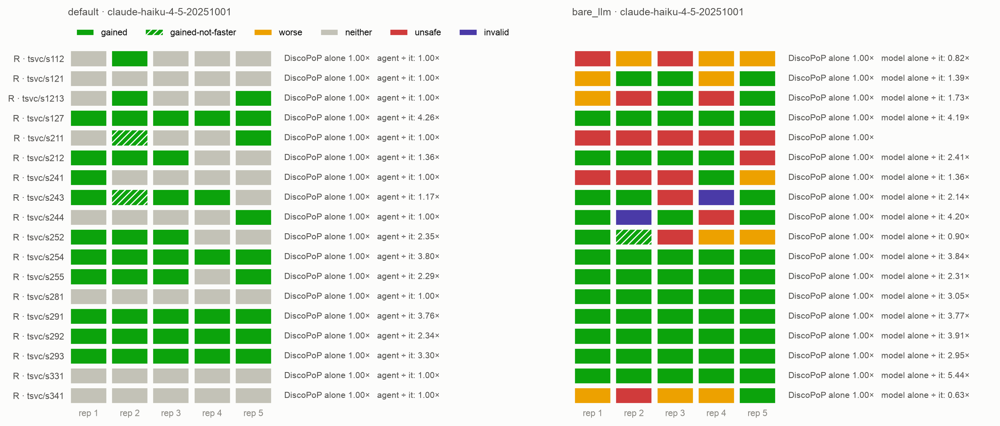
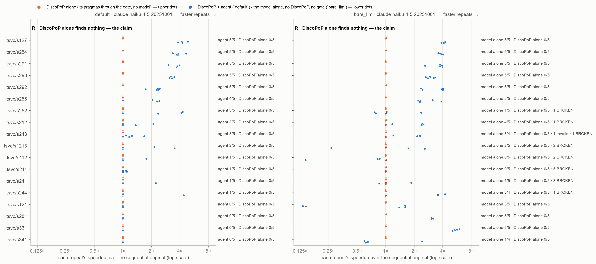

# E1-bare — the same model with no DiscoPoP and no gate

*Generated by `agent/tools/campaign.py reports` from `results/campaign.json` and the experiment record (`agent/THESIS_EXPERIMENTS.md`). Edit those, then regenerate — not this file.*

**Status:** done

## The question

What does the pipeline add over handing the program to the same model and asking it to parallelize it? The bare arm's BROKEN count is what the gate prevents; its FASTER count is what DiscoPoP's evidence and the gate's feedback add.

## Result in one paragraph

TSVC class R, 18 loops × 5, the same model with no DiscoPoP and no gate: FASTER in 58 of 88 trials, 53 of them race-free by the gate's own TSan and schedule matrix (4 benign races on s293, 1 not judgeable) — more than the agent's 44 of 90 (DiscoPoP alone: 0 of 90) — but a WRONG program shipped in 17 (19 %, all 17 stopped by the gate when replayed) and a slower one in 12, where the agent shipped 0 of either. Over the model, the pipeline adds trust, not reach — and most of the reach it loses is lost after the model: Phase B's speed check judges pragmas one at a time and drops sets that only pay together (7 trials recoverable, D33 proposed), the gate's clause stage falsely rejects one half of s281's split (5), DiscoPoP cannot write s331's reduction(max); the rest are rewrites that are slow in themselves.

## Figures

## What is in this folder

- [`analysis/`](analysis/) — the read-out: [`README.md`](analysis/README.md), [`figures.md`](analysis/figures.md), [`main_comparison_stats.md`](analysis/main_comparison_stats.md), [`vs_discopop_alone.md`](analysis/vs_discopop_alone.md)
- [`exhibits/`](exhibits/) — 22 case studies, below
- [`runs/`](runs/) — 2 archived run(s): the evidence
- [`checks/`](checks/) — 2 verification(s) made during the read-out
- [`preflight/`](preflight/) — 1 smoke run(s) before the launch

## Runs

| run | where | what it is | status | trials | outcomes |
|---|---|---|---|---:|---|
| `bare_smoke_mac` | [`preflight/bare_smoke_mac/`](preflight/bare_smoke_mac/) | the bare-LLM runner on one loop (s211), Mac | pre-flight | 1 | parallel-not-faster 1 |
| `e1_bare_a` | [`runs/e1_bare_a/`](runs/e1_bare_a/) | TSVC class R, lane A (node 0): 9 loops × bare_llm × 5 | valid | 45 | BROKEN 15, FASTER 21, SCAFFOLD_MODIFIED 1, VERIFY_FAILED 1, parallel-not-faster 7 |
| `e1_bare_b` | [`runs/e1_bare_b/`](runs/e1_bare_b/) | TSVC class R, lane B (node 1): 9 loops × bare_llm × 5 | valid | 45 | BROKEN 2, FASTER 37, parallel-not-faster 6 |
| `e1b_race_check` | [`checks/e1b_race_check/`](checks/e1b_race_check/) | the gate's race stages (TSan, schedule matrix) and output check over every bare_llm program, with the agent's 46 parallel TSVC programs from E1 as the positive control (tools/race_check.py, server, no model) | valid | 0 |  |
| `e1b_marginal_replay` | [`checks/e1b_marginal_replay/`](checks/e1b_marginal_replay/) | why the agent lost reach: Phase B's speed check replayed (tools/marginal_replay.py, the agent's own measure_marginal) on the 18 E1 trials whose safe DiscoPoP pragmas it dropped as slower, at 6, 12 and all threads, with 3 won trials as controls (server, no model) | valid | 0 |  |

## Exhibits

- [`bare_s112_r1_pragma_on_recurrence_broken`](exhibits/bare_s112_r1_pragma_on_recurrence_broken/) — A bare '#pragma omp parallel for' on s112's backward recurrence a[i+1] = a[i] + b[i]: a WAR race, 3.8× faster and wrong.  
  **unsafe** vs DiscoPoP alone (1.00× → 1.00×) · tsvc/s112, `bare_llm`, e1_bare_a rep 1 · pictures: `before_after.png`, `console.png`
- [`bare_s112_r3_pragma_on_recurrence_broken`](exhibits/bare_s112_r3_pragma_on_recurrence_broken/) — The same racy pragma on s112 in a second repeat.  
  **unsafe** vs DiscoPoP alone (1.00× → 1.00×) · tsvc/s112, `bare_llm`, e1_bare_a rep 3 · pictures: `before_after.png`, `console.png`
- [`bare_s112_r5_copy_per_repetition_worse`](exhibits/bare_s112_r5_copy_per_repetition_worse/) — A correct program shipped 7× SLOWER than the original (malloc + memcpy of a per repetition): without Settle, a slower program is delivered as parallelized.  
  **worse** vs DiscoPoP alone (1.00× → 0.14×) · tsvc/s112, `bare_llm`, e1_bare_a rep 5 · pictures: `before_after.png`, `console.png`
- [`bare_s1213_r2_snapshot_never_read_broken`](exhibits/bare_s1213_r2_snapshot_never_read_broken/) — The model alone fills a snapshot a_old to break s1213's anti-dependence — and then reads the live a[i+1]: the fix is written and not used.  
  **unsafe** vs DiscoPoP alone (1.00× → 1.00×) · tsvc/s1213, `bare_llm`, e1_bare_a rep 2 · pictures: `before_after.png`, `console.png`
- [`bare_s1213_r4_jacobi_for_gauss_seidel_broken`](exhibits/bare_s1213_r4_jacobi_for_gauss_seidel_broken/) — Double-buffering s1213 turns a Gauss–Seidel update into a Jacobi one — the seidel-2d error of the first smoke, in a TSVC loop.  
  **unsafe** vs DiscoPoP alone (1.00× → 1.00×) · tsvc/s1213, `bare_llm`, e1_bare_a rep 4 · pictures: `before_after.png`, `console.png`
- [`bare_s121_parallel_copy_faster`](exhibits/bare_s121_parallel_copy_faster/) — s121: the model alone buffers a like the agent did, but copies it with a PARALLEL loop — 1.6× where the agent's memcpy version ran at 0.73×.  
  **gained** vs DiscoPoP alone (1.00× → 1.59×) · tsvc/s121, `bare_llm`, e1_bare_a rep 2 · pictures: `before_after.png`, `console.png`
- [`bare_s211_r1_distribution_reads_old_b_broken`](exhibits/bare_s211_r1_distribution_reads_old_b_broken/) — The model alone splits s211 into two parallel loops in the wrong order: a[i] now reads the OLD b[i-1] — wrong at any thread count, shipped because nothing checks it.  
  **unsafe** vs DiscoPoP alone (1.00× → 1.00×) · tsvc/s211, `bare_llm`, e1_bare_a rep 1 · pictures: `before_after.png`, `console.png`
- [`bare_s211_r2_distribution_reads_old_b_broken`](exhibits/bare_s211_r2_distribution_reads_old_b_broken/) — The same wrong distribution of s211 in a second repeat (same code, other comments): the error is systematic, not a draw.  
  **unsafe** vs DiscoPoP alone (1.00× → 1.00×) · tsvc/s211, `bare_llm`, e1_bare_a rep 2 · pictures: `before_after.png`, `console.png`
- [`bare_s211_r3_distribution_reads_old_b_broken`](exhibits/bare_s211_r3_distribution_reads_old_b_broken/) — The same wrong distribution of s211 in a third repeat.  
  **unsafe** vs DiscoPoP alone (1.00× → 1.00×) · tsvc/s211, `bare_llm`, e1_bare_a rep 3 · pictures: `before_after.png`, `console.png`
- [`bare_s211_r4_distribution_war_race_broken`](exhibits/bare_s211_r4_distribution_war_race_broken/) — s211 distributed in the right order, but the loop b[i] = b[i+1] - … is still parallel over a WAR dependence: a race the output catches.  
  **unsafe** vs DiscoPoP alone (1.00× → 1.00×) · tsvc/s211, `bare_llm`, e1_bare_a rep 4 · pictures: `before_after.png`, `console.png`
- [`bare_s211_r5_distribution_war_race_broken`](exhibits/bare_s211_r5_distribution_war_race_broken/) — The same racy distribution of s211 in a second repeat — all five s211 trials of the model alone are wrong.  
  **unsafe** vs DiscoPoP alone (1.00× → 1.00×) · tsvc/s211, `bare_llm`, e1_bare_a rep 5 · pictures: `before_after.png`, `console.png`
- [`bare_s212_r5_distribution_reads_new_a_broken`](exhibits/bare_s212_r5_distribution_reads_new_a_broken/) — s212 distributed so that b[i] += a[i+1]*d[i] reads a[i+1] AFTER it was multiplied — the original read it before.  
  **unsafe** vs DiscoPoP alone (1.00× → 1.00×) · tsvc/s212, `bare_llm`, e1_bare_a rep 5 · pictures: `before_after.png`, `console.png`
- [`bare_s241_r1_race_kept_in_loop_broken`](exhibits/bare_s241_r1_race_kept_in_loop_broken/) — Reading a[i+1] into a local first does not remove the race: another thread may already have written it.  
  **unsafe** vs DiscoPoP alone (1.00× → 1.00×) · tsvc/s241, `bare_llm`, e1_bare_a rep 1 · pictures: `before_after.png`, `console.png`
- [`bare_s241_r2_distribution_reads_new_a_broken`](exhibits/bare_s241_r2_distribution_reads_new_a_broken/) — s241 distributed so that b[i] = a[i]*a[i+1]*d[i] reads the NEW a[i+1] where the original read the old one.  
  **unsafe** vs DiscoPoP alone (1.00× → 1.00×) · tsvc/s241, `bare_llm`, e1_bare_a rep 2 · pictures: `before_after.png`, `console.png`
- [`bare_s241_r3_snapshot_before_pb_mix_broken`](exhibits/bare_s241_r3_snapshot_before_pb_mix_broken/) — A snapshot of a taken before pb_mix changes the input: two stale elements per repetition, dump error 0.93 — a subtle error only a full-output check finds.  
  **unsafe** vs DiscoPoP alone (1.00× → 1.00×) · tsvc/s241, `bare_llm`, e1_bare_a rep 3 · pictures: `before_after.png`, `console.png`
- [`bare_s243_r3_distribution_reads_new_a_broken`](exhibits/bare_s243_r3_distribution_reads_new_a_broken/) — s243 split into three parallel loops; the third reads a[i+1] already overwritten by the first.  
  **unsafe** vs DiscoPoP alone (1.00× → 1.00×) · tsvc/s243, `bare_llm`, e1_bare_a rep 3 · pictures: `before_after.png`, `console.png`
- [`bare_s244_dead_store_removed_faster`](exhibits/bare_s244_dead_store_removed_faster/) — s244: the model alone sees that a[i+1] = … is overwritten by the next iteration except at the last, keeps only that one, and the loop becomes parallel — 3.6×.  
  **gained** vs DiscoPoP alone (1.00× → 3.56×) · tsvc/s244, `bare_llm`, e1_bare_a rep 1 · pictures: `before_after.png`, `console.png`
- [`bare_s244_r4_distribution_wrong_order_broken`](exhibits/bare_s244_r4_distribution_wrong_order_broken/) — s244 distributed in an order that lets the dead store a[i+1] = … survive where the original overwrites it.  
  **unsafe** vs DiscoPoP alone (1.00× → 1.00×) · tsvc/s244, `bare_llm`, e1_bare_a rep 4 · pictures: `before_after.png`, `console.png`
- [`bare_s252_r3_prefix_scan_wrong_algorithm_broken`](exhibits/bare_s252_r3_prefix_scan_wrong_algorithm_broken/) — The model alone replaces s252's two-term sum with a full prefix scan: a different algorithm, wrong and 0.1× slow.  
  **unsafe** vs DiscoPoP alone (1.00× → 1.00×) · tsvc/s252, `bare_llm`, e1_bare_b rep 3 · pictures: `before_after.png`, `console.png`
- [`bare_s281_index_split_5of5_faster`](exhibits/bare_s281_index_split_5of5_faster/) — Where the agent got 0 of 5, the model alone wins s281 in 5 of 5 by splitting the index range at LEN/2 — no copy, 3.0× at 12 threads.  
  **gained** vs DiscoPoP alone (1.00× → 3.03×) · tsvc/s281, `bare_llm`, e1_bare_b rep 1 · pictures: `before_after.png`, `console.png`
- [`bare_s331_max_reduction_5of5_faster`](exhibits/bare_s331_max_reduction_5of5_faster/) — s331 won 5 of 5 by the model alone with reduction(max: j) — the pragma DiscoPoP cannot write, so the agent (DiscoPoP writes its pragmas, D23) cannot reach it.  
  **gained** vs DiscoPoP alone (1.00× → 5.29×) · tsvc/s331, `bare_llm`, e1_bare_b rep 1 · pictures: `before_after.png`, `console.png`
- [`bare_s341_r2_compaction_order_lost_broken`](exhibits/bare_s341_r2_compaction_order_lost_broken/) — A compaction whose index comes from a critical counter: the packed order depends on thread timing, and the run then fails.  
  **unsafe** vs DiscoPoP alone (1.00× → 1.00×) · tsvc/s341, `bare_llm`, e1_bare_b rep 2 · pictures: `before_after.png`, `console.png`

## From the experiment record (§7 run log)

### `e1_bare_a`, `e1_bare_b` — 2026-09-23, server, **E1-bare: the same model alone, no DiscoPoP, no gate** (90 trials, Haiku)

**Setup.** Commit `cf0d5d96`; arm `bare_llm` (`discopop_agent/bare_llm.py`: the program and the
contract text, one call, no profile, no gate, no feedback); Haiku 4.5; TSVC class R, the 18 loops
of E1's primary set × 5; verification exactly as E1 (per-kernel size, 6 / 12 threads, 5
repeats, seeded input — the harness's verification code is unchanged since E1's `00d4594f`).
`e1_bare_a` (node 0, `s112 s121 s1213 s127 s211 s212 s241 s243 s244`) 04:59–07:32 UTC,
`e1_bare_b` (node 1, the other nine) 04:59–08:12 UTC; both `SWEEP: clean`. Its `default`
counterpart and DiscoPoP-alone baseline are E1's own trials (`e1_r_a`, `e1_r_b`). Read-out:
`results/E01b_bare_llm/analysis/` — the README there has the commands, the per-loop table and
every BROKEN trial by cause.

**Deviations, recorded first.** (1) The runner profiles every benchmark before its trials, so
DiscoPoP profiled all 18 loops although this arm reads nothing from it; 7 of the 18 draws hit the
random explorer stall (600 s each, draw repeated) — cost only. (2) Two trials have no verdict:
`s243` rep 4 reordered the scaffold calls (`SCAFFOLD_MODIFIED`), `s244` rep 2 wrote `private(i)`
for a loop-local `i` (does not compile); rates are over 88. (3) The arm ran two days after its
counterpart, on the same host, sizes and thread counts (so the pairing rule counts the timings as
comparable), at host load 3,027–7,392 (median 4,288). (4) The pre-registered read-out is the rates
and the BROKEN named; the bare arm's paired speed statistic (2.41×, p = 0.0002) is over its
CORRECT trials only (a wrong program is given no speed; `s211` has none left), while the agent's
1.08× counts every `no-change` as 1.00× — the two are not comparable and are not compared.

| TSVC class R, 18 loops × 5 | model alone (`bare_llm`) | DiscoPoP + agent (`default`, E1) | DiscoPoP alone |
|---|---|---|---|
| verified parallel program | **71 of 88** (81 %, CI 71–88 %) | 46 of 90 (51 %, CI 41–61 %) | 0 of 90 |
| FASTER | **58 of 88** (66 %, CI 56–75 %) | 44 of 90 (49 %, CI 39–59 %) | 0 of 90 |
| **BROKEN — a wrong program shipped** | **17** (19 %), in 9 of 18 loops | **0** | 0 |
| correct but slower (`worse`) shipped | 12 | 0 (Settle dropped 15) | 0 |
| loops FASTER at least once / in 5 of 5 | 16 / 8 | 14 / 5 | 0 / 0 |
| model calls, cost | 90, 7.82 USD-eq. | 125, 13.95 USD-eq. | — |

**C2 — what the gate prevents: 17 wrong programs and 12 slower ones in 88.** Every one of the
17 is wrong on the output check alone, and eight are one shape: a loop distribution that ignores
which value the original read (`s211` ×3, `s212`, `s241`, `s243`, `s244`, `s1213`); the rest are
races (`s211` ×2, `s112` ×2, `s241`), a Gauss–Seidel turned Jacobi (`s1213`, the seidel-2d error
of §2 in a TSVC loop), a snapshot taken before `pb_mix` changes the input (`s241`), a two-term sum
turned into a prefix scan (`s252`) and a compaction whose order depends on thread timing (`s341`).
E1's gate rejected **23 wrong rewrites in 19 agent trials**, on seven of the nine loops where
the model alone went wrong (`s112` 3, `s1213` 4, `s211` 3, `s212` 2, `s241` 5, `s243` 2,
`s244` 3) and on `s281` 1; on `s252` and `s341` the agent's model never produced a wrong rewrite. Without an oracle a user of the
model alone cannot tell the 17 from the 58 — which is what the gate is.

**Not what was expected: the model alone reaches MORE.** The plan read the bare arm's FASTER
count as "what the evidence and the feedback add"; on TSVC class R they add nothing to reach —
58 vs 44 FASTER, 16 vs 14 loops. The gap sits on four loops, each with a visible cause:
`s281` 5 vs 0 (the model alone splits the index range at `LEN/2`; the agent's model copied the
array per repetition and Settle dropped it — **wrong, corrected the same day below**: the agent's
model wrote the same split), `s331` 5 vs 0 (a max reduction — the pragma DiscoPoP
cannot write, T0.13; under D23 the agent's pragmas are DiscoPoP's), `s121` 3 vs 0 (both buffer
`a`; the model alone copies with a parallel loop, the agent's rewrites used `memcpy` — **only rep 3
did, corrected below**), `s244` 3 vs
1 (the model alone removes a dead store). The agent is ahead where the model alone ships wrong
programs: `s211` 1 vs 0 (5 BROKEN), `s112` 1 vs 0 (2 BROKEN), `s252` 3 vs 1. E1-bare changes
everything at once — evidence, gate, feedback, who writes the pragma, the role text — so it cannot
say which of them costs the four loops; E2 Part A (evidence none vs DiscoPoP, same pipeline) and
E3 (the model writes the pragmas) separate them, and `s281`, `s121` are among E2-C/D's seven
loops, `s331`, `s341` are E3's.

**Not checked for the model alone: races that change no printed value.** Its 71 parallel
programs passed the harness's verification (full dump on two inputs, digest at 6 and 12 threads,
5 repeats each) but not TSan or schedule stress, which only the agent's gate runs. A no-model
check — the gate's race stages over those 71 programs — would close this; **run the same day,
below**.

**What it changes.** H2 and C2 stand on a measured counterfactual: the same model, unguarded,
ships a wrong program in one trial in five on this set. What the pipeline adds over the model is
TRUST, not reach — the reach claim (C1) is against DiscoPoP alone and is unchanged. The four
loops are recorded as a limitation of `default` and as the question E2/E3 answer.

**Two checks the same afternoon (no model), and what they correct.** The author asked for the race
check and for WHY the agent reaches less. Both are in `results/E01b_bare_llm/checks/`.

*`e1b_race_check`* (`tools/race_check.py`, server, clang-20 with archer): every model-alone program
through the agent's own `validate(mode="safety")` — TSan, the schedule matrix, output on two inputs —
with the agent's 46 parallel TSVC programs as the positive control: **46 of 46 clean**. Of the model
alone's 58 FASTER programs **53 are clean**; 4 are races (`s293` reps 1–4: a pragma on `a[i] = a[0]`,
benign in effect — the value written is the value read — a data race nonetheless) and 1 cannot be
judged (`s341` rep 5 calls the OpenMP runtime, which the gate's first compile does not link — a gate
blind spot). All 13 parallel-not-faster programs are clean; **the gate stops all 17 BROKEN ones**
(TSan 9, output 7, schedule matrix 1). Race-checked, the model alone is FASTER in 53 of 88, the agent
in 44 of 90 — the reading stands.

*`e1b_marginal_replay`* (`tools/marginal_replay.py`, server): all 90 agent trials had a rewrite pass
Phase A; of the 44 that ended `no-change`, 15 fell at Settle (the copy-per-repetition finding of
`e1_r_a/b`, confirmed), 11 because DiscoPoP's pragmas on the rewrite raced or changed the output (the
gate right; this includes all of `s331` and `s341`), and **18 because Phase B's speed check dropped
pragmas that had passed every safety stage**. The replay rebuilds each measured state from the
archived patches and calls the agent's own `measure_marginal` at 6, 12 and all threads. The
hypothesis written into the tool — that the verdict depends on the thread count — is **refuted**:
the dropped pragmas measure below 1× at every thread count. What the data shows instead: Phase B
judges each pragma ALONE against the sequential rewrite, and **in 7 of the 18 trials the rewrite
pays only with all its pragmas together** — each alone 0.6–1.1× (or unstably near 1.0 on this host),
together 2.5–4.0× the rewrite and **1.2–2.8× the original** at 12 threads (`s1213` reps 1, 3; `s121`
reps 1, 2, 5; `s244` rep 1; `s112` rep 4). The other 11 are slower than the original even with every
pragma (0.10–0.97×): correct drops. Controls (`s127`, `s254`, `s291`, won in E1) replay at 1.9–3.9×.

**Corrections.** (1) `s281`: the agent's model wrote the SAME `LEN/2` split as the model alone in all
five repeats. It lost after the model — in reps 2–5 the gate's clause stage rejected DiscoPoP's
`private(x)` on the first half ("the loop writes `x` and later code reads it"; the only later reads
are in the second loop, after a write in the same iteration, and nothing reads `x` after the loops:
**a false reject**, an E7 labelled case), in rep 1 DiscoPoP reported a do-all on one half only; one
half parallel is 0.63–0.97× the original. (2) `s121`: only rep 3 used `memcpy`; reps 1, 2, 5 wrote a
loop copy like the model alone, and lost to the one-at-a-time speed check. (3) The `e1_r_a/b` entry's
"the Phase B marginals were not wrong either" holds for each pragma measured alone and not for the
set — see the §6 row. **What made `default` reach less, measured:** the one-at-a-time speed check
(7 trials), the clause false reject together with DiscoPoP's pattern on one half only (`s281`, 5),
a pragma DiscoPoP cannot write (`s331`, `s341`), and rewrites that are slow in themselves (Settle 15,
Phase B 6). On the agent's own measurement the seven would put it at 51 FASTER of 90 (an estimate —
the combined programs were timed, not verified by the harness). **D33, proposed** (§6): Phase B
measures a rewrite's safe pragmas together before dropping any.

## Change-log rows that name these runs (§6)

| Date | Repo | Change | Why |
|---|---|---|---|
| 2026-09-23 | plan | **D33 proposed — Phase B measures a rewrite's safe pragmas TOGETHER before dropping any.** Today Phase B times each pragma alone against the state before it and drops it if it does not pay; when a rewrite splits a loop into two or three, each pragma alone can lose while all of them win. Proposed: measure the set of safety-passing pragmas together against the state before them, then remove one at a time only while the set still pays (backward elimination). Replayed on E1 (`e1b_marginal_replay`) it recovers 7 of the 18 trials the check dropped (the agent: 51 FASTER of 90 instead of 44, on the agent's own measurement) and changes none of the 11 correct drops. The agent is frozen until E11 (the author, 22 Sep); **the author decides** whether D33 enters before E2 — then E2's `default` differs from E1's and is compared within E2 only — or after E11 | the author asked why the model alone reaches more; the replay answered it |
| 2026-09-23 | finding (gate, E7) | **The gate's clause stage rejects a correct `private(x)`** — `s281`, E1 reps 2–5: DiscoPoP's pragma on the first half of the agent's `LEN/2` split was refused because "the loop writes `x` and later code reads it"; the only later reads are in the second loop, each after a write in the same iteration, and nothing reads `x` after the loops. With one half parallel the program is 0.63–0.97× the original, so the agent lost `s281` in all five repeats although its model wrote the right rewrite every time (the model alone, writing the same clause, is TSan-clean and 3.0×). A labelled false reject for E7; not fixed (agent frozen) | `e1b_marginal_replay` |
| 2026-09-23 | correction | **`e1_r_a`/`e1_r_b` (§7) said "the Phase B marginals were not wrong either" and that "every `s121`/`s281` trial" copies the array.** Both hold only in part. Each marginal is right for the pragma measured ALONE, but in 7 trials the set of pragmas pays where no single one does (`e1b_marginal_replay`); and `s281`'s rewrites are copy-free index splits, `s121`'s reps 1, 2, 5 loop copies — only `s121` rep 3 used `memcpy`. The entry stays as written; this row and the E1-bare §7 entry correct it | measured the same afternoon |
| 2026-09-23 | result | **Race check of the model alone (`e1b_race_check`): 53 of its 58 FASTER programs are race-free; the gate would have stopped all 17 of its wrong ones.** Every `bare_llm` program through the agent's own `validate(mode="safety")` on the server (clang-20 with archer), the agent's 46 parallel TSVC programs as control — 46 of 46 clean. Not clean: `s293` reps 1–4 (a pragma on `a[i] = a[0]`: a data race, benign in effect) and `s341` rep 5, which the gate cannot judge (it calls the OpenMP runtime; the gate's first compile does not link it — a blind spot, E7). BROKEN caught by TSan 9, output 7, schedule matrix 1. Race-checked, the model alone is FASTER in 53 of 88 (60 %), the agent in 44 of 90 (49 %) | the author: "run the race check on the bare programs" |
| 2026-09-23 | result | **E1-bare complete (§7 `e1_bare_a`, `e1_bare_b`): the same model alone ships a wrong program in 17 of 88 trials; the agent in 0 of 90.** TSVC class R, 18 loops × 5, Haiku 4.5, no DiscoPoP, no gate: verified parallel 71 of 88, FASTER 58 of 88 — MORE than the agent's 44 of 90 (the plan expected the opposite) — and BROKEN 17, `worse` 12. The gap in reach sits on `s281`, `s331`, `s121`, `s244`, each with a named cause (index splitting vs a copy; a max reduction DiscoPoP cannot write; a parallel vs a sequential copy; a dead store); E1's gate rejected 23 wrong rewrites of the agent's model, on seven of the nine loops where the model alone shipped its 17. What the pipeline adds over the model is trust, not reach; which of evidence, gate, feedback or pragma authorship costs the four loops is E2's and E3's question. Owed, no model: the gate's race stages over the model alone's 71 parallel programs (its FASTER are output-checked, not TSan-checked) | the author's go, 22 Sep; the read-out pre-registered in the E1-bare row of §5s |
| 2026-09-23 | campaign | **The work branch is merged; E1-bare is running.** `e1-readout-e2-prep` fast-forwarded into `agentic_DiscoPop` at `cf0d5d96` after the merge gate: the agent's feature suite 40 of 40, harness type check and tests, `test_arms.py` (all arms, all experiments); `default` and `discopop_gate` resolve exactly as at E1's `00d4594f` except three new options that are inert when unset (`evidence_file`, `external_evidence`, `prompt_omit`) — and with them unset the prompts are byte-identical by construction (empty parts are filtered; the checklist is the same string, factored). Server synced, parity OK. E1-bare launched 04:59 UTC: `e1_bare_a` (node 0: `s112 s121 s1213 s127 s211 s212 s241 s243 s244`) and `e1_bare_b` (node 1: `s252 s254 s255 s281 s291 s292 s293 s331 s341`), `bare_llm` × 5, Haiku 4.5, `--threads 6,12 --repeats 5` as E1; the harness's verification code is unchanged since `00d4594f`, so the bare arm is judged exactly as E1's trials were. The server checkout stays at `cf0d5d96` until both lanes end | the author: "are we going to move back to our branch?" — yes, from here on all work is on `agentic_DiscoPop` |

