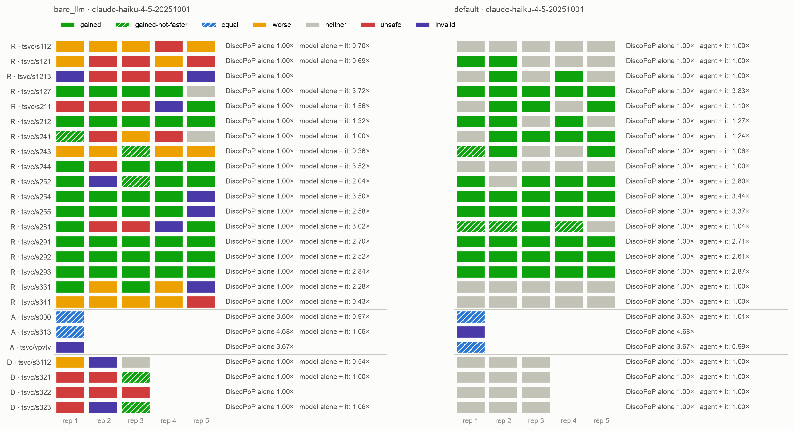
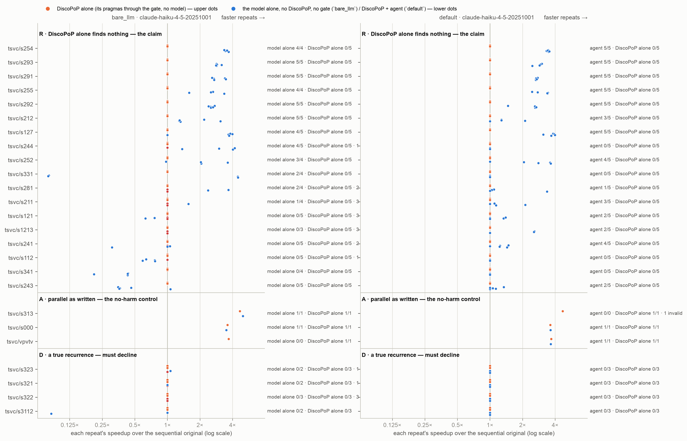

# E1 clean — the three-way main comparison on clean packages (D35, D36)

*Generated by `agent/tools/campaign.py reports` from `results/campaign.json` and the experiment record (`agent/THESIS_EXPERIMENTS.md`). Edit those, then regenerate — not this file.*

**Status:** done

## The question

On TSVC class R, with no hint in the source (D36), the model confined to its workspace (Fix 95) and agent v2: DiscoPoP alone vs DiscoPoP + agent (`default`) vs the model alone (`bare_llm`, the mirror prompt, D37) — which delivers correct, race-free, faster programs, and which ships wrong or slower ones? Plus the no-harm (class A) and must-decline (class D) controls.

## Result in one paragraph

TSVC class R, clean packages, agent v2, the model alone with the mirror prompt, 18 loops × 5: DiscoPoP alone reaches nothing (0 of 90); the agent is FASTER in 51 of 90, all race-free, and ships 0 unusable programs; the model alone is FASTER in 44, race-free in 39, and ships 46 unusable programs of 90 (16 BROKEN, 17 slower, 8 not compiling, 5 racy). H13 supported (agent fewer unusable on 14 loops, 0 the other way, p = 0.0004); reach: agent ahead on 10 loops, the model alone on 4, not significant (p = 0.13). Agent vs DiscoPoP alone: gained 51, unsafe 0, p = 0.0002. Controls: class A — agent equal to DiscoPoP alone (3.63× v 3.67×), model alone 1 of 3 not compiling; class D — agent declined 12 of 12, model alone 9 of 12 unusable (6 BROKEN).

## Figures

## What is in this folder

- [`analysis/`](analysis/) — the read-out: [`figures.md`](analysis/figures.md), [`main_comparison_stats.md`](analysis/main_comparison_stats.md), [`vs_discopop_alone.md`](analysis/vs_discopop_alone.md)
- [`runs/`](runs/) — 6 archived run(s): the evidence
- [`checks/`](checks/) — 2 verification(s) made during the read-out

## Runs

| run | where | what it is | status | trials | outcomes |
|---|---|---|---|---:|---|
| `e1c_r_1` | [`runs/e1c_r_1/`](runs/e1c_r_1/) | E1 clean, class R: s112 s121 s1213 s127 s211 x discopop_gate, default, bare_llm (mirror) x5, Haiku, lane 0.0 | valid | 75 | BROKEN 10, FASTER 17, VERIFY_FAILED 3, no-change 39, parallel-not-faster 6 |
| `e1c_r_2` | [`runs/e1c_r_2/`](runs/e1c_r_2/) | E1 clean, class R: s212 s241 s243 s244 s252 x discopop_gate, default, bare_llm (mirror) x5, Haiku, lane 0.1 | valid | 75 | BROKEN 3, FASTER 25, VERIFY_FAILED 1, no-change 37, parallel-not-faster 9 |
| `e1c_r_3` | [`runs/e1c_r_3/`](runs/e1c_r_3/) | E1 clean, class R: s254 s255 s281 s291 x discopop_gate, default, bare_llm (mirror) x5, Haiku, lane 1.0 | valid | 60 | BROKEN 2, FASTER 31, VERIFY_FAILED 3, no-change 21, parallel-not-faster 3 |
| `e1c_r_4` | [`runs/e1c_r_4/`](runs/e1c_r_4/) | E1 clean, class R: s292 s293 s331 s341 x discopop_gate, default, bare_llm (mirror) x5, Haiku, lane 1.1 | valid | 60 | BROKEN 1, FASTER 22, VERIFY_FAILED 1, no-change 30, parallel-not-faster 6 |
| `e1c_a` | [`runs/e1c_a/`](runs/e1c_a/) | E1 clean, class A (no-harm): s000, vpvtv, s313 x discopop_gate, default, bare_llm x1 | valid | 9 | FASTER 7, SCAFFOLD_MODIFIED 1, VERIFY_FAILED 1 |
| `e1c_d` | [`runs/e1c_d/`](runs/e1c_d/) | E1 clean, class D (must-decline): s321, s322, s323, s3112 x discopop_gate, default, bare_llm x3 — the model alone on true recurrences (the author's decision 3) | valid | 36 | BROKEN 6, VERIFY_FAILED 2, no-change 25, parallel-not-faster 3 |
| `e1c_race_check` | [`checks/e1c_race_check/`](checks/e1c_race_check/) | race_check.py (the gate's TSan + schedule matrix, archer, server, no model) over every trial of the model alone (bare_llm, mirror prompt) in e1c_r_1..4 — what makes its FASTER count race-free (D35 read-out, H13) | valid | 0 |  |
| `e1c_ad_race_check` | [`checks/e1c_ad_race_check/`](checks/e1c_ad_race_check/) | race_check.py over the model alone (bare_llm) in E1c's controls, classes A (e1c_a) and D (e1c_d) | valid | 0 |  |

## From the experiment record (§7 run log)

### `e2c_ab_1`, `e2c_ab_2`, `e2c_ab_3`, `e2c_ab_4`, `e2c_race_check`; `e1c_a`, `e1c_d`, `e1c_ad_race_check` — 2026-09-25, server, **E2 Parts A+B (Haiku) with the D38 twins, and E1c's controls** (540 + 45 trials; 315 race checks, no model)

- **Setup.** E2: commit `3f296eac` (agent code of E1c, `33673d7d`, plus the twin entry point); the 18 class-R loops × `full_b1`, `no_evidence`, `no_evidence_b1` and their twins `twin_full`, `twin_no_evidence`, plus `twin_dp` (DiscoPoP's pragmas unchecked, no model) × 5, four 12-core lanes (E1c's split), 25 Sep 05:15 → ≈ 20:00 UTC; `default`, `bare_llm`, `discopop_gate` are E1c's cells (same loops, same agent code). Controls: `e1c_a` (classes A: s000, vpvtv, s313 × the three E1c arms × 1) and `e1c_d` (class D: s321, s322, s323, s3112 × 3), same commit, lanes 1.0/1.1 after E2's node-1 lanes. The server checkout was synced once during E2's lanes 0.x, for two HTML documents and a registry line only (no file a trial reads). Race checks (`race_check.py`, the gate's TSan with archer and the schedule matrix, no model) over every program no gate saw: E2's three twin arms, the model alone in the controls. Read-outs in `results/E02_evidence_feedback_model/analysis/` and `results/E01c_clean_three_way/analysis/`.
- **E2 — every arm against the sequential original (class R, 90 trials each):**

  | arm | race-free FASTER | unusable programs |
  |---|---:|---:|
  | DiscoPoP alone (E1c) | 0 | 0 |
  | agent: evidence, 3 attempts (`default`, E1c) | 51 | **0** |
  | agent: evidence, 1 attempt (`full_b1`) | 48 | **0** |
  | agent: no evidence, 3 attempts (`no_evidence`) | **55** | **0** |
  | agent: no evidence, 1 attempt (`no_evidence_b1`) | 51 | **0** |
  | twin of `full_b1` (no gate) | 15 of 89 | 73 (66 BROKEN) |
  | twin of `no_evidence_b1` (no gate) | 17 of 90 | 71 (64 BROKEN) |
  | `twin_dp`: DiscoPoP's pragmas, nothing checked | 0 | 70 BROKEN, 20 no change |
  | the model alone (E1c) | 39 | 46 |

- **H12 (headline) — not supported.** DiscoPoP's evidence does not raise the race-free FASTER rate inside the pipeline (`full_b1` − `no_evidence_b1`: mean −0.03 per loop) nor on the twins (−0.02); larger inside on 3 loops, on the twins on 6, 9 tied; one-sided Wilcoxon p = 0.70, Cliff's δ −0.02 (counting corrected 25 Sep, §6: was 7 / 8 / 0.71).
- **H5b — not supported.** Two more attempts help about equally without evidence (+0.04) and with it (+0.03); p = 0.58.
- **H5d — not supported.** On the 8 loops where the clean model alone shipped a wrong program (s112, s121, s1213, s211, s241, s244, s281, s341) the evidence effect is −0.08, on the others 0.00 (Mann–Whitney one-sided p = 0.54). One loop stands out: on `s244` evidence LOWERS the one-attempt agent's success by 0.8 — worth a case study.
- **H13 — supported in every pairing.** The agent ships fewer unusable programs than its twin on 18 of 18 loops (evidence: p = 0.0001; no evidence: p = 0.0001) and than the model alone on 14, 0 the other way (p = 0.0009). **The gate's value, measured three ways:** agent vs its twin in race-free FASTER, 12 loops v 4 (one-sided p = 0.013) and 10 v 3 (p = 0.003); `twin_dp` — DiscoPoP's own pragmas without the gate — wrong in 70 of 90 trials (the D38 prediction); every twin's BROKEN programs are mostly DiscoPoP's unchecked pragmas (twin_full 55 of its 66 BROKEN fail TSan). Agent vs model alone in race-free FASTER: `no_evidence` 55 v 39, ahead on 10 loops v 4, one-sided p = 0.044; the other arms p = 0.08–0.14.
- **Reading.** On TSVC class R with Haiku, DiscoPoP's measured evidence adds nothing to the model's reach, inside the pipeline or without it — H5b, H5d and H12 all fail, and the best arm is the agent WITHOUT evidence at three attempts (55 of 90). What the pipeline adds is the gate: every agent arm ships no unusable program, where the same model without the gate ships 46 of 90 (the model alone) to 71–73 (the twins), and DiscoPoP's own suggestions, unchecked, are wrong in 78 % of trials. The harder tier (E2-app, LULESH / NPB-C, D-decision 7) is where evidence may still matter — the dependences there are not visible in the code the model reads.
- **E1c's controls.** Class A (no harm): DiscoPoP alone 3 of 3 FASTER (3.67×), the agent 2 of 2 (3.63×; its third trial is the `s313` harness edit, to be repeated), the model alone 2 of 3 (4.24×; `vpvtv` does not compile). Class D (must decline): the agent declined all 12; DiscoPoP alone 0 parallel; **the model alone shipped 9 unusable programs of 12** (6 BROKEN, 2 not compiling, 1 slower). Race check of the model alone: 2 of its 3 FASTER clean; 2 programs not judgeable.

### `e1c_r_1`, `e1c_r_2`, `e1c_r_3`, `e1c_r_4`, `e1c_race_check` — 2026-09-24/25, server, **E1 clean: the three-way main comparison on TSVC class R** (270 trials, Haiku; 90 race checks, no model)

- **Setup.** Commit `33673d7d` (agent v2: D32, D33, Fixes 91–92; packages v3 without the header hint, D36; the model confined to its workspace, Fix 95; the model alone with the MIRROR prompt, D37; per-benchmark explorer limit). The 18 class-R loops × `discopop_gate`, `default`, `bare_llm` × 5, threads 6,12, repeats 5, check seed 7, on four 12-core lanes (`--node N.H`, split 5/5/4/4 loops), 24 Sep 18:33 → 25 Sep ≈ 04:50 UTC; every lane's credential sweep clean. `e1c_race_check`: `race_check.py` (the gate's TSan with archer and the schedule matrix) over all 90 `bare_llm` trials on the server, 25 Sep. Read-out `results/E01c_clean_three_way/analysis/main_comparison_stats.md` (`--arm default --three-way default --races …`).
- **The three arms against the sequential original (class R, 90 trials each):**

  | | DiscoPoP alone | DiscoPoP + agent | the model alone |
  |---|---:|---:|---:|
  | verified parallel program | 0 | 55 (61 %) | 64 (71 %) |
  | FASTER (≥ 1.1×) | 0 | **51 (57 %, CI 46–66)** | 44 (49 %, CI 39–59) |
  | FASTER and race-free | 0 | **51** | **39 (43 %, CI 34–54)** |
  | BROKEN (wrong output) | 0 | **0** | **16** |
  | correct but slower (< 0.91×) | 0 | 0 | 17 |
  | racy (TSan) | 0 | 0 | 5 (all `s293`: every thread reads `a[0]` while iteration 0 writes the same value — right answer, still a data race the gate rejects) |
  | does not compile | 0 | 0 | 8 |
  | **unusable programs** | **0** | **0** | **46 (51 %)** |
  | median speedup of the FASTER trials | — | 2.67× | 2.84× |

- **H13 (trust), its first test: supported.** Per loop, the agent ships fewer unusable programs on 14, the model alone on 0, 4 tied; paired Wilcoxon one-sided p = 0.0004. The model alone's 46 unusable programs, every one a result: BROKEN on `s112`, `s121` ×3, `s1213` ×3, `s211` ×3, `s241` ×2, `s244`, `s281` ×2, `s341`; not compiling on `s1213` ×2, `s211`, `s252`, `s254`, `s255`, `s281`, `s331`; slower on `s112` ×4, `s121` ×2, `s241`, `s243` ×4, …; racy `s293` ×5 (full list in the read-out).
- **Reach: the agent is now ahead, not significantly.** Race-free FASTER per loop: agent ahead on 10, the model alone on 4 (`s212` 5 v 3, `s244` 4 v 0, `s331` 2 v 0, `s281` 2 v 1), 4 tied; p (agent ahead) = 0.13, two-sided 0.26. FASTER alone: 9 v 4, p = 0.23. Where only the agent succeeds: `s121`, `s1213`, `s241`, `s243` (the model alone ships only unusable programs there), `s211` 3 v 1. Neither arm: `s112`, `s341` (the agent declines; the model alone ships 10 unusable programs).
- **Agent vs DiscoPoP alone (D19): gained 51, gained-not-faster 4, neither 35, unsafe 0.** Speed paired by loop: median 1.17× (bootstrap CI 1.00–2.75×), Wilcoxon one-sided p = 0.0002 over 12 non-zero pairs, Cliff's δ +0.67. H1 holds on the clean packages with agent v2. The floor (D32) found DiscoPoP alone keeping nothing in 90 of 90 (`dp_floor = original`, as expected on class R).
- **Process.** Agent: 126 model calls (0 failed), 92 full re-profiles, 22 explorer stalls (at the 60 s limit, redrawn), mean 372 s per trial (median 267) + 65 s verification, 16.1 USD-eq; D33 kept a joint set in 1 trial, none of the 51 FASTER came through it. The model alone: 90 calls, mean 101 s + 92 s verification, 8.1 USD-eq. DiscoPoP alone: 41 s + 75 s.
- **Against the hinted runs (E1, E1-bare), descriptively:** the agent 44 → 51 FASTER (v1 → v2 and hint removed); the model alone 58 → 44 FASTER and 53 → 39 race-free, unusable 35 → 46 (8 not compiling where E1-bare had 1). Two things changed for the model alone at once — the hint left the source (D36) and the prompt became the mirror (D37) — so the drop is not attributed to either; `d36_hint_check` (N = 3) found the hint's effect not one-directional.
- **Reading.** On clean packages the pipeline delivers more correct, race-free speedups than the same model alone (51 v 39, not significant per loop at 18 loops × 5) and ships no unusable program where the model alone ships 46 of 90 — the trust result is significant, the reach result is not. The classes A and D controls (`e1c_a`, `e1c_d`) complete E1c.

## Change-log rows that name these runs (§6)

| Date | Repo | Change | Why |
|---|---|---|---|
| 2026-09-25 | plan | **D39 — the measurement harness stays in the benchmark's file (the author, 25 Sep: "so we can just keep them, no harm").** The question (the author): the file every model edits holds our measurement — for a TSVC loop 160 of 174 lines (sizes, data, initial values, perturbed input, digest, timing, `pb_mix`, `main`): the models read it, DiscoPoP profiles it (s313: 87 % of the dependence records, 117 task patterns over `main`), and dependences with an end in it reach the agent's evidence ("RAW on `a` from line 108", written by `init_array` before the loop). **Tried: packaging v4** (`prepare_tsvc.py --layout v4`, built and kept): the measurement in a header per loop OUTSIDE the package (`prepared/_harness/`, found by every build through CPATH — `tools/harness_include.py`), which DiscoPoP never instruments (it instruments only code inside `DP_PROJECT_ROOT_DIR`; hotspot detection the same) and no model's working copy holds; the file keeps TSVC's loop, `pb_mix`, one `#include` and `PB_MAIN(kernel)` (a macro, so `main` stays instrumented); the header's digest is checked before and after every trial. **T0.15 (`tools/harness_equivalence.py`, no model) — output identical in 33 of 33 loops** (digest on the shipped and the perturbed input, full dump). **DiscoPoP's measured dependences for the benchmark's own code identical** (s211: 28 = 28 records, keyed by line text). **But the explorer's verdict changes:** on `s211` (a true recurrence) it reports a Do-All on the loop AND on the repetition loop in 5 of 5 draws (Mac) and 3 of 3 (server, LLVM 20) whenever the program's code spans two files — even with everything instrumented and the arrays allocated in instrumented code; in the one-file layout it reports none in 5 of 5 and 3 of 3. In one file `doall_prevented.json` holds the dynamic RAW on `b` that blocks both loops; after the split it is empty, although the profiler recorded the same 9 RAW records. A DiscoPoP defect in how the explorer assigns call-path states to loop iterations when a program spans more than one file (bug report **B8**, the Fix 81/82 family). *Correction, same day:* moving `pb_mix` back into the file during this work was a misdiagnosis — the symptom is the same with it in or out. **Decision: the one-file layout stays** — it biases no comparison (every arm reads the same file; DiscoPoP's analysis is the one every run has used; no harness region or pattern is ever acted on, in any arm) and costs only time and tokens (s313: a 20 s profile instead of 5 s; ≈ 1,500 tokens per file read); the two-file layout would change DiscoPoP's results. **With it:** H13 counts only failures of the code under test (a harness edit has its own row); Fix 97 — every arm told about the harness in the same words, the agent's gate refusing a harness edit with a free retry — is in the agent for packages that list protected lines (v4); for the one-file packages it is built next, for E3 onward (the measuring functions named by the package, the same sentence the model alone already gets, the gate protecting those functions and every call to them); the rest of E2 runs on the agent its A+B ran on; the two trials that edited the harness (`e1c_a` s313 default, `e2c_ab_4` s331 twin_full rep 4) are repeated. **B8 is fixed before the application benchmarks** (LULESH, NPB, PolyBench's project layout — multi-file by nature; whether T0.8's PolyBench equivalence holds under B8 is checked then) | the author, 25 Sep |
| 2026-09-25 | finding | **The agent's model is never told which functions measure the program; the model alone's is (found by E1c class A).** In `e1c_a` the agent's `s313` program inlined the harness's `pb_mix(nl)` call into the kernel ("to make array dependencies explicit to profiler") — output identical, so the gate kept it, and the harness scored it SCAFFOLD_MODIFIED, an unusable program under H13. The mirror prompt of the model alone names the measuring functions ("Do not change these functions — they set up, time and print the program: …", from the package's `exclude_functions`); the agent's request does not — `--exclude-functions` only keeps the agent from ASKING about regions inside them, and the contract forbids touching I/O, not the timer or the perturbation — and the twins use the agent's request, so they lack it too. **An asymmetry in the model alone's favour**, rare so far: 1 agent trial on the clean packages (`e1c_a` `s313`), 3 in the pilots (`pilot2`, `local_obs1` `seidel-2d`, `pilot4` `md`), against 1 of the model alone (`e1_bare_a` `s243`). Stated as a threat for every read-out that includes H13; the comparison agent vs twin (H12) is not affected (neither is told). **Proposed, not built (the agent is frozen while E2 runs, D34):** the agent's request names the measuring functions exactly as the mirror prompt does, and the gate rejects a candidate that changes them (the harness's `scaffold.check`, run inside the gate). The author decides | E1c class A, 25 Sep |
| 2026-09-24 | plan | **The clean redo is split so the author's question is answered first: E1-clean (group E1c) runs before E2's other arms.** The author: "I want to see the results of the latest version of the agent against the model alone on E1." No such comparison exists yet — both arms of E1 and E1-bare saw the hint (D36). E1c = TSVC class R, 18 loops × `discopop_gate`, `default`, `bare_llm` (the mirror prompt, D37) × 5, Haiku, on four lanes (`e1c_r_1`–`4`), then the controls: class A × 1 and class D × 3 × the same three arms (`e1c_a`, `e1c_d`; the model alone on true recurrences, decision 3). E2 A+B then adds `full_b1`, `no_evidence`, `no_evidence_b1` on the same agent commit and reads its `default` and model-alone cells from E1c — so the agent must not change between the two | the author, 24 Sep |

