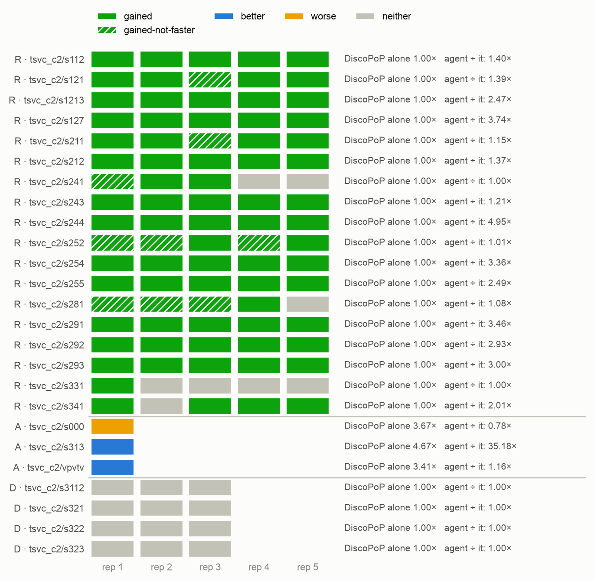
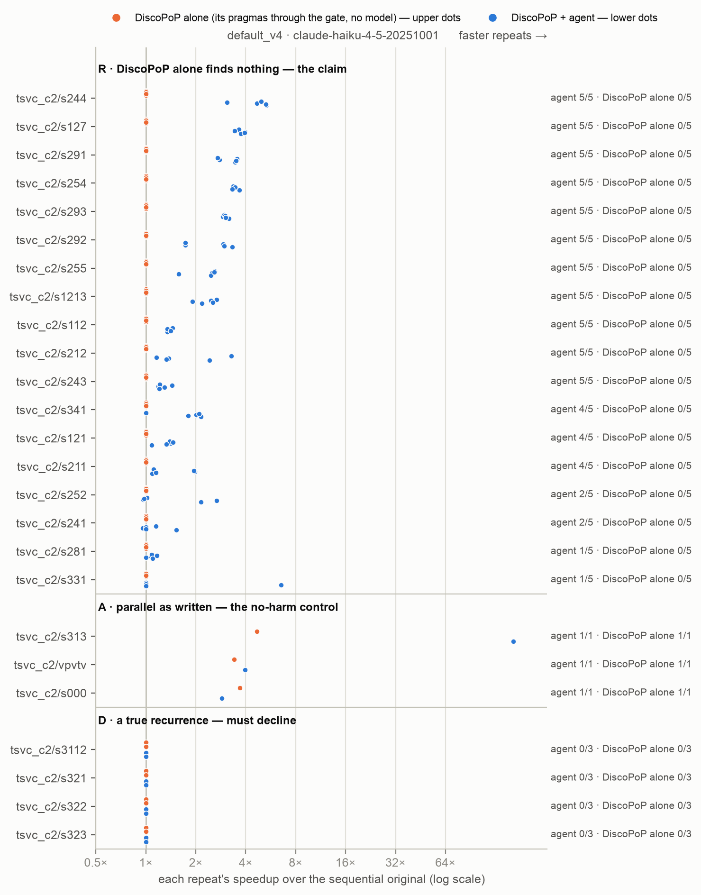

# E1-v6 — the headline three-way comparison on clean files in TSVC's own form (packaging v6, prompt version 4)

*Generated by `agent/tools/campaign.py reports` from `results/campaign.json` and the experiment record (`agent/THESIS_EXPERIMENTS.md`). Edit those, then regenerate — not this file.*

**Status:** running

## The question

E1-final again where the file a model reads is an ordinary code file — TSVC's function with its repetition loop and its `dummy` call, comments removed, no note, no harness, one editable file — and the order statement is the corrected one: on TSVC class R (with class A and D controls), DiscoPoP alone vs the Haiku agent vs Haiku, Sonnet, Opus and Fable alone — who ships correct, race-free, faster programs, and who ships unusable ones?

## Result in one paragraph

Class R, 18 loops × 5, race-checked: DiscoPoP alone 0 of 90; the Haiku agent 73 race-free FASTER with 0 unusable; Haiku alone 38 with 50 unusable; Sonnet alone 77 with 11 (5 racy); Opus alone 89 with 0; Fable alone 89 with 1. T1 (agent > DiscoPoP alone, median 1.70×), T2 (fewer unusable than Haiku alone) and T6 (more reach than Haiku alone) rejected; against Sonnet, Opus and Fable alone no advantage in reach (Opus and Fable ahead on 6 loops). Controls: every setup but Haiku alone FASTER on the three class-A loops; the agent declines all 12 class-D trials. One of the agent's 73 (s331) parallelizes the repetition loop itself and is right only for the tested data; on s313 the agent removes the 47 unused repetitions (164×) — both possible because the result of those two loops is a scalar that our `dummy` call does not take. 821 model calls, $134 API-equivalent, 8.5 h + re-runs.

## Figures

## What is in this folder

- [`analysis/`](analysis/) — the read-out: [`e1v6_tests.md`](analysis/e1v6_tests.md), [`fable/main_comparison_stats.md`](analysis/fable/main_comparison_stats.md), [`figures.md`](analysis/figures.md), [`haiku/main_comparison_stats.md`](analysis/haiku/main_comparison_stats.md), [`main_comparison_stats.md`](analysis/main_comparison_stats.md), [`opus/main_comparison_stats.md`](analysis/opus/main_comparison_stats.md), [`repetition_loop.md`](analysis/repetition_loop.md), [`repetitions_necessary.md`](analysis/repetitions_necessary.md), [`sonnet/main_comparison_stats.md`](analysis/sonnet/main_comparison_stats.md), [`vs_discopop_alone.md`](analysis/vs_discopop_alone.md), [`vs_e1_final.md`](analysis/vs_e1_final.md)
- [`runs/`](runs/) — 11 archived run(s): the evidence
- [`checks/`](checks/) — 1 verification(s) made during the read-out
- [`preflight/`](preflight/) — 1 smoke run(s) before the launch

## Runs

| run | where | what it is | status | trials | outcomes |
|---|---|---|---|---:|---|
| `e1v6_smoke` | [`preflight/e1v6_smoke/`](preflight/e1v6_smoke/) | E1-v6 smoke: tsvc_c2/s211 and s000 × default_v4, discopop_gate_v4 (Haiku) and bare_llm_v4 with Haiku, Sonnet, Opus, Fable × 1 (12 trials, 18 model calls) — configuration check on packaging v6, never counted | valid | 12 | FASTER 11, no-change 1 |
| `e1v6_r_1` | [`runs/e1v6_r_1/`](runs/e1v6_r_1/) | E1-v6 class R: s112 s121 s1213 s127 s211 × default_v4, discopop_gate_v4 (Haiku) × 5, threads 6,12, repeats 5 | valid | 50 | FASTER 23, no-change 25, parallel-not-faster 2 |
| `e1v6_r_2` | [`runs/e1v6_r_2/`](runs/e1v6_r_2/) | E1-v6 class R: s212 s241 s243 s244 s252 × default_v4, discopop_gate_v4 (Haiku) × 5, threads 6,12, repeats 5 | valid | 50 | FASTER 19, no-change 27, parallel-not-faster 4 |
| `e1v6_r_3` | [`runs/e1v6_r_3/`](runs/e1v6_r_3/) | E1-v6 class R: s254 s255 s281 s291 × default_v4, discopop_gate_v4 (Haiku) × 5, threads 6,12, repeats 5 | valid | 40 | FASTER 16, no-change 21, parallel-not-faster 3 |
| `e1v6_r_4` | [`runs/e1v6_r_4/`](runs/e1v6_r_4/) | E1-v6 class R: s292 s293 s331 s341 × default_v4, discopop_gate_v4 (Haiku) × 5, threads 6,12, repeats 5 | valid | 40 | FASTER 15, no-change 25 |
| `e1v6_a` | [`runs/e1v6_a/`](runs/e1v6_a/) | E1-v6 class A (no-harm): s000 vpvtv s313 × default_v4, discopop_gate_v4 (Haiku) × 1 | valid | 6 | FASTER 6 |
| `e1v6_d` | [`runs/e1v6_d/`](runs/e1v6_d/) | E1-v6 class D (must-decline): s321 s322 s323 s3112 × default_v4, discopop_gate_v4 (Haiku) × 3 | valid | 24 | no-change 24 |
| `e1v6_bare_haiku` | [`runs/e1v6_bare_haiku/`](runs/e1v6_bare_haiku/) | E1-v6 the model alone: bare_llm_v4 with claude-haiku-4-5-20251001 on class R × 5, A × 1, D × 3 (one run per model) | valid | 105 | BROKEN 25, FASTER 43, VERIFY_FAILED 24, changed-not-parallel 1, parallel-not-faster 12 |
| `e1v6_bare_sonnet` | [`runs/e1v6_bare_sonnet/`](runs/e1v6_bare_sonnet/) | E1-v6 the model alone: bare_llm_v4 with claude-sonnet-5 on class R × 5, A × 1, D × 3 (one run per model) | valid | 105 | BROKEN 2, FASTER 91, no-change 1, parallel-not-faster 11 |
| `e1v6_bare_opus` | [`runs/e1v6_bare_opus/`](runs/e1v6_bare_opus/) | E1-v6 the model alone: bare_llm_v4 with claude-opus-5-5 on class R × 5, A × 1, D × 3 (one run per model) | valid | 105 | FASTER 101, parallel-not-faster 4 |
| `e1v6_bare_fable` | [`runs/e1v6_bare_fable/`](runs/e1v6_bare_fable/) | E1-v6 the model alone: bare_llm_v4 with claude-fable-5-1 on class R × 5, A × 1, D × 3 (one run per model) | valid | 105 | FASTER 98, changed-not-parallel 1, no-change 1, parallel-not-faster 5 |
| `e1v6_race_check` | [`checks/e1v6_race_check/`](checks/e1v6_race_check/) | race_check.py (the gate's TSan with archer and the schedule matrix, server, no model) over every model-alone parallel program of E1-v6 and, as the positive control, every parallel program of the agent | valid | 0 |  |
| `e1v6c_s281` | [`runs/e1v6c_s281/`](runs/e1v6c_s281/) | E1-v6 corrected for DiscoPoP B14: tsvc_c2/s281 × default_v4, discopop_gate_v4 × 5, Haiku, threads 6/12, repeats 5, as e1v6_r_3 — on the fixed DiscoPoP; read out beside the registered result | valid | 10 | FASTER 5, no-change 5 |
| `e1v6c_v7_agent` | not archived yet | E1-v6 corrected for the repetitions (packaging v7): tsvc_c3/s331 × default_v4, discopop_gate_v4 × 5 (as e1v6_r_4), Haiku — on the fixed DiscoPoP | registered |  |  |
| `e1v6c_v7_control` | not archived yet | E1-v6 corrected for the repetitions (packaging v7): tsvc_c3/s313 × default_v4, discopop_gate_v4 × 1 (as e1v6_a), Haiku — on the fixed DiscoPoP | registered |  |  |
| `e1v6c_race_check` | not archived yet | race_check.py (server, no model) over the model-alone programs and the agent's parallel programs of the corrected runs (e1v6c_*) | registered |  |  |
| `e1v6c_v7_bare_haiku` | not archived yet | E1-v6 corrected for the repetitions (packaging v7): haiku alone on tsvc_c3/s313 and s331 × bare_llm_v4 × 5, as e1v6_bare_haiku | registered |  |  |
| `e1v6c_v7_bare_sonnet` | not archived yet | E1-v6 corrected for the repetitions (packaging v7): sonnet alone on tsvc_c3/s313 and s331 × bare_llm_v4 × 5, as e1v6_bare_sonnet | registered |  |  |
| `e1v6c_v7_bare_opus` | not archived yet | E1-v6 corrected for the repetitions (packaging v7): opus alone on tsvc_c3/s313 and s331 × bare_llm_v4 × 5, as e1v6_bare_opus | registered |  |  |
| `e1v6c_v7_bare_fable` | not archived yet | E1-v6 corrected for the repetitions (packaging v7): fable alone on tsvc_c3/s313 and s331 × bare_llm_v4 × 5, as e1v6_bare_fable | registered |  |  |

## Change-log rows that name these runs (§6)

| Date | Repo | Change | Why |
|---|---|---|---|
| 2026-10-07 | deviation | **E2-v6b and the jobs queued with it ran to their end (7 Oct 03:30–16:13 UTC): every run has all its trials, every counted trial all its model calls, sweep clean — after two pauses at the session limit, the first noticed an hour late because the Mac was asleep. Recorded before the race check and the read-out.** Launched 03:30 UTC by the self-resuming launcher, detached from the session; order as registered (the three three-attempt jobs and `e2v6b_agent_1` first; `e2v6b_agent_2` 06:54, `e2v6b_agent_3` 11:12, `e1v6c_s281` 12:17, `t0_11_c2_b14_c` 12:23, the other suites' draws 12:51, 13:24, 13:52). **First pause.** The limit was reached at about 09:13 UTC ("You've hit your session limit · resets 10:3x"). The Mac, on which the launcher's watch runs, was asleep with its lid closed from 08:48 to 10:17 UTC; the four jobs ran on and 52 trials went through with a refused model call (`e2v6b_fb_1` 3, `e2v6b_fb_2` 10, `e2v6b_fb_3` 23, `e2v6b_agent_2` 16). At the wake the watch stopped every job, set the 52 aside (`<run>/_call_failed/`, stamp `1007_1034`), waited for the reset and re-launched what was owed at 10:34 UTC — the time it would have resumed had it paused at once; nothing but the 52 re-runs was lost. **Second pause** 14:50 UTC (resets 15:30): two trials cut off mid-way set aside (`_interrupted/`, stamp `1007_1534`: one of `e2v6b_fb_2`, one of `e2v6b_agent_3`), resumed 15:34. The two no-model draws that were running at that moment were stopped with the rest and resumed; their finished trials were kept (the runner skips them). **What is counted:** 280 trials of E2-v6b and the 10 of `e1v6c_s281`, 0 failed calls among them; 988 model calls, $193.12 API-equivalent; the 52 and the 2 are archived with their runs and never counted. No-model runs: `t0_11_c2_b14_c` 44 of 44, `t0_11_b14_apps_a`, `_b`, `_c` 31 of 31 each. **For every unattended run from here on:** the launcher's watch needs the Mac awake — a closed lid on battery sleeps it whatever is asked (`caffeinate` cannot prevent that); the runs themselves are on the server and unaffected, and what a late pause costs is re-runs, never a counted trial | Deviation, E2-v6b |
| 2026-10-07 | plan | **E2-v6b pre-registered — the hidden-order experiment run again on the fixed DiscoPoP; with it the corrections of E1-v6 and the no-model checks they need. The author: "ok go with your recommendation". Written before any trial, the smoke included.** Put to the author with B14's numbers: all four agent setups of E2-v6 again (280 trials, about $190 API-equivalent and 15 hours when they ran), `s281` in the main comparison with the two loops already owed, and DiscoPoP alone again on the suites whose originals have loops side by side; the cheaper option (the two setups with evidence only) was put beside it. **The one-version decision of 2 Oct now reads: the agent unchanged, DiscoPoP fixed** — every run from here on uses the profiler rebuilt on 7 Oct 00:3x UTC from `9c60a854e` (pass `3405a9f32e54`). **E2-v6b** (registry group, `results/E02v6b_hidden_order_fixed_discopop/`). The same as E2-v6 in everything but DiscoPoP: the seven units (`config/e2v6b_population.json`, E2-v6's), the `tsvc_c2` packages, Haiku 4.5, the four agent arms (`full_b1_nospeed_v4`, `no_evidence_b1_nospeed_v4`, `full_nospeed_v4`, `no_evidence_nospeed_v4`) × 10, prompt version 4, speed check off, threads 6 and 12, 5 repeats, the agent and the harness as they are. Runs: `e2v6b_agent_1` (`k19`, `k23`), `e2v6b_agent_2` (`k31`, `k27`), `e2v6b_agent_3` (`s161`, `k53`, `k48`), `e2v6b_fb_1`, `e2v6b_fb_2`, `e2v6b_fb_3` (the three-attempt arms, same split); `e2v6b_race_check`. **Reused, and said so in the read-out:** the four model-alone runs of E2-v6 (`e2v6_bare_haiku`, `e2v6_bare_sonnet`, `e2v6_bare_opus`, `e2v6_bare_fable`) and their race check — a model alone has no DiscoPoP in its path. DiscoPoP alone: `t0_11_c2_b14_a`, `t0_11_c2_b14_b` (done, unchanged) and a third draw, `t0_11_c2_b14_c`. **First, an instrument check** (`e2v6b_smoke`, never counted): `k23` × `full_b1_nospeed_v4` × 2. It passes if no model call fails and every shipped program that is the split carries a directive on BOTH loops; otherwise nothing is launched and it is reported. (The mechanism pilot is E2-v6's; this checks that the agent's own re-profiling uses the rebuilt profiler.) **Tests:** V6-i and V6-ii, the same commands on the new runs (`--population config/e2v6b_population.json`, `--family-size 52`). They are the SAME two hypotheses tested again on a corrected instrument, not new members of the family; E2-v6b's results are the ones reported, E2-v6's move to history with the reason, and a test not rejected now is reported as not rejected. Outcome, exclusions and the descriptive read-out as registered for E2-v6 (`e2v6_readout.py --experiment e2v6b`, `e12_stats.py --set e2v6b`), and beside each cell E2-v6's number. **Expectations, written before the smoke:** the counts within noise of E2-v6's (45, 10, 46, 22 of 50) — a success needs one directive on the hot loop, which the defect did not take away; the successes on `k19`, `k23`, `k27`, `k31` clearly faster than E2-v6's 1.4–1.9×, towards the expert's 3.1–4.2×, because every loop of the split can now get its directive; `s161` and `k48` as before; on `k53` at three attempts the false Do-All no longer reaches the gate and DiscoPoP's blockers name the real dependence, so those trials may end differently — in which direction is not predicted; the no-evidence arm at one attempt as before (10 of 50), the only arm the defect provably did not touch. **What it decides:** the result of the hidden-order experiment that the thesis reports. **E1-v6, corrected beside the registered result** (`main_comparison_stats.py --drop RUN:BENCHMARK` with the new runs): `e1v6c_s281` — `tsvc_c2/s281` × `default_v4`, `discopop_gate_v4` × 5 as `e1v6_r_3`, on the fixed DiscoPoP (packaging v6, so that only DiscoPoP differs); and, after T0.18, `s313` and `s331` on packaging v7 in every setup (`e1v6c_v7_agent`, `e1v6c_v7_control`, `e1v6c_v7_bare_haiku`, `_sonnet`, `_opus`, `_fable`, `e1v6c_race_check`) — approved on 5 Oct. The replay's "4 programs" is a lower bound for E1-v6 (its agent has three attempts): a replay of the rewrites the agent discarded is owed before E1-v6's correction is called complete. **T0.18** (no model, on the fixed DiscoPoP): `t0_18_server_a`, `t0_18_server_b` (`tsvc_c2` against `tsvc_c3`), `t0_1_c3_sizes`, `t0_11_c3_a`, `t0_11_c3_b`, `t0_11_c3_c`, `t0_14_c3_refs`. **The other suites' classes on the fixed profiler** (no model): `t0_11_b14_apps_a`, `_b`, `_c` — the 31 packages of `t0_11_classes_a` outside TSVC (PolyBench 27, NPB `is`, `md`, Rodinia `hotspot` and `pathfinder`), invoked as then; one draw took about two hours there, 40 minutes of it `adi`'s instrumented compile. NPB `lu` and `mg`, Rodinia `nw` and LULESH were not in T0.11 (limits L1–L3 of the defect list) and are not in these draws; LULESH is measured with E6's pre-flight. **Order on the four 12-core groups:** the smoke; then the three three-attempt jobs and the three one-attempt jobs; `e1v6c_s281`; `t0_11_c2_b14_c`; the other suites' draws; T0.18 and then the v7 re-runs as groups free. The launcher is the self-resuming one of E2-v6 (stops at the session limit, waits for the reset, re-launches what is owed), started detached from the session. **Cost, API-equivalent:** about $193 for E2-v6b, about $14 for E1-v6's corrections, about $1 for the smoke; 15 hours and the pauses at the session limit | Plan, pre-registered |
| 2026-10-05 | result | **E1-v6 read out — on clean files the claim stands as it stood: the pipeline makes a small model safe and far more successful and beats DiscoPoP alone; a strong model alone still reaches further** (pre-registered commands; `results/E01v6_clean_files_three_way/analysis/e1v6_tests.md`, `<model>/main_comparison_stats.md`). 630 trials, 0 with a failed model call after the 18 re-runs; race check `e1v6_race_check` on every model-alone program and, as the positive control, on the agent's 85 parallel programs — all 85 clean. **Class R, 18 loops × 5, race-free FASTER / unusable:** DiscoPoP alone 0 / 0 (no change in 90 of 90); the Haiku agent **73 / 0** (9 more parallel but not faster, 8 unchanged); Haiku alone 38 / 50 (17 BROKEN, 10 slower, 3 racy, 20 not compiling); Sonnet alone 77 / 11 (5 racy); Opus alone 89 / 0; Fable alone 89 / 1. **The nine tests** (Holm inside E1-v6; family bound p × 50): **T1 rejected** — the agent against DiscoPoP alone, median 1.70×, p 1.5e-05 (family 0.0008); **T2 rejected** — fewer unusable programs than Haiku alone, ahead on 16 loops and behind on none, p 0.0002 (family 0.010); **T6 rejected by Holm inside the experiment** — more reach than Haiku alone, ahead on 14 loops, behind on 3, p 0.0039 (Holm 0.027; the family bound 0.195 does not reject); T3–T5 no test (fewer than six loops differ: Sonnet alone unusable on 5 loops where the agent is not, Opus on none, Fable on 1); T7 not rejected (the agent ahead on 3 loops, Sonnet on 4); T8, T9 not rejected — Opus and Fable alone are AHEAD on 6 loops and behind on none (two-sided 0.031 each). **H2 holds by its definition: 0 unusable agent programs. Secondary (a) qualifies it — what the programs did to the repetition loop (`analysis/repetition_loop.md`; every exception read):** in class R the loop and the `dummy` call are kept as they are in 89 or 90 of 90 programs of every setup, and no program became unusable through them. Two of the AGENT's programs rewrite across the repetitions, and both pass every check: `s331` rep 1 (class R, one of the 73, 6.53×) puts `#pragma omp parallel for` on the repetition loop itself and calls `dummy` 48 times after it — right only because, on the shipped and the perturbed input, the values `dummy` changes do not move the index the loop searches for; `s313` (class A, 164×) runs `dummy` 47 times, then the dot product once — the first 47 dot products are overwritten and never used. No model alone did either. **Cause, ours:** both loops return a SCALAR; our `dummy(a, b, c, d, e)` changes input elements, which forces every repetition only where a repetition's result lives in the arrays. TSVC's own call passes the scalar (`dummy(a, b, c, d, e, aa, bb, cc, dot)`, "to make all computations appear required"); packaging v6 dropped that argument — and the agent, whose first region is the repetition loop, is the setup that asks a model to restructure it. In v4 the note and the protected lines stood in the way; in v5 the loop was out of reach. Counted as pre-registered (73); without `s331` rep 1 the agent has 72, and no test changes. **Controls:** class A — DiscoPoP alone, the agent, Sonnet, Opus, Fable FASTER 3 of 3, Haiku alone 2 of 3; the agent ÷ DiscoPoP alone: `vpvtv` 1.16, `s000` 0.78 (one trial each; below the 0.9 no-harm line once), `s313` not comparable (above). Class D — the agent and DiscoPoP alone leave all 12 trials unchanged; the models alone do not decline: Opus FASTER and race-free in 8 of 12 (real parallel algorithms for the recurrences), Fable 3, Sonnet 1, Haiku alone unusable in 11 of 12. **Secondary (b), against E1-final** (`analysis/vs_e1_final.md`; packages and order sentence changed together, no cause claimed): the agent 65 → 73 — `s212` 1 → 5 and `s243` 2 → 5 of 5 (two of the three loops whose order sentence was false), `s341` 0 → 4; the models alone as before (FASTER before the race check: Haiku 42 → 41, Sonnet 80 → 82, Opus 89 → 89, Fable 90 → 89) — the note they no longer read did not carry them. **Secondary (c):** `s243`, `s244`, `s292` — sequential original 1.60 s, 1.57 s, 3.54 s, 18–33 % slower than in the one-file packaging (T0.17); their speedups (the agent 1.21×, 4.95×, 2.93×; the strong models 2.4–5.4×) are not comparable with E1-final's. **Why the agent is behind the strong models** (the author's question, from the trials): 14 of its 17 misses are on `s331`, `s281`, `s241`, `s252`, which Opus and Fable alone solve 5 of 5 — the rewrites are Haiku's (`s252`: half the work left sequential), and where the directive DiscoPoP can write does not fit the loop (`s331`) the agent ends with nothing. **Cost, API-equivalent:** 821 model calls, $134 — the agent 401 calls, $75, 13.6 h of agent time (E1-final: 358 calls); Haiku alone $10, Sonnet $11, Opus $10, Fable $27; 8.5 h on the server and 2.6 h of re-runs. **Proposed, the author's decision:** pass TSVC's scalar to `dummy` and fold it into the output (a package fix for the loops whose result is a scalar), then re-run `s331` and `s313` in every setup | Result, E1-v6 |
| 2026-10-05 | deviation | **E1-v6 ran to its end (00:51–09:21 UTC, 22 jobs, 630 trials, sweep clean) — and 18 trials lost their model calls to the session limit; they are re-run, never counted. No class-R trial is among them.** From 08:48 UTC every model call returned "You've hit your session limit · resets 10:40am (UTC)": the run's own calls (809) had used the subscription's window up. Affected, by `llm_call_failures` > 0: **12 trials of Opus alone** (`e1v6_bare_opus`: `s313` rep 1 — class A; `s321` reps 2–3, `s322` reps 1–3, `s323` reps 1–3, `s3112` reps 1–3 — class D; outcome AGENT_ERROR) and **6 trials of the agent** (`e1v6_d`: `s323` and `s3112`, reps 1–3, `default_v4`; nine failed calls each, outcome no-change — a decline that is no decision). The 450 class-R trials, on which the nine tests run, finished before the limit and have no failed call. As the pre-registration fixes (and RUNBOOK §6: 0 failed calls is the only acceptable value): the 18 trial directories are moved to `<run>/_call_failed/` on the server and the same invocations resumed under the same run ids; the read-out loads only trials with 0 failed calls. Nothing of E1-v6 has been read beyond the outcome counts needed to find these trials. Cost so far, API-equivalent: 809 model calls, $113 (the agent 389 calls, $58, 11.4 h of agent time — E1-final's agent: 358 calls; the smoke run's 7 calls on `s000` did not generalise) | Deviation |
| 2026-10-05 | finding | **E1-v6's smoke run (`e1v6_smoke`: 12 trials, 18 model calls, $3.45 API-equivalent; never counted): clean — the launch condition is met; and the agent's cost per trial may be higher than E1-final's.** Every trial changed the benchmark's file only; no failed call; the full dump exact on both inputs in all 12. `s000` (class A): FASTER in all six setups, 3.4–3.5×. `s211` (class R): DiscoPoP alone no change; FASTER for the agent (1.37×) and for every model alone — Haiku 1.97×, Opus 2.17×, Fable 2.18×, Sonnet 2.40× (the reference: 2.12×). **The temporary array is paid once, by every writer's own choice:** all five `s211` programs obtain it with `malloc` in front of the repetition loop and release it after it (in packaging v5's smoke run Sonnet and Opus obtained it in the function on every call and reached 0.64× and 0.95×). **Nobody got the repetition loop wrong:** in all five the loop stays sequential and `dummy(a, b, c, d, e)` is called once per repetition, at its place, outside every parallel region — with no note telling them. Two trials are no evidence of a rate; the main runs count it (the pre-registration's secondary read-out a). **Seen in the agent's log, to be reported with the cost:** on `s000` the agent made 7 model calls and took 813 s where E1-final's agent made 3 and took 329 s. Its first region is the repetition loop, for which DiscoPoP has no pattern; with no note saying that this loop is the measurement's, Haiku tried four rewrites of it (one did not compile, one passed the checks and was 0.13× as fast — refused by the speed judgement), the budget of that region ran out, and the pragma came from the next region as before. The result is the same; the price is calls and time. On `s211` it made 3 calls (E1-final: 1 or 2). If that holds over the population, the agent arm costs up to about twice E1-final's 358 calls and 15.4 h of agent time — told to the author with the launch (the estimate given before it, about 13 h and $140 in all, was E1-final's). The agent itself is not changed: its version is the pre-registered one, and what it does without the note is part of what E1-v6 measures | Finding, smoke |
| 2026-10-05 | plan | **E1-v6 pre-registered — E1-final on clean files in TSVC's own form; written before any main trial (the smoke `e1v6_smoke` is a configuration check, never counted).** The author: "ok go ahead" (row below). **What differs from E1-final, and nothing else:** packaging v6 (suite `tsvc_c2`, T0.17: the benchmark's file holds the function with its repetition loop and one call of `dummy` per repetition — no note, no protected line, one editable file; `main` and `dummy` in a second file no model can change) and prompt version 4 (the order statement by what carries a flow, every dependence read by its own type; no wording changed). The population, the models, N, the threads and the tests are E1-final's. E1-v5 — the same on packaging v5 — was stopped after 8 trials, none analysed; its registrations that were never launched are removed. **Population** — classes measured on the v6 packages (`t0_11_c2_a`, `t0_11_c2_b`, `t0_11_c2_c`): every loop of the population the same class in 3 of 3 draws, and the class it has in packagings v4 and v5 (row below); sizes measured on them (`t0_1_c2_sizes`): class R × 5 — s112, s121, s1213, s127, s211, s212, s241, s243, s244, s252, s254, s255, s281, s291, s292, s293, s331, s341; class A × 1 — s000, vpvtv, s313; class D × 3 — s321, s322, s323, s3112: 105 trials per setup. **Runs** (registered in `results/campaign.json`, group E1-v6): the agent and DiscoPoP alone (`default_v4`, `discopop_gate_v4`, Haiku) on class R in four runs on the four 12-core lanes — `e1v6_r_1` (s112 s121 s1213 s127 s211), `e1v6_r_2` (s212 s241 s243 s244 s252), `e1v6_r_3` (s254 s255 s281 s291), `e1v6_r_4` (s292 s293 s331 s341) — then `e1v6_a` and `e1v6_d`; the model alone (`bare_llm_v4`) in one run per model — `e1v6_bare_haiku`, `e1v6_bare_sonnet`, `e1v6_bare_opus`, `e1v6_bare_fable` (Opus and Fable never at the same time). Threads 6,12, repeats 5, speed check ON; one commit for every run. **Outcomes per trial** (as E1-final): race-free FASTER against the sequential original of the SAME packaging; unusable (BROKEN, racy, slower, not compiling); a verified-correct program that does not finish is reported apart (4 Oct). A parallel program is race-free only where `race_check.py` finds it clean — run on every model-alone parallel program and, as the positive control, on every parallel program of the agent (`e1v6_race_check`). **Tests, class R, paired by loop over the 18 loops** (`main_comparison_stats.py e1v6_r_1..4:default_v4+discopop_gate_v4 e1v6_bare_<model>:bare_llm_v4 --three-way default_v4 --bare bare_llm_v4 --baseline-arm discopop_gate_v4 --races …`, once per model; `e1f_tests.py` for the nine): (T1, H1) the agent against DiscoPoP alone — Wilcoxon signed-rank on per-loop medians, one-sided, Cliff's delta, bootstrap interval of the median ratio; (T2–T5, H13) the agent against each model alone — per-loop unusable rate, Wilcoxon one-sided (the agent fewer); (T6–T9, reach) the agent against each model alone — per-loop race-free FASTER rate, Wilcoxon one-sided (the agent more). Holm over T1–T9 inside E1-v6; they join the campaign family beside E1-final's nine (M = 41 + 9 = 50). (H2) the agent's unusable programs: a count with every case named, no p-value — expected 0 (Fix 104 is in force). **Controls, descriptive:** class A — the agent's speed-up ÷ DiscoPoP alone's per loop (no harm if ≥ 0.9); class D — every valid trial declines. **Exclusions, fixed now:** a trial whose model call failed (`llm_call_failures`) is re-run, never counted; a trial in which a file other than the benchmark's differs (SCAFFOLD_MODIFIED — not possible by construction) is redone as Fix 103 says and, if it stays, counted unusable; nothing else is dropped. **Expectations, written before the smoke run** (E1-final: the agent 65 of 90 race-free FASTER with 1 unusable; Haiku alone 40 with 47 unusable; Sonnet 78 / 9; Opus 89 / 1; Fable 90 / 0): T1 rejected; H2 holds; T2 (against Haiku alone) rejected; T3–T5 and T6–T9 open against the strong models, as in E1-final. The function a model reads is E1-final's function; what it is no longer given is the note that the repetitions must stay in order and that the loop under study is the one inside, the protected lines, and the size sentence. Without the note a model alone may get the repetition loop wrong more often than in E1-final (more unusable programs for the weaker models) — or as rarely: not known, and the smoke run is too small to say. The agent is expected at or above its 65: its request for the repetition loop states from the profile that the loop has 48 iterations, calls `dummy()` and is blocked through it, and three loops no longer carry a false order (`s212`, `s243`, `s244`). **What decides what:** as E1-final — a strong model alone that reaches as far as the agent with no more unusable programs is reported as such, and the claim is the narrowed one (the pipeline makes a small model safe and beats DiscoPoP alone; where the deciding fact is hidden — the hidden-order experiment on v6 — only the agent with evidence finds it). **Secondary, descriptive, no test:** (a) every unusable program and every correct-but-not-FASTER program read for what it did to the repetition loop and the `dummy` call (kept as they are; moved, removed, duplicated; inside a parallel region; the loop itself made parallel), per arm and model — the price of the freedom v6 gives back, counted; (b) E1-v6 against E1-final per loop (two things changed at once — the packaging and the prompt version — so no cause is claimed), with `s212`, `s243`, `s244` named: the loops whose order sentence was false in E1-final; (c) the sequential original's time beside every speedup of `s243`, `s244`, `s292`: in v6 their original is 18–33 % slower than in the one-file packaging (T0.17), so their speedups are not comparable with E1-final's. Cost per setup reported (model calls, tokens, time) | Plan, pre-registered |

