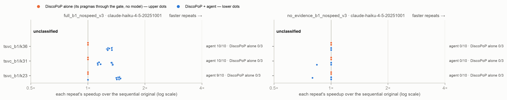

# E2-O3 — does the evidence effect hold on more hidden-order kernels?

*Generated by `agent/tools/campaign.py reports` from `results/campaign.json` and the experiment record (`agent/THESIS_EXPERIMENTS.md`). Edit those, then regenerate — not this file.*

**Status:** done

## The question

On three new kernels whose split order is decided by a fact hidden outside the file in three different ways (an offset pointer, an offset variable, an accessor macro), speed check off, prompt version 3: does the Haiku agent with DiscoPoP's evidence ship more race-free verified parallel programs covering the hot loop than without, and how do Haiku, Sonnet, Opus and Fable alone do on the same kernels?

## Result in one paragraph

O3-i rejected: with DiscoPoP's evidence the Haiku agent finds the hidden split 29/30 (29 FASTER) vs 0/30 without, on three new ways of hiding the order (offset pointer, offset variable, accessor macro); exact p 1.7e-15, family at most 3.5e-11. Models alone over the three: Haiku 0/30 (30 unsafe), Sonnet 2/15, Opus 8/15 (2 faster), Fable 6/15 (5 faster), unsafe 7 to 13 of 15; the agent 0 unsafe.

## Figures

## What is in this folder

- [`analysis/`](analysis/) — the read-out: [`figures.md`](analysis/figures.md), [`main_comparison_stats.md`](analysis/main_comparison_stats.md), [`vs_discopop_alone.md`](analysis/vs_discopop_alone.md)
- [`runs/`](runs/) — 5 archived run(s): the evidence
- [`checks/`](checks/) — 1 verification(s) made during the read-out
- [`preflight/`](preflight/) — 4 smoke run(s) before the launch

## Runs

| run | where | what it is | status | trials | outcomes |
|---|---|---|---|---:|---|
| `t0_1_o3_sizes` | [`preflight/t0_1_o3_sizes/`](preflight/t0_1_o3_sizes/) | T0.1 sizes for tsvc_b1/k23, k31, k36 (server, no model) | valid | 0 |  |
| `t0_11_o3_a` | [`preflight/t0_11_o3_a/`](preflight/t0_11_o3_a/) | T0.11 draw a on tsvc_b1/k23, k31, k36: discopop_capability (budget 0, no model), threads 6/12, repeats 5 | valid | 3 | no-change 3 |
| `t0_11_o3_b` | [`preflight/t0_11_o3_b/`](preflight/t0_11_o3_b/) | T0.11 draw b on tsvc_b1/k23, k31, k36: discopop_capability, no model | valid | 3 | no-change 3 |
| `t0_11_o3_c` | [`preflight/t0_11_o3_c/`](preflight/t0_11_o3_c/) | T0.11 draw c on tsvc_b1/k23, k31, k36: discopop_capability, no model | valid | 3 | no-change 3 |
| `e2o3_agent` | [`runs/e2o3_agent/`](runs/e2o3_agent/) | E2-O3: tsvc_b1/k23, k31, k36 × full_b1_nospeed_v3, no_evidence_b1_nospeed_v3 × 10, Haiku, threads 6/12, repeats 5 | valid | 60 | FASTER 29, no-change 29, parallel-not-faster 2 |
| `e2o3_bare_haiku` | [`runs/e2o3_bare_haiku/`](runs/e2o3_bare_haiku/) | E2-O3: claude-haiku-4-5-20251001 alone on tsvc_b1/k23, k31, k36 × bare_llm_nospeed_v3 × 10 | valid | 30 | BROKEN 28, VERIFY_FAILED 2 |
| `e2o3_bare_sonnet` | [`runs/e2o3_bare_sonnet/`](runs/e2o3_bare_sonnet/) | E2-O3: claude-sonnet-5 alone on tsvc_b1/k23, k31, k36 × bare_llm_nospeed_v3 × 5 | valid | 15 | BROKEN 12, FASTER 2, VERIFY_FAILED 1 |
| `e2o3_bare_opus` | [`runs/e2o3_bare_opus/`](runs/e2o3_bare_opus/) | E2-O3: claude-opus-5-5 alone on tsvc_b1/k23, k31, k36 × bare_llm_nospeed_v3 × 5 | valid | 15 | BROKEN 7, FASTER 2, parallel-not-faster 6 |
| `e2o3_bare_fable` | [`runs/e2o3_bare_fable/`](runs/e2o3_bare_fable/) | E2-O3: claude-fable-5-1 alone on tsvc_b1/k23, k31, k36 × bare_llm_nospeed_v3 × 5 | valid | 15 | BROKEN 9, FASTER 5, parallel-not-faster 1 |
| `e2o3_race_check` | [`checks/e2o3_race_check/`](checks/e2o3_race_check/) | race_check.py over every model-alone program of E2-O3 (bare_llm_nospeed_v3: Haiku, Sonnet, Opus, Fable) and, as the positive control, the agent's parallel programs (both arms), no model | valid | 0 |  |

## From the experiment record (§7 run log)

### `t0_1_o3_sizes`, `t0_11_o3_a`, `t0_11_o3_b`, `t0_11_o3_c`, `e2o3_agent`, `e2o3_bare_haiku`, `e2o3_bare_sonnet`, `e2o3_bare_opus`, `e2o3_bare_fable`, `e2o3_race_check` — 2026-10-03, server, **E2-O3: three more hidden-order kernels** (135 model trials + 61 re-run)

- **Setup.** Pre-registered §6 3 Oct; packages built on the server identical to the Mac's; T0.1 (node 0, idle server): all three at LARGE. Agent (`full_b1_nospeed_v3`, `no_evidence_b1_nospeed_v3`, Haiku × 10) and Haiku alone from 09:45 UTC; the session limit cut the subscription at 10:23 UTC (61 trials recorded failed calls: set aside under `<run>/_call_failed/`, re-run from 18:26 UTC); Sonnet, Opus, Fable alone × 5 after. 0 failed calls in every counted trial. Race check `e2o3_race_check`: all 31 agent programs clean.
- **Result:** §6 3 Oct (E2-O3 read out); `results/E02o3_hidden_order_kernels/stats/`.

## Change-log rows that name these runs (§6)

| Date | Repo | Change | Why |
|---|---|---|---|
| 2026-10-03 | result | **E2-O3 read out — the evidence effect holds on three more hidden-order kernels** (pre-registered command: `e2b1_stats.py --population config/e2o3_population.json`, the v3 arm names, `--family-size 41`; `results/E02o3_hidden_order_kernels/stats/`; race check `e2o3_race_check` on every model-alone program and on the agent's parallel programs — all 31 agent programs clean; 61 call-failed trials re-run, none counted). **O3-i (CONFIRMATORY): the Haiku agent with evidence 29/30 race-free verified parallel programs covering the hot loop (29 FASTER) vs 0/30 without** — `k23` (offset pointer) 9 vs 0, `k31` (offset variable) 10 vs 0, `k36` (accessor macro) 10 vs 0; MH OR infinite, CMH p 8.4e-13, exact p 1.7e-15, campaign family (M = 41) at most 3.5e-11: **rejected**. O3-iii (descriptive): unsafe, the agent 0/30 vs Haiku alone 30/30. **The models alone** (`stats/models_alone.md`), successes (FASTER) and unsafe over the three kernels: Haiku 0/30 (0), 30 unsafe; Sonnet 2/15 (2), 13; Opus 8/15 (2), 7; Fable 6/15 (5), 9 — on `k23` every model alone failed 5/5 (racy); Opus's successes are mostly correct but not faster (run-time schedulers). Control `k48` (E2-V3's cells): both agent arms 10/10, no harm. DiscoPoP alone: no change in all 9 draws. **What it decides:** the effect is not ORDER-2's alone — with the order hidden four different ways (index tables, offset pointer, offset variable, accessor macro) the agent with DiscoPoP's evidence finds the split in 39 of 40 trials and without it in none; the strongest models alone reach at most 5 of 15 FASTER and ship unsafe programs in 7 to 13 of 15 | Result |
| 2026-10-03 | plan | **E2-O3 pre-registered — more hidden-order kernels (the author: "yes the design is ok go ahead"); written before any E2-O3 trial.** Why: E2-V3's evidence effect inside the agent rests on one constructed unit (ORDER-2 X, `k19`), whose order is hidden in index tables; the hidden-order search found no real loop (29 Sep). **Units** (`config/e2o3_population.json`; `prepare_tsvc.py` ORDER-3, packaging v4, hot loop declared): the two statements of ORDER-2b X — S1 accumulates into `u` what S2 wrote into `v` one iteration earlier, S2 reads `u` elements nothing writes, so the only legal split runs S2's loop FIRST, against the text — with the deciding fact hidden outside the file three new ways: `k23` an offset pointer (`u[i] += w[i] * c[i]; v[i] = x[i] * d[i] + c[i];`, the harness sets `v = w + 1`, `x = u + LEN_1D` — f2c's shifted arrays), `k31` an offset variable (`v[i + off]`, `u[i + far]`, `off = -1`, `far = LEN_1D` set with the data), `k36` an accessor macro (`AT1(v, i)` = `v[i - 1]`, `AT2(u, i)` = `u[i + LEN_1D]`, defined in the harness header). **Checked on the Mac before any trial (3 Oct):** the right split reproduces the original output on the default and the perturbed input, the textual split does not (all three, and `k19` as the reference); DiscoPoP finds no Do-All in any; prompt version 3's order statement fires on each hot loop and is right ("the loop holding line 20 has to run completely before the loop holding line 19"). On `k23` DiscoPoP names the read by its own name — "reads an element of `w` that line 20 (`v[i] = …`) writes" — so the statement both orders the split and reveals the alias; recorded, not changed. **Control:** ORDER-2b Y (`k48`), E2-V3's cells (both agent arms × 10, Haiku alone × 10) and E12's strong models alone — not re-run (they ran on SDK 0.2.128; E12's Haiku-alone control showed no SDK effect). **Arms** (speed check off, as E2-V3; Fix 103 in force): the Haiku agent `full_b1_nospeed_v3` and `no_evidence_b1_nospeed_v3` × 10; the model alone `bare_llm_nospeed_v3` with Haiku × 10 and Sonnet 5, Opus 5.5, Fable 5.1 × 5 — 135 model trials; no twins (the author's focus is the agent against the models alone; E2-V3 answered the twin question). DiscoPoP alone from three T0.11 draws (no model). Runs: `t0_1_o3_sizes`, `t0_11_o3_a`–`c` (no model), `e2o3_agent`, `e2o3_bare_haiku`, `_sonnet`, `_opus`, `_fable`. After E1-final and the E12 completion; Opus and Fable never at once. **Primary outcome** (as E2-B1/E2-V3): a race-free verified parallel program covering the hot loop; FASTER and unsafe reported beside it. **Tests:** **O3-i, CONFIRMATORY** — the evidence effect inside the agent, pooled over the three kernels: Mantel-Haenszel OR with the exact one-sided CMH test (`e2b1_stats.py --population config/e2o3_population.json`, test `E2B1-i`), predicted greater; it joins the campaign family (M = 41), Holm. Per kernel: Fisher's exact, descriptive. **O3-iii, descriptive** — unsafe programs, the agent with evidence against Haiku alone. **The models alone**, descriptive as E12: per kernel, successes, FASTER and unsafe of each model alone against the Haiku agent with evidence (Fisher one-sided). **What it decides:** O3-i rejected → the effect is not ORDER-2's alone: wherever DiscoPoP measures the order-deciding flow and version 3 states it, the agent with evidence finds the split the model without it cannot; the per-kernel cells say which hiding mechanisms it covers. Not rejected → the effect is specific to ORDER-2's mechanism, and the thesis says so. **Pilot rule:** the mechanism (D4 inside the agent) is established by E2-V3 (`k19` 10/10 vs 1/10; Sonnet 9/10 vs 0/10); each new kernel's property is checked above; no separate pilot | Plan, pre-registered |

