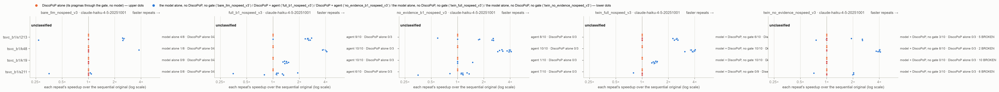

# E2-V3 — prompt version 3 inside the agent: does DiscoPoP's evidence, stated as the split order it imposes, help where the order decides?

*Generated by `agent/tools/campaign.py reports` from `results/campaign.json` and the experiment record (`agent/THESIS_EXPERIMENTS.md`). Edit those, then regenerate — not this file.*

**Status:** done

## The question

On the units where version 3's order statement fires (ORDER-2 X, s1213, s211), speed check off: does the agent with evidence ship more race-free verified parallel programs covering the hot loop than without, inside the agent and on the twins, and fewer unsafe programs than the model alone; with no harm on ORDER-2 Y?

## Result in one paragraph

Evidence effect inside the agent SUPPORTED (prompt v3): MH OR 11.0 (1.9–63.4), exact p 0.0007, family-adjusted ≤ 0.036 — ORDER-2 X 10/10 with evidence vs 1/10 without; s1213 and s211 at the ceiling in both arms (9–10/10). No harm on the control. The agent 0/30 unsafe vs the model alone 25/30. One constructed unit carries the effect; ORDER-2 was repackaged once (R = 1 defect).

## Figures

## What is in this folder

- [`analysis/`](analysis/) — the read-out: [`figures.md`](analysis/figures.md), [`main_comparison_stats.md`](analysis/main_comparison_stats.md), [`vs_discopop_alone.md`](analysis/vs_discopop_alone.md)
- [`exhibits/`](exhibits/) — 3 case studies, below
- [`runs/`](runs/) — 6 archived run(s): the evidence
- [`preflight/`](preflight/) — 8 smoke run(s) before the launch

## Runs

| run | where | what it is | status | trials | outcomes |
|---|---|---|---|---:|---|
| `t0_1_v3_sizes` | [`preflight/t0_1_v3_sizes/`](preflight/t0_1_v3_sizes/) | T0.1 sizes for tsvc_b1/k17, k42, s1213, s211 (server, no model) | valid | 0 |  |
| `t0_11_v3_a` | [`preflight/t0_11_v3_a/`](preflight/t0_11_v3_a/) | T0.11 draw a on tsvc_b1/k17, k42, s1213, s211: discopop_capability (budget 0, no model), threads 6/12, repeats 5 | valid | 4 | no-change 2, parallel-speed-not-measurable 2 |
| `t0_11_v3_b` | [`preflight/t0_11_v3_b/`](preflight/t0_11_v3_b/) | T0.11 draw b on tsvc_b1/k17, k42, s1213, s211: discopop_capability (budget 0, no model), threads 6/12, repeats 5 | valid | 4 | no-change 2, parallel-speed-not-measurable 2 |
| `t0_11_v3_c` | [`preflight/t0_11_v3_c/`](preflight/t0_11_v3_c/) | T0.11 draw c on tsvc_b1/k17, k42, s1213, s211: discopop_capability (budget 0, no model), threads 6/12, repeats 5 | valid | 4 | no-change 2, parallel-speed-not-measurable 2 |
| `e2v3_k17` | [`runs/e2v3_k17/`](runs/e2v3_k17/) | E2-V3 main run: tsvc_b1/k17 × full_b1_nospeed_v3, no_evidence_b1_nospeed_v3, twin_full_nospeed_v3, twin_no_evidence_nospeed_v3, bare_llm_nospeed_v3 × 10 trials, Haiku, threads 6/12, repeats 5 — SUPERSEDED (packaging defect, §6 29 Sep): kept, not analysed | valid | 50 | BROKEN 19, no-change 1, parallel-speed-not-measurable 30 |
| `e2v3_s1213` | [`runs/e2v3_s1213/`](runs/e2v3_s1213/) | E2-V3 main run: tsvc_b1/s1213 × full_b1_nospeed_v3, no_evidence_b1_nospeed_v3, twin_full_nospeed_v3, twin_no_evidence_nospeed_v3, bare_llm_nospeed_v3 × 10 trials, Haiku, threads 6/12, repeats 5 | valid | 50 | BROKEN 12, FASTER 30, VERIFY_FAILED 2, no-change 2, parallel-not-faster 4 |
| `e2v3_s211` | [`runs/e2v3_s211/`](runs/e2v3_s211/) | E2-V3 main run: tsvc_b1/s211 × full_b1_nospeed_v3, no_evidence_b1_nospeed_v3, twin_full_nospeed_v3, twin_no_evidence_nospeed_v3, bare_llm_nospeed_v3 × 10 trials, Haiku, threads 6/12, repeats 5 | valid | 50 | BROKEN 20, FASTER 16, SCAFFOLD_MODIFIED 1, VERIFY_FAILED 1, parallel-not-faster 12 |
| `e2v3_k42` | [`runs/e2v3_k42/`](runs/e2v3_k42/) | E2-V3 main run: tsvc_b1/k42 × full_b1_nospeed_v3, no_evidence_b1_nospeed_v3, twin_full_nospeed_v3, twin_no_evidence_nospeed_v3, bare_llm_nospeed_v3 × 10 trials, Haiku, threads 6/12, repeats 5 — SUPERSEDED (packaging defect, §6 29 Sep): kept, not analysed | valid | 50 | BROKEN 8, VERIFY_FAILED 1, parallel-speed-not-measurable 41 |
| `t0_1_v3b_sizes` | [`preflight/t0_1_v3b_sizes/`](preflight/t0_1_v3b_sizes/) | T0.1 sizes for tsvc_b1/k19, k48 (ORDER-2b; server, no model) | valid | 0 |  |
| `t0_11_v3b_a` | [`preflight/t0_11_v3b_a/`](preflight/t0_11_v3b_a/) | T0.11 draw a on tsvc_b1/k19, k48: discopop_capability (budget 0, no model), threads 6/12, repeats 5 | valid | 2 | no-change 2 |
| `t0_11_v3b_b` | [`preflight/t0_11_v3b_b/`](preflight/t0_11_v3b_b/) | T0.11 draw b on tsvc_b1/k19, k48: discopop_capability (budget 0, no model), threads 6/12, repeats 5 | valid | 2 | no-change 2 |
| `t0_11_v3b_c` | [`preflight/t0_11_v3b_c/`](preflight/t0_11_v3b_c/) | T0.11 draw c on tsvc_b1/k19, k48: discopop_capability (budget 0, no model), threads 6/12, repeats 5 | valid | 2 | no-change 2 |
| `e2v3_k19` | [`runs/e2v3_k19/`](runs/e2v3_k19/) | E2-V3 re-run of ORDER-2 X, repackaged (substitution §6 29 Sep): tsvc_b1/k19 × full_b1_nospeed_v3, no_evidence_b1_nospeed_v3, twin_full_nospeed_v3, twin_no_evidence_nospeed_v3, bare_llm_nospeed_v3 × 10 trials, Haiku, threads 6/12, repeats 5 | valid | 50 | BROKEN 19, FASTER 21, VERIFY_FAILED 1, no-change 9 |
| `e2v3_k48` | [`runs/e2v3_k48/`](runs/e2v3_k48/) | E2-V3 re-run of ORDER-2 Y (control), repackaged: tsvc_b1/k48 × full_b1_nospeed_v3, no_evidence_b1_nospeed_v3, twin_full_nospeed_v3, twin_no_evidence_nospeed_v3, bare_llm_nospeed_v3 × 10 trials, Haiku, threads 6/12, repeats 5 | valid | 50 | BROKEN 9, FASTER 39, VERIFY_FAILED 2 |
| `e2v3s_k19` | not archived yet | E2-V3 with Sonnet (claude-sonnet-5): tsvc_b1/k19 × full_b1_nospeed_v3, no_evidence_b1_nospeed_v3, twin_full_nospeed_v3, twin_no_evidence_nospeed_v3, bare_llm_nospeed_v3 × 10 trials, threads 6/12, repeats 5 | registered |  |  |

## Exhibits

- [`k19_evidence_right_split`](exhibits/k19_evidence_right_split/) — ORDER-2 X with DiscoPoP's evidence (prompt v3): the model splits the loop with line 20's loop first, as the order statement says; the gate keeps it — a race-free verified parallel program covering the hot loop (10 of 10).  
  no DiscoPoP-alone trial to pair with · tsvc_b1/k19, `full_b1_nospeed_v3`, e2v3_k19 rep 1 · pictures: `before_after.png`, `console.png`
- [`k19_no_evidence_reverted`](exhibits/k19_no_evidence_reverted/) — ORDER-2 X without evidence: the model's split in the textual order changes the output, the gate reverts it, and the agent ships the program unchanged (9 of 10).  
  no DiscoPoP-alone trial to pair with · tsvc_b1/k19, `no_evidence_b1_nospeed_v3`, e2v3_k19 rep 1 · pictures: `before_after.png`, `rejected_attempt.png`, `console.png`
- [`k19_twin_wrong_order`](exhibits/k19_twin_wrong_order/) — ORDER-2 X, the twin without evidence (no gate): the wrong-order split is shipped and the output is wrong (9 of 10) — what the gate prevents in the agent.  
  no DiscoPoP-alone trial to pair with · tsvc_b1/k19, `twin_no_evidence_nospeed_v3`, e2v3_k19 rep 1 · pictures: `before_after.png`, `console.png`

## From the experiment record (§7 run log)

### `e2v3_k19`, `e2v3_k48`; `t0_1_v3b_sizes`, `t0_11_v3b_a`, `t0_11_v3b_b`, `t0_11_v3b_c` — 2026-09-29, server, **E2-V3 with ORDER-2 repackaged: the first evidence effect inside the agent** (100 Haiku trials; 6 draws, no model)

- **Setup.** Repository `f45776d7`; `e2v3_k19` lane 0.0, `e2v3_k48` lane 0.1, draws on lanes 1.0/1.1; 12:05 → 14:43 UTC; 0 failed model calls; sweep clean. Packages `tsvc_b1/k19` (X) and `k48` (Y): ORDER-2 with TSVC's 48 repetitions, `u[ju[i]] += v[kv[i]] * c[i]; v[jv[i]] = u[ku[i]] * d[i] + c[i];`, index tables only in the hidden harness header (`prepare_tsvc.py` `_ORDER2B_BODY`; header line with `kv[i] = i-1` for X, `ku[i] = i-1` for Y). Checked before any trial: no Do-All in either; the v3 order statement fires in both and is right; the right split reproduces the output, the wrong one does not. T0.1: k19 and k48 verified at LARGE. The five v3 arms × 10 (`--prompt-version 3`, speed check off).
- **Result.** k19 (X): agent with evidence **10/10** race-free verified parallel programs covering the hot loop (all FASTER) vs **1/10** without (9 no-change: the gate reverted every wrong-order rewrite); twins 10/10 vs 0/10 (all 10 BROKEN); the model alone 0/10 (10 unsafe); DiscoPoP alone 0/3. k48 (Y): agent 10/10 in both arms; twins 10/10 vs 8/10; model alone 1/10. Race checks on every model-only parallel program: 49/49 clean (`analysis/race_check_b/`).
- **Read-out** (the pre-registered E2-V3 command with k19 in place of k17; `results/E02v3_order_statement/stats/e2b1_stats.md`): (i) evidence inside the agent, strata k19/s1213/s211 — **MH OR 11.0 (1.91–63.4), exact p 0.00068, Holm 0.004, campaign family (M = 27) 0.004–0.036: rejected.** (ii) twins OR 2.54, Holm 0.055: not rejected. (iii) unsafe, agent vs model alone, 0/30 vs 25/30: rejected. The effect is carried by k19 alone; s1213 and s211 are at the ceiling in both arms (§6 29 Sep, limits).

### `e2v3_k17`, `e2v3_s1213`, `e2v3_s211`, `e2v3_k42`; `t0_1_v3_sizes`, `t0_11_v3_a`, `t0_11_v3_b`, `t0_11_v3_c` — 2026-09-29, server, **E2-V3: prompt version 3 inside the agent** (200 Haiku trials; 12 draws, no model)

- **Setup.** Repository `dc97e27e`; one lane per unit, 05:04 → 08:12 UTC; 0 failed model calls; sweep clean. Pre-registered (§6 29 Sep): units where the v3 order statement fires on the package's own profile — ORDER-2 X (`k17`, new), `s1213`, `s211` (re-packaged v4) — and ORDER-2 Y (`k42`) as the control; arms `full_b1_nospeed_v3`, `no_evidence_b1_nospeed_v3`, their twins, `bare_llm_nospeed_v3`; N = 10. T0.1: s1213/s211 LARGE; k17/k42 verified at EXTRALARGE, speed not measurable (0.28 s serial).
- **Result.** Agent 29/30 with and 29/30 without evidence on (a) (k17 10/10 both, s1213 9/9, s211 10/10); twins 17/29 vs 9/30; model alone 8/30 (21 unsafe); race checks 94/94 clean. **Defect found in the data (mine):** k17/k42 were packaged with one repetition; the one-iteration repetition loop is a trivial Do-All whose pragma counts as covering the hot loop, so every k17/k42 "success" is that pragma (DiscoPoP alone 3/3). Classified post hoc from the programs: the model split X in the right order 9/10 (agent) and 10/10 (twin) with evidence, 0 without (agent 10/10 unsplit, twin 9/10 wrong order). The units were repackaged (k19/k48) and re-run; k17/k42 are kept and superseded.

## Change-log rows that name these runs (§6)

| Date | Repo | Change | Why |
|---|---|---|---|
| 2026-09-29 | plan | **E2-V3: ORDER-2 repackaged and re-run (the author: "Ok"), recorded before any new trial.** Substitution (`config/e2v3_population.json`): k17 → **k19** (X, confirmatory), k42 → **k48** (Y, control). Same kernel shape with TSVC's 48 repetitions: `u[ju[i]] += v[kv[i]] * c[i]; v[jv[i]] = u[ku[i]] * d[i] + c[i];` — u accumulates (the repetition loop is sequential, and a wrong split corrupts every u through the first repetition), v is assigned (the order-deciding RAW is carried by the inner loop only). Checked on the Mac before any trial: DiscoPoP reports no Do-All in either (DiscoPoP alone should now be 0); version 3's statement fires in both and is right (X: line 20 first; Y: line 19 first, the textual order); the right split reproduces the output digest, the full dump and the perturbed input, the wrong split changes all three. Runs `e2v3_k19`, `e2v3_k48` (the same five v3 arms × 10) and T0.1/T0.11 on the two packages; e2v3_k17/k42 are kept and superseded. **The pre-registered tests are unchanged** and re-read with k19 in place of k17 (strata k19, s1213, s211; s1213 and s211 from their existing runs); the post-hoc split classification is reported beside them again as descriptive | Plan, before the re-run |
| 2026-09-29 | runs | **E2-V3's run list** (all valid, archived under `results/E02v3_order_statement/`): pre-flight `t0_1_v3_sizes`, `t0_11_v3_a`, `t0_11_v3_b`, `t0_11_v3_c` (k17, k42, s1213, s211), `t0_1_v3b_sizes`, `t0_11_v3b_a`, `t0_11_v3b_b`, `t0_11_v3b_c` (k19, k48); main runs `e2v3_s1213`, `e2v3_s211`, `e2v3_k19`, `e2v3_k48` (analysed), `e2v3_k17`, `e2v3_k42` (superseded by the R = 1 packaging defect, kept) | Run log |
| 2026-09-29 | plan | **Two follow-ups pre-registered (the author: "both go ahead") — before any trial.** **(1) E2-V3 with a second model:** ORDER-2 X (`tsvc_b1/k19`) with **Sonnet** (`claude-sonnet-5`), the five v3 arms × 10 (run `e2v3s_k19`; `config/e2v3s_population.json`). Test: E2-V3's (i), agent with vs without evidence, one stratum — reported with the exact one-sided p (the CMH on one stratum is Fisher's test) and its own Holm set of the four tests; the campaign family grows to M = 31. What follows: rejected → the effect is not a Haiku property; not rejected with the no-evidence agent near 10/10 → a stronger model finds the order from the code alone (a ceiling, reported as such). **(2) E2-B1's confirmatory loops, twins only, prompt v3:** `tsvc_b1/s151`, `s161`, `rodinia_b1/bfs` × `twin_full_nospeed_v3`, `twin_no_evidence_nospeed_v3` × 10, Haiku (runs `e2b1v3_twins`, `e2b1v3_bfs`; `config/e2b1v3_population.json`; the order statement fires on none of them). Question: does the v3 wording remove the harm the v1 wording did to the twins (E2-B1: success 3/29 vs 10/30, unsafe 22/29 vs 13/30, OR 0.19)? Criterion, descriptive: harm removed if the v3 twins' MH OR has a 95 % interval containing 1 or above it AND the unsafe count with evidence is not more than 2 above without; the v1 vs v3 contrast reported as the difference of log odds ratios with its interval. Race check on every twin program as in E2-B1. Both on the server at once (lanes split; bfs twins by `--reps`); Sonnet calls weigh more on the shared subscription — a failed call is re-run, never counted | Plan, pre-registered |

