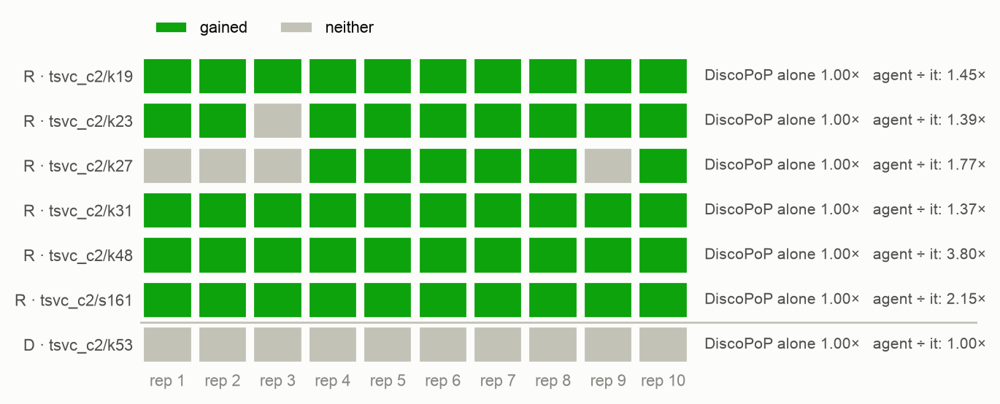
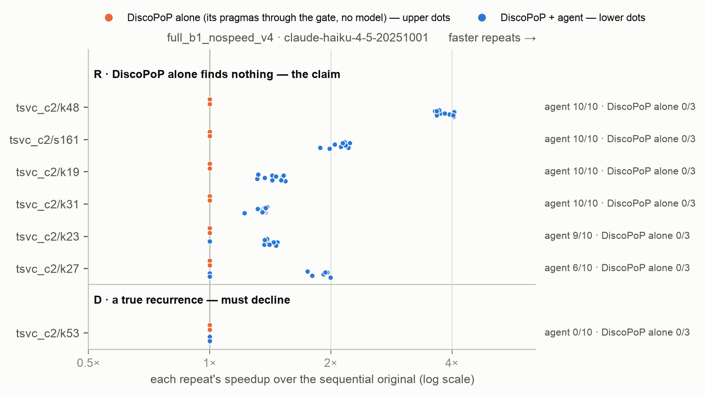

# E2-v6 — the hidden order on clean files: does DiscoPoP's evidence let the agent find a split no reading of the file can find, and can retries with feedback stand in for it?

*Generated by `agent/tools/campaign.py reports` from `results/campaign.json` and the experiment record (`agent/THESIS_EXPERIMENTS.md`). Edit those, then regenerate — not this file.*

**Status:** done

## The question

On seven units of packaging v6 whose deciding fact is outside the benchmark's file — four constructed kernels of three shapes, the real TSVC loop s161, a hidden cycle that must be left alone, and a control whose textual order is right — speed check off, prompt version 4: does the Haiku agent with DiscoPoP's evidence ship more race-free verified parallel programs covering the hot loop than without it, and how do Haiku, Sonnet, Opus and Fable alone do on the same units?

## Result in one paragraph

Five units whose split order is decided outside the file, Haiku, speed check off, race-checked; DiscoPoP alone changes nothing on any unit (three draws). The agent with DiscoPoP's evidence at one attempt: 45 of 50 race-free verified parallel programs covering the hot loop (all 45 FASTER), 0 unsafe; without the evidence 10 of 50, 9 of them on `s161`, where the model finds the order alone — V6-i rejected (MH odds ratio 351, exact p 1.4e-16, family bound at most 4.0e-12). Three attempts with feedback, without evidence: 22 of 50 against 10 — V6-ii rejected (odds ratio 21, p 0.00068, family bound 0.035) — at 17.8 model calls per success against 1.6, and far below the evidence at one attempt (22 against 45); with evidence, three attempts add nothing (46 against 45). On the unit that has to be left alone (`k53`) the one-attempt agent ships no parallel program in 20 trials; at three attempts 8 of 20 trials ship one that parallelizes only a loop the model added, and 2 of those crash at the verification size (an array of the data's length on the stack) — with a third on `k23` the agent's first unsafe programs, 3 of 280. The models alone on the five units: Haiku 3 of 50 with 47 unsafe, Sonnet 7 of 25 with 17, Opus 10 of 25 with 6 unsafe and 9 too slow, Fable 17 of 25 with 7 unsafe; on `k23` every model alone fails all 25. Fast and right on the four constructed kernels: the agent with evidence 35 of 40, Fable 5 of 20, Opus 3 of 20, Sonnet 2 of 20, Haiku 0 of 40. The agent's successes there reach 1.4–1.9× where the expert version reaches 3.1–4.2×: DiscoPoP writes the directive on only part of the loops of the split. 1,181 model calls, $243 API-equivalent.

## Figures

## What is in this folder

- [`analysis/`](analysis/) — the read-out: [`e2v6_readout.md`](analysis/e2v6_readout.md), [`figures.md`](analysis/figures.md), [`main_comparison_stats.md`](analysis/main_comparison_stats.md), [`vs_discopop_alone.md`](analysis/vs_discopop_alone.md)
- [`exhibits/`](exhibits/) — 11 case studies, below
- [`runs/`](runs/) — 10 archived run(s): the evidence
- [`checks/`](checks/) — 2 verification(s) made during the read-out
- [`preflight/`](preflight/) — 1 smoke run(s) before the launch

## Runs

| run | where | what it is | status | trials | outcomes |
|---|---|---|---|---:|---|
| `e2v6_pilot` | [`preflight/e2v6_pilot/`](preflight/e2v6_pilot/) | E2-v6 mechanism pilot (the rule: a with/without pilot before a long experiment): tsvc_c2/k19 and k27 × full_b1_nospeed_v4, no_evidence_b1_nospeed_v4 × 2, Haiku — never counted | valid | 8 | FASTER 3, no-change 5 |
| `e2v6_agent_1` | [`runs/e2v6_agent_1/`](runs/e2v6_agent_1/) | E2-v6: tsvc_c2/k19, k23 × full_b1_nospeed_v4, no_evidence_b1_nospeed_v4 × 10, Haiku, threads 6/12, repeats 5 | valid | 40 | FASTER 19, no-change 20, parallel-not-faster 1 |
| `e2v6_agent_2` | [`runs/e2v6_agent_2/`](runs/e2v6_agent_2/) | E2-v6: tsvc_c2/k31, k27 × full_b1_nospeed_v4, no_evidence_b1_nospeed_v4 × 10, Haiku, threads 6/12, repeats 5 | valid | 40 | FASTER 16, no-change 24 |
| `e2v6_agent_3` | [`runs/e2v6_agent_3/`](runs/e2v6_agent_3/) | E2-v6: tsvc_c2/s161, k53, k48 × full_b1_nospeed_v4, no_evidence_b1_nospeed_v4 × 10, Haiku, threads 6/12, repeats 5 | valid | 60 | FASTER 38, no-change 21, parallel-not-faster 1 |
| `e2v6_bare_haiku` | [`runs/e2v6_bare_haiku/`](runs/e2v6_bare_haiku/) | E2-v6: claude-haiku-4-5-20251001 alone on the seven units × bare_llm_nospeed_v4 × 10 | valid | 70 | BROKEN 61, FASTER 4, VERIFY_FAILED 5 |
| `e2v6_bare_sonnet` | [`runs/e2v6_bare_sonnet/`](runs/e2v6_bare_sonnet/) | E2-v6: claude-sonnet-5 alone on the seven units × bare_llm_nospeed_v4 × 5 | valid | 35 | BROKEN 27, FASTER 7, changed-not-parallel 1 |
| `e2v6_bare_opus` | [`runs/e2v6_bare_opus/`](runs/e2v6_bare_opus/) | E2-v6: claude-opus-5-5 alone on the seven units × bare_llm_nospeed_v4 × 5 | valid | 35 | BROKEN 17, FASTER 8, parallel-not-faster 10 |
| `e2v6_bare_fable` | [`runs/e2v6_bare_fable/`](runs/e2v6_bare_fable/) | E2-v6: claude-fable-5-1 alone on the seven units × bare_llm_nospeed_v4 × 5 | valid | 35 | BROKEN 8, FASTER 10, parallel-not-faster 17 |
| `e2v6_race_check` | [`checks/e2v6_race_check/`](checks/e2v6_race_check/) | race_check.py (server, no model) over every model-alone program of E2-v6 and, as the positive control, every program of the agent's four arms (an unchanged program is recorded as such) | valid | 0 |  |
| `e2v6_fb_1` | [`runs/e2v6_fb_1/`](runs/e2v6_fb_1/) | E2-v6, the feedback arms: tsvc_c2/k19, k23 × full_nospeed_v4, no_evidence_nospeed_v4 (three attempts per region) × 10, Haiku, threads 6/12, repeats 5 | valid | 40 | BROKEN 1, FASTER 24, no-change 15 |
| `e2v6_fb_2` | [`runs/e2v6_fb_2/`](runs/e2v6_fb_2/) | E2-v6, the feedback arms: tsvc_c2/k31, k27 × full_nospeed_v4, no_evidence_nospeed_v4 (three attempts per region) × 10, Haiku, threads 6/12, repeats 5 | valid | 40 | FASTER 23, no-change 16, parallel-not-faster 1 |
| `e2v6_fb_3` | [`runs/e2v6_fb_3/`](runs/e2v6_fb_3/) | E2-v6, the feedback arms: tsvc_c2/s161, k53, k48 × full_nospeed_v4, no_evidence_nospeed_v4 (three attempts per region) × 10, Haiku, threads 6/12, repeats 5 | valid | 60 | BROKEN 2, FASTER 37, no-change 12, parallel-not-faster 9 |
| `e2v6_stack_check` | [`checks/e2v6_stack_check/`](checks/e2v6_stack_check/) | verify-source (server, no model; added after the data, descriptive) over the agent's three programs that crash in the final run — k23 rep 10, k53 rep 3 and rep 10 of full_nospeed_v4: as the harness ran them, and with the stack limits lifted (ulimit -s unlimited, OMP_STACKSIZE=1G); threads 6/12, repeats 5 | valid | 6 | VERIFY_FAILED 3, parallel-not-faster 3 |

## Exhibits

- [`k19_v6_feedback_aligned_loop`](exhibits/k19_v6_feedback_aligned_loop/) — E2-v6, three attempts without evidence: led by DiscoPoP's blockers of its own rewrites, the model shifts the first statement by one iteration so that the whole loop is one parallel loop — 5.04×, above the expert version (4.14×) and the evidence-guided split (1.45×); 1 of 10 trials, 10 model calls.  
  no DiscoPoP-alone trial to pair with · tsvc_c2/k19, `no_evidence_nospeed_v4`, e2v6_fb_1 rep 9 · pictures: `before_after.png`, `rejected_attempt.png`, `console.png`
- [`k23_v6_evidence_right_split`](exhibits/k23_v6_evidence_right_split/) — E2-v6, with evidence, one attempt: the split with the second statement's loop first — the order the file does not show — and DiscoPoP's directive on that loop; the first statement's loop stays sequential (1.47× where the expert version reaches 3.33×).  
  no DiscoPoP-alone trial to pair with · tsvc_c2/k23, `full_b1_nospeed_v4`, e2v6_agent_1 rep 1 · pictures: `before_after.png`, `console.png`
- [`k23_v6_fable_alone_racy`](exhibits/k23_v6_fable_alone_racy/) — E2-v6, Fable alone on `k23`: both statements in one parallel loop as they stand, 4.3× and a wrong output — the offset pointer that links the iterations is set outside the file; every model alone fails all its `k23` trials (25 of 25).  
  no DiscoPoP-alone trial to pair with · tsvc_c2/k23, `bare_llm_nospeed_v4`, e2v6_bare_fable rep 1 · pictures: `before_after.png`, `console.png`
- [`k23_v6_no_evidence_reverted`](exhibits/k23_v6_no_evidence_reverted/) — E2-v6, without evidence, one attempt: the model splits in the order of the text, the output changes, the gate rejects the rewrite at every region, and the agent ships the program unchanged (9 of 10).  
  no DiscoPoP-alone trial to pair with · tsvc_c2/k23, `no_evidence_b1_nospeed_v4`, e2v6_agent_1 rep 1 · pictures: `before_after.png`, `rejected_attempt.png`, `console.png`
- [`k23_v6_stack_array_crash`](exhibits/k23_v6_stack_array_crash/) — E2-v6, three attempts with evidence: the model copies `c` and `d` into arrays of the data's length inside the function and DiscoPoP's directive makes them `firstprivate` — right at the size the agent works with, a segmentation fault at the verification size; one of the agent's three unsafe programs.  
  no DiscoPoP-alone trial to pair with · tsvc_c2/k23, `full_nospeed_v4`, e2v6_fb_1 rep 10 · pictures: `before_after.png`, `rejected_attempt.png`, `console.png`
- [`k27_v6_evidence_not_enough`](exhibits/k27_v6_evidence_not_enough/) — E2-v6, with evidence, one attempt: the model splits the three statements in the order of the text although the request states the order; the output changes, the gate rejects the rewrite at all three regions and the program stays unchanged (4 of 10 at one attempt, 2 of 10 at three).  
  no DiscoPoP-alone trial to pair with · tsvc_c2/k27, `full_b1_nospeed_v4`, e2v6_agent_2 rep 1 · pictures: `before_after.png`, `rejected_attempt.png`, `console.png`
- [`k27_v6_evidence_three_loops`](exhibits/k27_v6_evidence_three_loops/) — E2-v6, with evidence, one attempt, three statements: the split into three loops in the only legal order (second, third, first) in one call; DiscoPoP's directive on two of the three loops (1.92× where the expert version reaches 4.17×).  
  no DiscoPoP-alone trial to pair with · tsvc_c2/k27, `full_b1_nospeed_v4`, e2v6_agent_2 rep 7 · pictures: `before_after.png`, `console.png`
- [`k53_v6_opus_orders_at_run_time`](exhibits/k53_v6_opus_orders_at_run_time/) — E2-v6, Opus alone on the unit that has to be left alone: an inspector sorts the iterations into dependence levels at run time and runs each level in parallel — right for any tables, here close to one level per iteration: 0.03×. The same construction puts Opus's `k19` and `k27` programs past the 30-minute limit and its `k48` programs at 0.01×.  
  no DiscoPoP-alone trial to pair with · tsvc_c2/k53, `bare_llm_nospeed_v4`, e2v6_bare_opus rep 2 · pictures: `before_after.png`, `console.png`
- [`k53_v6_retries_add_copy_loops`](exhibits/k53_v6_retries_add_copy_loops/) — E2-v6, three attempts without evidence on the unit that has to be left alone: the model copies `u` and `v`, runs the kernel's loop sequentially on the copies and copies back in parallel — a parallel program that parallelizes nothing of the kernel (0.94×); 8 of 20 three-attempt trials end like this, none of 20 at one attempt.  
  no DiscoPoP-alone trial to pair with · tsvc_c2/k53, `no_evidence_nospeed_v4`, e2v6_fb_3 rep 7 · pictures: `before_after.png`, `rejected_attempt.png`, `console.png`
- [`k53_v6_stack_array_crash`](exhibits/k53_v6_stack_array_crash/) — E2-v6, three attempts with evidence, the unit that has to be left alone: the kernel's loop runs sequentially on a full-length copy on the stack and only the copy-back loop is parallel, with the copy `firstprivate` — a segmentation fault at the verification size.  
  no DiscoPoP-alone trial to pair with · tsvc_c2/k53, `full_nospeed_v4`, e2v6_fb_3 rep 3 · pictures: `before_after.png`, `rejected_attempt.png`, `console.png`
- [`k53_v6_stack_array_crash_b`](exhibits/k53_v6_stack_array_crash_b/) — E2-v6, the second crash on `k53` (rep 10): three snapshots of the data's length on the stack, a parallel copy-back loop with `firstprivate(u_snapshot)`.  
  no DiscoPoP-alone trial to pair with · tsvc_c2/k53, `full_nospeed_v4`, e2v6_fb_3 rep 10 · pictures: `before_after.png`, `rejected_attempt.png`, `console.png`

## From the experiment record (§7 run log)

### `e2v6_pilot`; `e2v6_agent_1`, `e2v6_agent_2`, `e2v6_agent_3`, `e2v6_fb_1`, `e2v6_fb_2`, `e2v6_fb_3`, `e2v6_bare_haiku`, `e2v6_bare_sonnet`, `e2v6_bare_opus`, `e2v6_bare_fable`; `e2v6_race_check`, `e2v6_stack_check` — 2026-10-05/06, server, **E2-v6: the hidden order on clean files, evidence × attempts, and four models alone** (455 trials; the pilot's 8 never counted)

- **Deviations first** (§6, 5 and 6 Oct): two pauses at the subscription's session limit (5 Oct 20:30 UTC, 6 Oct 01:26 UTC) — 16 trials that lost a model call and 7 cut off mid-way are set aside in their runs (`_call_failed/`, `_interrupted/`) and re-run under the same run ids, none counted; a restart of the Mac session (6 Oct about 18:00 UTC) took the launcher with it while the last job ran on — a read-only wait handed over to it after the job. The registered tool was run on the server's working copies before the end, on complete arms only; nothing was added, dropped or re-run on what was seen. Two additions after the data, descriptive: the race check over all four agent arms and `e2v6_stack_check`.
- **Setup.** Pre-registered §6 5 Oct with its amendment (two three-attempt arms). Packaging v6 (`tsvc_c2`), prompt version 4, speed check off, threads 6 and 12, 5 repeats, one 12-core group per job; pilot `e2v6_pilot` GO (with evidence 3 of 4, without 0 of 4). First part at commit `1258cd677` (5 Oct 15:15 UTC: the one-attempt runs `e2v6_agent_1`–`3` to 19:27, Fable alone, the three-attempt runs begun); resumed parts and Sonnet, Haiku and Opus alone at `4adf76ec2` (nothing of the runner, the agent or the `tsvc_c2` packages differs between the two); last trial 6 Oct 20:30 UTC. Opus and Fable alone never at once; every sweep clean; 0 failed model calls among the 455 counted; 1,181 model calls, $243 API-equivalent.
- **Checks** (server, no model, commit `a09c1bf6e` and `0758ef82a`): `e2v6_race_check` — every model-alone program and every program of the agent's four arms: all 172 changed programs of the agent clean, no count changed for a model alone. `e2v6_stack_check` — the agent's three crashing programs through `verify-source`: they crash as run, and verify exact at 0.43×, 0.81×, 0.74× with the stack limits lifted.
- **Result:** §6 6 Oct (E2-v6 read out); `results/E02v6_hidden_order_clean_files/` — `stats/` (the registered tests, `README.md` says how to read the tool's rows), `analysis/e2v6_readout.md`, `stats/models_alone.md`, `exhibits/` (eleven case studies).

## Change-log rows that name these runs (§6)

| Date | Repo | Change | Why |
|---|---|---|---|
| 2026-10-06 | result | **E2-v6 read out — on clean files the evidence decides whether the agent finds a split whose order the file does not show (45 of 50 against 10 of 50); retries with feedback recover part of it at eleven times the calls and do harm where nothing can be gained; the agent ships its first three unsafe programs; and its successes reach about a third to a half of the expert version's speed.** Registered commands (`results/E02v6_hidden_order_clean_files/stats/README.md`): `e2b1_stats.py --population config/e2v6_population.json`, the v4 arm names, `--family-size 52`; the descriptive part `tools/e2v6_readout.py` (`analysis/e2v6_readout.md`) and `e12_stats.py --set e2v6` (`stats/models_alone.md`). Race check `e2v6_race_check`: every model-alone program (175) and every program of the agent's four arms (280): all 172 changed programs of the agent clean; of the models alone every program the harness had scored FASTER or parallel-not-faster is clean and every race lies on a program the harness had already called BROKEN (at TSan: Haiku 49, Sonnet 24, Opus 5, Fable 5; at the schedule matrix 3 more) — the race check changes no count. 455 trials, 0 failed calls (deviations: the row below). **V6-i (CONFIRMATORY) — rejected.** The Haiku agent at one attempt, race-free verified parallel programs covering the hot loop: with evidence **45 of 50** (all 45 FASTER), without **10 of 50** (8 FASTER) — `k19` 10 vs 0, `k23` 9 vs 1, `k27` 6 vs 0, `k31` 10 vs 0, `s161` 10 vs 9; MH odds ratio 351 (95 % 26–4702), CMH one-sided p 7.8e-14, exact p 1.4e-16; campaign family (M = 52) at most 4.0e-12. Unsafe: 0 of 50 in both arms. The effect is on four units, not five: on `s161`, the one real TSVC loop, Haiku finds the order without the evidence (the registration named it as a unit that could fail). **V6-ii — rejected.** Without evidence, three attempts with feedback against one: **22 of 50** (18 FASTER) vs 10 of 50 — `k19` 2 vs 0, `k23` 4 vs 1, `k27` 1 vs 0, `k31` 5 vs 0, `s161` 10 vs 9; odds ratio 21 (2.4–187), one-sided p 0.00068, exact 0.00034; family bound 0.035. **Descriptive, as registered.** (1) The feedback does not stand in for the evidence: three attempts without it 22 of 50 against one attempt with it 45 of 50 (odds ratio 0.03, two-sided p 3.3e-07), at 7.8 model calls per trial and 17.8 per success against 1.5 and 1.6. (2) With evidence, three attempts add nothing: 46 against 45 (p = 1; `k27` 8 vs 6, `k23` 8 vs 9). (3) The interaction in H5b's form: two more attempts add 24 points without evidence and 2 with it; ratio of the odds ratios 15.8 (1.1–222), z = 2.04, one-sided p 0.021. (4) Control `k48`: 10 of 10, all FASTER, in all four agent arms — no harm. **The unit that has to be left alone, `k53`.** At one attempt the agent ships no parallel program in 20 trials, as expected. At three attempts it ships one in 8 of 20 (4 with evidence, 4 without): every one keeps the kernel's loop sequential and makes a copy loop parallel that the model added (read from the programs; `hot_loop_covered` is true for five of them — their copy-back loop writes the kernel's arrays) — none is faster, and two crash (below). That is the cost of the same retries that V6-ii credits: asked again after "no parallel pattern", the model delivers a parallel loop where none is to be had. **The agent's first unsafe programs: 3 of 280 trials**, all in the three-attempt arm with evidence — `k23` rep 10, `k53` rep 3 and rep 10 (BROKEN: a segmentation fault in the first timed run at the verification size). The model put arrays of the data's length inside the function and DiscoPoP's directive lists them `firstprivate`; the gate tests at the size the agent is given, where they fit. `e2v6_stack_check` (the harness's own verification, no model): as run, all three crash again at 6 threads; under `ulimit -s unlimited` and `OMP_STACKSIZE=1G` all three verify exact and run at 0.43×, 0.81× and 0.74× of the original — right, and slower. Whether the agent's speed check, which runs at the agent's size and is off in this experiment, would have refused them is not measured. The text of every changed program (`analysis/e2v6_readout.md`): these three are the only ones of the agent's 172 with an automatic array of the data's length; the agent's other temporaries are on the heap (12), as are Opus's and Fable's (25 of 35 programs each). **The models alone** (five units; successes · of them FASTER · unsafe · too slow): Haiku 3 of 50 · 3 · 47 · 0; Sonnet 7 of 25 · 7 · 17 · 0; Opus 10 of 25 · 8 · 6 · 9; Fable 17 of 25 · 10 · 7 · 1. On `k23` all four fail every trial (25 of 25 unsafe; the race check finds the race in all 25).  Fast and right on the four constructed kernels: the agent with evidence 35 of 40; Fable 5 of 20, Opus 3 of 20, Sonnet 2 of 20 (all on `k31`), Haiku 0 of 40. On the control `k48`, where a plain split is right, the agent is 10 of 10 FASTER (3.8×) and no model alone ships a fast right program except Haiku once: Haiku and Sonnet are unsafe in 14 of 15, Opus and Fable are right and slow (0.01× and 0.49×). **An expectation not met:** the registration said the models alone cannot tell `k53` from `k19` and `k48`. Haiku and Sonnet cannot (15 of 15 unsafe). Opus and Fable do not need to: on the units with index tables they write an inspector that orders the iterations at run time — right whatever the tables hold (their 10 `k53` programs: 9 verified, 1 past the 30-minute limit, none faster), and so slow where the dependences form a chain that 11 of Opus's 35 programs and 1 of Fable's exceed the 30-minute limit (correct, too slow: reported, not unsafe). Without the measured fact a careful model pays for safety with all the speed; a less careful one loses the safety. **How fast the agent's successes are — new in this read-out.** Median speedup of the successes with evidence at one attempt: `k19` 1.45×, `k23` 1.40×, `k27` 1.93×, `k31` 1.37× — the expert versions through the same verification (`t0_14_c2_refs`) reach 4.14×, 3.33×, 4.17×, 3.09×; on `k48` the agent reaches 3.80× of the expert's 4.13×. Cause, read from the programs and logs: after the right split DiscoPoP reports Do-All for the loop of the assignment and not for the loop of `u[…] += …`, which reads what the loop before it wrote; the agent's directive therefore stands on one of two loops (two of three on `k27`). On `k48` the same statement's loop, reading elements nothing writes, gets its directive. Why DiscoPoP reports no pattern there is NOT examined yet — open, and the next thing to look at (a DiscoPoP defect would be fixed at the root, B-numbered). One trial without evidence found a better program than the split: led by DiscoPoP's blockers of its own rewrites, the model shifted the first statement by one iteration and made the whole loop one parallel loop, 5.04× (`k19` rep 9, 10 calls). **The repetition loop:** kept as it is by every changed program of the agent (172 of 172); 2 of Opus's and 6 of Fable's programs write it two to four times — the original loop again as the fallback when an allocation fails, each copy with its `dummy` call; none removes or reorders a repetition. **Cost, API-equivalent:** 1,181 model calls, $243 — the one-attempt arms $16 and $18, the three-attempt arms $47 and $112, Haiku alone $6, Sonnet $12, Opus $7, Fable $25. The amendment estimated "about $40 more" for the two three-attempt arms; they cost $159, most of it the arm without evidence, which makes 7.8 calls per trial. **Expectations of the registration:** met on `k19`, `k23`, `k31` (most trials with evidence, none or one without), `k27` (a majority with, none without), V6-i; `s161` was open and shows no advantage; not met for the strongest models on `k53` (above). **What it decides:** the mechanism claim stands on clean files, without our note and with the corrected sentence — where the deciding fact is outside the file, DiscoPoP's measurement is what finds the split, for a small model inside the pipeline (45 of 50 against 10) and against every stronger model alone (35 of 40 fast and right against at most 5 of 20). Stated with it: the effect is the split's ORDER, not its full parallelization (about a third to a half of the expert's speed); feedback is a second, weaker and far costlier route to the same fact; and more attempts are not free — they produced the agent's only unsafe programs and its only pointless ones. Eleven case studies: `results/E02v6_hidden_order_clean_files/exhibits/`. **Put to the author:** whether the gate gets a guard against arrays of the data's length on the stack (the agent has one version for everything that remains, the decision of 2 Oct, and memory handling is the model's decision, 4 Oct), and the examination of DiscoPoP's missing Do-All on the second loop | Result, E2-v6 |
| 2026-10-06 | plan | **E2-v6, added after the data and before the read-out (descriptive, no model): a stack check on the agent's three programs that crash in the final run, and the race check on all four agent arms.** Three trials of the three-attempt arm with evidence (`full_nospeed_v4`: `k23` rep 10, `k53` rep 3 and rep 10) are BROKEN by the registered rule: the program passed the agent's checks and the harness's output check at the size the agent works with, and the first timed run at the verification size ended with a segmentation fault (`final_run_failed_T6`, return code −11). In each the model put arrays of the data's length inside the function (`real_t x[LEN_1D]`) and DiscoPoP's directive lists them `firstprivate`. Run by hand on idle cores on 6 Oct, the three binaries crash at 1, 6 and 12 threads and run through with the stack limits lifted. **`e2v6_stack_check`** (registered, `checks`) puts that through the harness's own verification so that it is on record with the output compared: each of the three shipped files with `verify-source` (threads 6 and 12, 5 repeats, the unit's verification size) once as the harness ran it and once under `ulimit -s unlimited` and `OMP_STACKSIZE=1G`. It changes no count: the three trials stay BROKEN (the rule of 28 Sep: a stack array sized by the problem that crashes at the verification size is a crash). **The race check** (`e2v6_race_check`) was registered before the amendment for "the agent's parallel programs (both arms)"; it is run over every program of all FOUR agent arms (an unchanged program is recorded as such) and over every model-alone program | Plan, E2-v6 |
| 2026-10-06 | deviation | **E2-v6 ran to its end (5 Oct 15:15 UTC – 6 Oct 20:30 UTC): 455 trials, every one with all its model calls, credential sweep clean — after a second pause at the session limit and a restart of the Mac session that took the launcher with it; no counted trial is affected. Recorded before the race check and the read-out.** **The second pause (6 Oct 01:26 UTC).** The watch added after the first pause stopped every job at the first "session limit" line in a running trial's log; 267 of 455 trials were done (the one-attempt arms and Fable alone complete). Four trials were cut off mid-way and are in `<run>/_interrupted/` (stamp `1006_0302`): `e2v6_fb_1` `k23` rep 3 and `e2v6_fb_3` `k53` rep 1 of `no_evidence_nospeed_v4`, `e2v6_fb_2` `k27` rep 9 of `full_nospeed_v4`, `e2v6_bare_sonnet` `k19` rep 3; no trial lost a model call in this pause. **Resumed 03:02 UTC** under the same run ids and invocations, by a launcher that needs no session (`e2v6_auto.sh`, the author: "can you continue on your on"): at a "session limit" line it stops every job, sets aside what was cut off or lost a call, waits for the reset the message names, re-launches what is owed, and ends only when every run has all its trials. It was not needed again: no trial log after 03:02 UTC shows the limit (the author reported 99 % of the limit at about 04:50 UTC; it reset before a call was refused). Launched after the resume: the three three-attempt runs and Sonnet alone (03:02), Haiku alone (04:41), Opus alone (05:44 — Fable alone had ended at 01:15: never at once). **The restart (about 18:00 UTC).** The session on the Mac ended and took the launcher, a task of that session, with it; the one job still running (Opus alone, 32 of 35) ran on. The launcher was NOT started again while that job ran — its clean-up sets aside every trial folder without a result and would have taken the running trial from its job, and it would have launched the run a second time. A wait that only reads the server, started detached from the session (`detach.py`), handed over to the launcher when no job ran (20:35 UTC): nothing owed, sweep clean. **What is counted:** 455 trials with 0 failed calls — 1,181 model calls (the one-attempt arms 311, the three-attempt arms 695, the models alone 175); the 7 interrupted and the 16 failed-call trials of the two pauses are archived with their runs (`_interrupted/`, `_call_failed/`) and never counted. **Why 29 hours and not the 10 to 12 I estimated:** the two pauses (about 3 h), and the stronger models alone, whose programs on several units are correct but very slow — the harness times every program ten times (two thread counts × five) with a 30-minute limit per run: Opus alone 14.8 h for 35 trials (12 trials ended at that limit, 18 took 25 minutes or more), Fable alone 9.1 h (1 and 7). **Looked at before the end, stated:** the author asked for the progress throughout; to answer, the registered tool was run on the server's working copies, reading only — V6-i's arms on 6 Oct 04:50 UTC (complete since 5 Oct 19:27), the three-attempt arms 09:50 UTC (complete since 07:22), and the harness's outcomes of the models alone 14:20 UTC, with Opus alone at 29 of 35. Every arm of both tests was complete when it was looked at; the number of trials was fixed by the registration, and no trial was added, dropped or re-run on what was seen. Three archived binaries of the agent's that crash in the final run were re-run by hand on idle cores (0–11, 11:13 UTC, 21 runs of seconds each, in a scratch directory; Opus alone was then in `k27` rep 5 on cores 36–47, a trial that ended at the 30-minute limit) — read out with the experiment | Deviation, E2-v6 |
| 2026-10-05 | deviation | **E2-v6 paused at the subscription's session limit (about 20:30 UTC) and resumed after its reset; the trials that lost a model call are re-run, never counted; the one-attempt arms — V6-i's data — were complete before it.** The author: "i am hiting my limits it will reset in 1 hr 19 min". State at that moment: `e2v6_agent_1`, `e2v6_agent_2`, `e2v6_agent_3` finished (140 trials, 0 failed calls, 18:24–19:27 UTC); the three-attempt runs `e2v6_fb_1`, `e2v6_fb_2`, `e2v6_fb_3` at 14, 12 and 16 trials; Fable alone at its 19th; Haiku, Sonnet and Opus alone not launched. **Done at once:** the Mac queue stopped; the three running three-attempt jobs killed (two of their trials already showed "session limit"; left running they would have gone through every remaining trial with failed calls); Fable alone left to finish the program it was timing — its 16 remaining trials then failed their call and are moved to `e2v6_bare_fable/_call_failed/` (`k27` rep 5, `k48` 1–5, `k53` 1–5, `s161` 1–5); the three agent trials cut off mid-way are moved to `<run>/_interrupted/` (`k19` rep 5, `k31` rep 3, `s161` rep 7 of `no_evidence_nospeed_v4`) and start again; credential sweep clean. **Resumed** under the same run ids and invocations (the runner skips finished trials). The resumed part runs at a later commit than the first: record entries, results, and packaging v7 in the generator (merged in this pause; nothing of the runner, the agent or the `tsvc_c2` packages changes — `test_integrity` 1c holds the packages to the generator's v6 rendering). The launcher now watches for "session limit" in the running trials' logs and stops every job at the first one. Opus and Fable alone still never run at once (the author was asked whether to lift that for this experiment and has not answered) | Deviation |
| 2026-10-05 | result | **E2-v6's mechanism pilot (`e2v6_pilot`, 8 Haiku agent trials, never counted): GO by the registered rule — with evidence 3 of 4, without 0 of 4.** `k19`: with evidence 2 of 2 race-free verified parallel programs covering the hot loop (one model call each), without 0 of 2 (three calls each, no change); `k27` (the three-statement chain): with evidence 1 of 2 — in the other trial every rewrite changed the output and the gate refused it, no change — without 0 of 2. The order sentence stands in the logged request of all four trials with evidence and in none without; 0 failed calls; the full dump exact on both inputs in all eight. The main runs are launched on the packages as registered (`tsvc_c2`; the finding of the row below does not touch E2-v6's outcome) | Result, pilot |
| 2026-10-05 | plan | **E2-v6 amended before any trial: two THREE-attempt arms — evidence and feedback as two factors (the author).** The author asked what separates Haiku alone from the Haiku agent without the evidence, whether DiscoPoP re-profiling the rewrite and writing the directives "isn't … evidence", why the experiment runs at one attempt, and for "an experiment that will test the effectiveness of the feedback of the agent"; then: "yes we can [add] the two three-attempt setups to the hidden-order experiment". **What the code does (read before answering; `llm/render.py`, `llm/client.py`, `phases/verdicts._rewrite_feedback`):** `--evidence none` removes every DiscoPoP section from the REQUEST a region starts with. DiscoPoP is still used after the model has written: it re-profiles the rewrite, and where it finds a parallel loop it writes the directive. With one attempt per region nothing of that reaches the model. With more attempts a rejected attempt goes back in the same conversation with its reason — the gate's diagnostic (does not compile, output differs, a race), or, after a rewrite DiscoPoP still cannot parallelize, "DiscoPoP STILL finds no parallel pattern" followed by DiscoPoP's blockers OF THAT REWRITE, whatever `--evidence` says. So the author's point holds: in a no-evidence arm with retries, DiscoPoP's analysis reaches the model through the feedback; that is why the evidence contrast (V6-i) runs at ONE attempt (as E2-B1, E2-V3, E2-O3; `args.py`: "pair the ablation with --budget 1 to isolate the two"). **Added arms** (`arms.json`): `full_nospeed_v4` — evidence, three attempts; `no_evidence_nospeed_v4` — no evidence in the request, three attempts (feedback, DiscoPoP's blockers of the model's own rewrite included). Both × 10 on the seven units, Haiku: 140 more agent trials (455 model trials in all), about $40 more; runs `e2v6_fb_1` (`k19`, `k23`), `e2v6_fb_2` (`k31`, `k27`), `e2v6_fb_3` (`s161`, `k53`, `k48`). The four agent arms are a 2 × 2: evidence in the request (yes, no) × attempts (one, three). **Tests added:** **V6-ii, pre-registered, joins the family (M = 52)** — without evidence in the request, three attempts with feedback against one, pooled over the five units of (a): exact one-sided CMH, predicted greater (the feedback finds some of what the evidence states). **Descriptive, the question the author asked:** (1) can the feedback stand in for the evidence — `no_evidence_nospeed_v4` against `full_b1_nospeed_v4` per unit and pooled (two-sided), with the model calls each arm needs per success; (2) what three attempts add WITH evidence (`full_nospeed_v4` against `full_b1_nospeed_v4` — little room is expected: one attempt was at 29 of 30 in E2-O3); (3) the interaction, as E2's H5b; (4) on the decline unit `k53` and the control `k48`, all four arms beside each other. **Not separated by this design, stated:** the feedback's two parts — the gate's own diagnostics and DiscoPoP's blockers of the rewrite — arrive together; taking DiscoPoP's part out of the feedback needs a switch the agent does not have. V6-i and the pilot are unchanged | Plan, amendment before any trial |
| 2026-10-05 | plan | **E2-v6 pre-registered — the hidden order on clean files (packaging v6, prompt version 4); written before any E2-v6 trial, the pilot included.** Why: E2-V3 and E2-O3 showed the evidence effect inside the agent on packaging v4, where every request carried our note and a false size sentence and the order sentence was version 3's (wrong on several loops); E1-v6 has just shown that on loops whose dependences are in plain sight a strong model alone reaches further than the Haiku agent. This is the experiment where the deciding fact is NOT in the file. **Units** (`config/e2v6_population.json`; suite `tsvc_c2`): (a) the order runs against what the file shows — `k19` (index tables), `k23` (an offset pointer), `k31` (an offset variable), `k27` (three statements, legal order second-third-first), `s161` (a real TSVC loop: the sign pattern of `b`); (b) control `k48` — the textual order is right; (c) decline unit `k53` — `k19`'s text with tables that make the statements feed each other: the loop has to be left alone. **Checked without a model:** class of every unit in three draws (`t0_11_c2_a`–`c`: DiscoPoP alone changes nothing; `k53` D by declaration); the order statement of prompt version 4 on those draws' profiles, the repetition loop's own request included — right on 44 of 44 packages in each draw (`results/T0_instruments/T0.17_repetition_loop_inside/analysis/order_replay_class_draws/`; version 3 wrong on 6 to 7, `k27` and `k53` among them): `k27` gets both orders, `k53` "feed each other", `k48` the textual order; expert solutions accepted for `k19`, `k23`, `k27`, `k31`, `k48` (`t0_14_c2_refs`; `s161` has none on file — its truth is the order written down from its data, `order_replay.py`). **Arms** (speed check off, as E2-V3 and E2-O3): the Haiku agent `full_b1_nospeed_v4` and `no_evidence_b1_nospeed_v4` × 10 per unit; the model alone `bare_llm_nospeed_v4` with Haiku × 10 and Sonnet 5, Opus 5.5, Fable 5.1 × 5 — 315 model trials; DiscoPoP alone from the three class draws. **Runs:** `e2v6_agent_1` (`k19`, `k23`), `e2v6_agent_2` (`k31`, `k27`), `e2v6_agent_3` (`s161`, `k53`, `k48`), `e2v6_bare_haiku`, `e2v6_bare_sonnet`, `e2v6_bare_opus`, `e2v6_bare_fable` (Opus and Fable never at once), `e2v6_race_check`. **Pilot first** (`e2v6_pilot`, never counted; the rule of 26 Sep): `k19` and `k27` × both agent arms × 2. GO if, over the four trials per arm, the arm with evidence ships a race-free verified parallel program covering the hot loop in at least 3 and the arm without in at most 1, the order statement stands in the first request of every trial with evidence, and no call failed; otherwise stop and report. **Primary outcome** (as E2-B1, E2-V3, E2-O3): a race-free verified parallel program covering the hot loop; FASTER and unsafe reported beside it. **Tests:** **V6-i, CONFIRMATORY** — the evidence effect inside the agent, pooled over the five units of (a): Mantel-Haenszel OR with the exact one-sided CMH test (`e2b1_stats.py --population config/e2v6_population.json`, test `E2B1-i`, the v4 arm names), predicted greater; it joins the campaign family (M = 51), Holm. Per unit: Fisher's exact, descriptive — `s161` and `k27` are the units that can fail (`s161` showed no advantage under E2-B1's wording; `k27` needs two orders at once). **Descriptive:** unsafe programs, the agent with evidence against Haiku alone; the models alone per unit — successes, FASTER, unsafe — against the agent with evidence (Fisher one-sided, as E12); control `k48` — both agent arms succeed, no harm; decline unit `k53` — per setup, how many trials ship a parallel program at all and how many of those are wrong: the agent is expected to ship none with or without evidence (the gate), the models alone cannot tell `k53` from `k19` and `k48`. **Exclusions, fixed now:** a trial with a failed model call is re-run, never counted; nothing else is dropped. **Expectations, written before the pilot** (E2-O3 on v4: with evidence 29 of 30, without 0 of 30; E2-V3 `k19`: 8 of 10 against 0 of 10): on `k19`, `k23`, `k31` with evidence most trials, without none; `k27` with evidence a majority, without none; `s161` open; the models alone mostly unsafe or correct but serial on (a), with Opus and Fable finding some; V6-i rejected. **What it decides:** V6-i rejected on clean files → the thesis's mechanism claim stands without the note and with the corrected sentence — where the deciding fact is outside the file, DiscoPoP's measurement is what finds the split, for a small model inside the pipeline and against stronger models alone; not rejected → the earlier effect depended on what v4's requests carried, and is reported so | Plan, pre-registered |
| 2026-10-05 | decision | **The hidden-order experiment on packaging v6 goes ahead — the author: "ok".** Put to the author with E1-v6's first read-out (class R with the race check: the agent 73 of 90 race-free FASTER with 0 unusable; Haiku alone 38 with 50; Sonnet 77 with 11; Opus 89 with 0; Fable 89 with 1 — T1, T2, T6 rejected), after his questions why the agent is behind Sonnet, Opus and Fable (answered from the trials: the rewrites are Haiku's — 14 of the agent's 17 misses are on `s331`, `s281`, `s241`, `s252`, which Opus and Fable alone solve 5 of 5; on `s252` Haiku leaves the carried value in a sequential pass where Opus recomputes it; on `s331` the directive has to come from DiscoPoP and the roundabout rewrite is reverted as slower — the same loops as in E1-final) and why the experiment was repeated (the note in the file, the protected lines and the two sentences in every request, one of them false; the false order sentence on three loops). Stated to him: seven units — `k19`, `k23`, `k31`, `k27`, `s161`, the decline unit `k53`, the control `k48`; the Haiku agent with and without DiscoPoP's evidence × 10, Haiku alone × 10, Sonnet, Opus and Fable alone × 5; 315 model trials; about $70–80 API-equivalent and 7–8 h, an estimate scaled from E2-O3; it starts when E1-v6's re-run control trials have ended (no sync during a run). The author: "ok". Before the main runs, as the campaign's rule asks, a with/without pilot of the mechanism on these packages (`e2v6_pilot`, 8 agent trials) | The author, 5 Oct |

