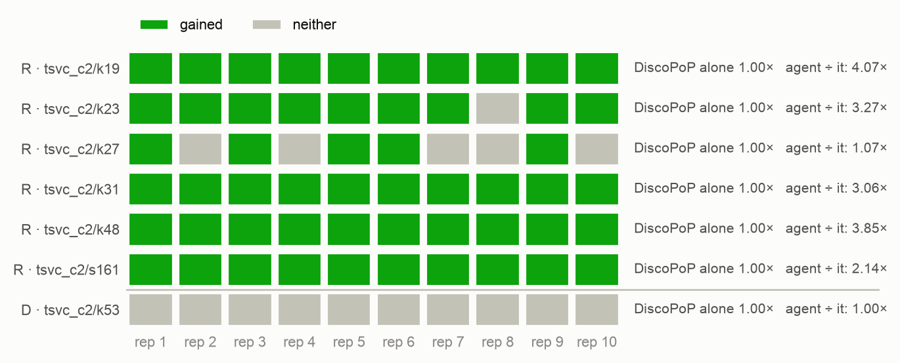
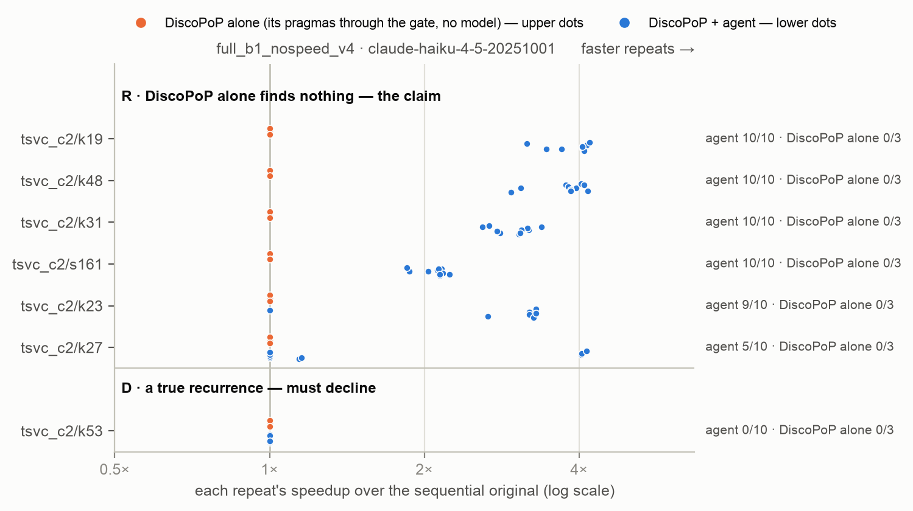

# E2-v6b — the hidden order on clean files, run again on the fixed DiscoPoP (defect B14): evidence × attempts

*Generated by `agent/tools/campaign.py reports` from `results/campaign.json` and the experiment record (`agent/THESIS_EXPERIMENTS.md`). Edit those, then regenerate — not this file.*

**Status:** done

## The question

E2-v6's question, with a profiler that records the iterations of every loop: does the Haiku agent with DiscoPoP's evidence ship more race-free verified parallel programs covering the hot loop than without it, what do retries with feedback add — and how fast are the programs now that DiscoPoP can report every loop of a split?

## Result in one paragraph

E2-v6 run again on the fixed DiscoPoP (defect B14 of the profiler), Haiku, speed check off, race-checked; the models alone are E2-v6's runs. The agent with DiscoPoP's evidence at one attempt: 44 of 50 race-free verified parallel programs covering the hot loop (all FASTER), 0 unsafe; without the evidence 14 of 50 — V6-i rejected (MH odds ratio 76, exact p 7.0e-13, family bound at most 2.9e-09). Three attempts with feedback, without evidence: 22 of 50 against 14 — V6-ii NOT rejected (odds ratio 3.6, one-sided p 0.028, family bound 0.11): the feedback's effect is not established on the corrected instrument; it had been in E2-v6 (22 against 10). With every loop of the split now reported, the successes with evidence run at the expert version's speed: 4.07×, 3.27×, 4.04×, 3.06× on k19, k23, k27, k31 (expert 4.14×, 3.33×, 4.17×, 3.09×; E2-v6: 1.45×, 1.40×, 1.93×, 1.37×). No unsafe program in 280 trials. On the unit that has to be left alone the one-attempt agent ships nothing parallel in 20 trials; at three attempts 10 of 20 ship a program that parallelizes only a loop the model added. Against the models alone: fast and right on the four constructed kernels 34 of 40, Fable 5 of 20, Opus 3, Sonnet 2, Haiku 0 of 40. 977 model calls, $191 API-equivalent.

## Figures

## What is in this folder

- [`analysis/`](analysis/) — the read-out: [`e2v6_readout.md`](analysis/e2v6_readout.md), [`figures.md`](analysis/figures.md), [`main_comparison_stats.md`](analysis/main_comparison_stats.md), [`vs_discopop_alone.md`](analysis/vs_discopop_alone.md)
- [`exhibits/`](exhibits/) — 2 case studies, below
- [`runs/`](runs/) — 6 archived run(s): the evidence
- [`checks/`](checks/) — 1 verification(s) made during the read-out
- [`preflight/`](preflight/) — 2 smoke run(s) before the launch

## Runs

| run | where | what it is | status | trials | outcomes |
|---|---|---|---|---:|---|
| `e2v6b_smoke` | [`preflight/e2v6b_smoke/`](preflight/e2v6b_smoke/) | E2-v6b instrument check, never counted: tsvc_c2/k23 × full_b1_nospeed_v4 × 2, Haiku — does the agent's own re-profiling on the rebuilt profiler give both loops of the split their directive | valid | 2 | FASTER 2 |
| `t0_11_c2_b14_c` | [`preflight/t0_11_c2_b14_c/`](preflight/t0_11_c2_b14_c/) | T0.11 on packaging v6 with DiscoPoP B14 fixed, draw c, server, no model: arm discopop_capability on the 44 tsvc_c2 packages — the third draw of DiscoPoP alone on the fixed profiler (a and b: group B14) | valid | 44 | FASTER 8, no-change 34, parallel-speed-not-measurable 2 |
| `e2v6b_race_check` | [`checks/e2v6b_race_check/`](checks/e2v6b_race_check/) | race_check.py (server, no model) over every program of the agent's four arms of E2-v6b — the positive control; the models alone and their race check are E2-v6's | valid | 0 |  |
| `e2v6b_agent_1` | [`runs/e2v6b_agent_1/`](runs/e2v6b_agent_1/) | E2-v6b: tsvc_c2/k19, k23 × full_b1_nospeed_v4, no_evidence_b1_nospeed_v4 × 10, Haiku, threads 6/12, repeats 5 — as e2v6_agent_1, fixed DiscoPoP | valid | 40 | FASTER 22, no-change 17, parallel-not-faster 1 |
| `e2v6b_fb_1` | [`runs/e2v6b_fb_1/`](runs/e2v6b_fb_1/) | E2-v6b, the three-attempt arms: tsvc_c2/k19, k23 × full_nospeed_v4, no_evidence_nospeed_v4 × 10, Haiku, threads 6/12, repeats 5 — as e2v6_fb_1, fixed DiscoPoP | valid | 40 | FASTER 24, no-change 10, parallel-not-faster 6 |
| `e2v6b_agent_2` | [`runs/e2v6b_agent_2/`](runs/e2v6b_agent_2/) | E2-v6b: tsvc_c2/k31, k27 × full_b1_nospeed_v4, no_evidence_b1_nospeed_v4 × 10, Haiku, threads 6/12, repeats 5 — as e2v6_agent_2, fixed DiscoPoP | valid | 40 | FASTER 15, no-change 24, parallel-not-faster 1 |
| `e2v6b_fb_2` | [`runs/e2v6b_fb_2/`](runs/e2v6b_fb_2/) | E2-v6b, the three-attempt arms: tsvc_c2/k31, k27 × full_nospeed_v4, no_evidence_nospeed_v4 × 10, Haiku, threads 6/12, repeats 5 — as e2v6_fb_2, fixed DiscoPoP | valid | 40 | FASTER 21, no-change 16, parallel-not-faster 3 |
| `e2v6b_agent_3` | [`runs/e2v6b_agent_3/`](runs/e2v6b_agent_3/) | E2-v6b: tsvc_c2/s161, k53, k48 × full_b1_nospeed_v4, no_evidence_b1_nospeed_v4 × 10, Haiku, threads 6/12, repeats 5 — as e2v6_agent_3, fixed DiscoPoP | valid | 60 | FASTER 39, no-change 21 |
| `e2v6b_fb_3` | [`runs/e2v6b_fb_3/`](runs/e2v6b_fb_3/) | E2-v6b, the three-attempt arms: tsvc_c2/s161, k53, k48 × full_nospeed_v4, no_evidence_nospeed_v4 × 10, Haiku, threads 6/12, repeats 5 — as e2v6_fb_3, fixed DiscoPoP | valid | 60 | FASTER 39, no-change 10, parallel-not-faster 11 |

## Exhibits

- [`k19_v6b_both_loops_expert_speed`](exhibits/k19_v6b_both_loops_expert_speed/) — E2-v6b, with evidence, one attempt, on the fixed DiscoPoP: the split with the second statement's loop first and a directive on BOTH loops, in one model call — 4.12×, the expert version's speed (4.14×); the same trial shape reached 1.45× before defect B14 was fixed (`k23_v6_evidence_right_split` in E2-v6's folder shows the one-directive program).  
  no DiscoPoP-alone trial to pair with · tsvc_c2/k19, `full_b1_nospeed_v4`, e2v6b_agent_1 rep 1 · pictures: `before_after.png`, `console.png`
- [`k53_v6b_retries_add_a_loop`](exhibits/k53_v6b_retries_add_a_loop/) — E2-v6b, three attempts with evidence on the unit that has to be left alone: after rejected rewrites the model adds loops it can make parallel and leaves the kernel's own loop sequential — a parallel program that gains nothing (0.98×), 10 model calls; 10 of 20 three-attempt trials end like this, none of 20 at one attempt. The pressure of the retries, not the profiler's defect.  
  no DiscoPoP-alone trial to pair with · tsvc_c2/k53, `full_nospeed_v4`, e2v6b_fb_3 rep 1 · pictures: `before_after.png`, `rejected_attempt.png`, `console.png`

## Change-log rows that name these runs (§6)

| Date | Repo | Change | Why |
|---|---|---|---|
| 2026-10-07 | result | **E2-v6b read out — on the fixed DiscoPoP the evidence effect holds (44 of 50 against 14), the agent's programs now run at the expert version's speed, and the effect of retries with feedback is NOT established any more (22 of 50 against 14; V6-ii not rejected).** Registered commands on the new runs (`results/E02v6b_hidden_order_fixed_discopop/stats/`: `e2b1_stats.py --population config/e2v6b_population.json --family-size 52`; `e12_stats.py --set e2v6b`; `analysis/e2v6_readout.md`: `e2v6_readout.py --experiment e2v6b`). The models alone and their race check are E2-v6's (no DiscoPoP in their path). Race check `e2v6b_race_check`: all 182 changed programs of the agent's four arms clean (98 unchanged). 280 trials, 0 failed calls (deviations: the row below). Each number is followed by E2-v6's in brackets. **V6-i (CONFIRMATORY) — rejected again.** One attempt, race-free verified parallel programs covering the hot loop: with evidence **44 of 50** [45], all 44 FASTER; without **14 of 50** [10], 12 FASTER — `k19` 10 vs 0, `k23` 9 vs 4, `k27` 5 vs 0, `k31` 10 vs 1, `s161` 10 vs 9; MH odds ratio 76 (95 % 11–522) [351], CMH one-sided p 5.6e-11, exact p 7.0e-13; campaign family (M = 52) at most 2.9e-09. Unsafe: 0 in both arms. **V6-ii — NOT rejected.** Without evidence, three attempts with feedback against one: **22 of 50** [22] vs 14 of 50 [10] — `k19` 5 vs 0, `k23` 4 vs 4, `k27` 0 vs 0, `k31` 3 vs 1, `s161` 10 vs 9; odds ratio 3.6 (1.1–11.9) [21], one-sided p 0.028, exact 0.026; family bound 0.11 — above 0.05. The three-attempt arm did not move (22 and 22); the one-attempt arm it is compared with rose from 10 to 14 (`k23` 1 → 4, `k31` 0 → 1): three of the four new successes are the right split found without evidence in a later region's call — a program the profiler before the fix would have accepted as well — and one is a copy-loop program. Ten trials per cell can do that, and the test had been marginal in E2-v6 (bound 0.035). As registered, E2-v6b's verdict is the one reported: **the feedback's effect is not established**; the direction is the same. The interaction in H5b's form is gone with it: two more attempts add 16 points without evidence and 8 with it, ratio of the odds ratios 1.1, p 0.46 [15.8, p 0.021]. **Descriptive.** Three attempts without evidence against one attempt with it: 22 vs 44 (odds ratio 0.02, two-sided p 5.1e-07), at 16.9 model calls per success against 2.0. With evidence, three attempts against one: 48 vs 44 (p 0.24; `k27` 10 vs 5 — the three-statement kernel is where a second try helps). Evidence against none at three attempts: 48 vs 22 (p 1.0e-08). Control `k48`: 10 of 10 FASTER in all four arms. **The speeds — what the fix was for.** Median of the successes with evidence at one attempt, beside the expert version through the same verification: `k19` 4.07× (expert 4.14×) [1.45×], `k23` 3.27× (3.33×) [1.40×], `k27` 4.04× (4.17×) [1.93×], `k31` 3.06× (3.09×) [1.37×]; `s161` 2.14× [2.15×], `k48` 3.85× (4.13×) [3.80×]. Every success there carries a directive on every loop of the split. **Safety.** No unsafe program in 280 trials [3 of 280]. No program holds an array of the data's length on the stack this time (heap in 21 changed programs) — that is the model's choice in these trials, not an effect of the fix; the limit of the speed-off setups stated on 7 Oct stands. **The unit that has to be left alone, `k53`:** one attempt, nothing parallel in 20 trials [20]; three attempts, a parallel program in 10 of 20 [8] — 6 with evidence, 4 without — every one with the kernel's loop sequential and a loop the model added parallel; none unsafe. The retries' pressure towards a pointless parallel program is not a product of the defect. **Against the models alone** (E2-v6's runs): fast and right on the four constructed kernels — the agent with evidence 34 of 40, Fable 5 of 20, Opus 3 of 20, Sonnet 2 of 20, Haiku 0 of 40; and the agent's programs are now as fast as the expert's where E2-v6 had them at a third to a half. **Cost, API-equivalent:** $191 for the 280 trials ($17, $17, $42, $115 for the four arms), 977 model calls. **Expectations of the registration:** counts within noise of E2-v6's — met (44, 14, 48, 22 against 45, 10, 46, 22); speeds towards the expert's — met, they are at it; `s161` and `k48` as before — met; `k53` at three attempts open — the pointless programs stayed, the unsafe ones did not recur; the no-evidence arm at one attempt "as before" — 14 against 10, a difference the fix does not explain. **What it decides:** this is the result of the hidden-order experiment. The mechanism claim stands and is now complete — where the deciding fact is outside the file, DiscoPoP's evidence lets a small model find the split (44 of 50 against 14) and the pipeline then delivers the expert's speed; the claim that feedback can partly stand in for the evidence is withdrawn to "not shown". E2-v6 is kept as history (its folder holds the four model-alone runs this result uses) | Result, E2-v6b |
| 2026-10-07 | deviation | **E2-v6b and the jobs queued with it ran to their end (7 Oct 03:30–16:13 UTC): every run has all its trials, every counted trial all its model calls, sweep clean — after two pauses at the session limit, the first noticed an hour late because the Mac was asleep. Recorded before the race check and the read-out.** Launched 03:30 UTC by the self-resuming launcher, detached from the session; order as registered (the three three-attempt jobs and `e2v6b_agent_1` first; `e2v6b_agent_2` 06:54, `e2v6b_agent_3` 11:12, `e1v6c_s281` 12:17, `t0_11_c2_b14_c` 12:23, the other suites' draws 12:51, 13:24, 13:52). **First pause.** The limit was reached at about 09:13 UTC ("You've hit your session limit · resets 10:3x"). The Mac, on which the launcher's watch runs, was asleep with its lid closed from 08:48 to 10:17 UTC; the four jobs ran on and 52 trials went through with a refused model call (`e2v6b_fb_1` 3, `e2v6b_fb_2` 10, `e2v6b_fb_3` 23, `e2v6b_agent_2` 16). At the wake the watch stopped every job, set the 52 aside (`<run>/_call_failed/`, stamp `1007_1034`), waited for the reset and re-launched what was owed at 10:34 UTC — the time it would have resumed had it paused at once; nothing but the 52 re-runs was lost. **Second pause** 14:50 UTC (resets 15:30): two trials cut off mid-way set aside (`_interrupted/`, stamp `1007_1534`: one of `e2v6b_fb_2`, one of `e2v6b_agent_3`), resumed 15:34. The two no-model draws that were running at that moment were stopped with the rest and resumed; their finished trials were kept (the runner skips them). **What is counted:** 280 trials of E2-v6b and the 10 of `e1v6c_s281`, 0 failed calls among them; 988 model calls, $193.12 API-equivalent; the 52 and the 2 are archived with their runs and never counted. No-model runs: `t0_11_c2_b14_c` 44 of 44, `t0_11_b14_apps_a`, `_b`, `_c` 31 of 31 each. **For every unattended run from here on:** the launcher's watch needs the Mac awake — a closed lid on battery sleeps it whatever is asked (`caffeinate` cannot prevent that); the runs themselves are on the server and unaffected, and what a late pause costs is re-runs, never a counted trial | Deviation, E2-v6b |
| 2026-10-07 | result | **E2-v6b's instrument check passed: on the rebuilt profiler the agent gives both loops of the split their directive (`e2v6b_smoke`, 2 Haiku trials, never counted) — the main runs are launched.** `k23` × `full_b1_nospeed_v4` × 2 (03:24–03:28 UTC — corrected 7 Oct, first written 03:33 —, one 12-core group; 0 failed model calls, one call per trial; sweep clean). Both trials: the split with the second statement's loop first, `#pragma omp parallel for` on BOTH loops (E2-v6: on the first only), race-free verified, FASTER — 3.07× and 3.25× (6 and 12 threads), 3.21× and 3.19×; E2-v6's nine successes on `k23` had a median of 1.40×, the expert version reaches 3.33×. The agent's own no-model feature checks on the fixed profiler: 66 of 66 (Mac). The registered rule is met | Result, E2-v6b |
| 2026-10-07 | plan | **E2-v6b pre-registered — the hidden-order experiment run again on the fixed DiscoPoP; with it the corrections of E1-v6 and the no-model checks they need. The author: "ok go with your recommendation". Written before any trial, the smoke included.** Put to the author with B14's numbers: all four agent setups of E2-v6 again (280 trials, about $190 API-equivalent and 15 hours when they ran), `s281` in the main comparison with the two loops already owed, and DiscoPoP alone again on the suites whose originals have loops side by side; the cheaper option (the two setups with evidence only) was put beside it. **The one-version decision of 2 Oct now reads: the agent unchanged, DiscoPoP fixed** — every run from here on uses the profiler rebuilt on 7 Oct 00:3x UTC from `9c60a854e` (pass `3405a9f32e54`). **E2-v6b** (registry group, `results/E02v6b_hidden_order_fixed_discopop/`). The same as E2-v6 in everything but DiscoPoP: the seven units (`config/e2v6b_population.json`, E2-v6's), the `tsvc_c2` packages, Haiku 4.5, the four agent arms (`full_b1_nospeed_v4`, `no_evidence_b1_nospeed_v4`, `full_nospeed_v4`, `no_evidence_nospeed_v4`) × 10, prompt version 4, speed check off, threads 6 and 12, 5 repeats, the agent and the harness as they are. Runs: `e2v6b_agent_1` (`k19`, `k23`), `e2v6b_agent_2` (`k31`, `k27`), `e2v6b_agent_3` (`s161`, `k53`, `k48`), `e2v6b_fb_1`, `e2v6b_fb_2`, `e2v6b_fb_3` (the three-attempt arms, same split); `e2v6b_race_check`. **Reused, and said so in the read-out:** the four model-alone runs of E2-v6 (`e2v6_bare_haiku`, `e2v6_bare_sonnet`, `e2v6_bare_opus`, `e2v6_bare_fable`) and their race check — a model alone has no DiscoPoP in its path. DiscoPoP alone: `t0_11_c2_b14_a`, `t0_11_c2_b14_b` (done, unchanged) and a third draw, `t0_11_c2_b14_c`. **First, an instrument check** (`e2v6b_smoke`, never counted): `k23` × `full_b1_nospeed_v4` × 2. It passes if no model call fails and every shipped program that is the split carries a directive on BOTH loops; otherwise nothing is launched and it is reported. (The mechanism pilot is E2-v6's; this checks that the agent's own re-profiling uses the rebuilt profiler.) **Tests:** V6-i and V6-ii, the same commands on the new runs (`--population config/e2v6b_population.json`, `--family-size 52`). They are the SAME two hypotheses tested again on a corrected instrument, not new members of the family; E2-v6b's results are the ones reported, E2-v6's move to history with the reason, and a test not rejected now is reported as not rejected. Outcome, exclusions and the descriptive read-out as registered for E2-v6 (`e2v6_readout.py --experiment e2v6b`, `e12_stats.py --set e2v6b`), and beside each cell E2-v6's number. **Expectations, written before the smoke:** the counts within noise of E2-v6's (45, 10, 46, 22 of 50) — a success needs one directive on the hot loop, which the defect did not take away; the successes on `k19`, `k23`, `k27`, `k31` clearly faster than E2-v6's 1.4–1.9×, towards the expert's 3.1–4.2×, because every loop of the split can now get its directive; `s161` and `k48` as before; on `k53` at three attempts the false Do-All no longer reaches the gate and DiscoPoP's blockers name the real dependence, so those trials may end differently — in which direction is not predicted; the no-evidence arm at one attempt as before (10 of 50), the only arm the defect provably did not touch. **What it decides:** the result of the hidden-order experiment that the thesis reports. **E1-v6, corrected beside the registered result** (`main_comparison_stats.py --drop RUN:BENCHMARK` with the new runs): `e1v6c_s281` — `tsvc_c2/s281` × `default_v4`, `discopop_gate_v4` × 5 as `e1v6_r_3`, on the fixed DiscoPoP (packaging v6, so that only DiscoPoP differs); and, after T0.18, `s313` and `s331` on packaging v7 in every setup (`e1v6c_v7_agent`, `e1v6c_v7_control`, `e1v6c_v7_bare_haiku`, `_sonnet`, `_opus`, `_fable`, `e1v6c_race_check`) — approved on 5 Oct. The replay's "4 programs" is a lower bound for E1-v6 (its agent has three attempts): a replay of the rewrites the agent discarded is owed before E1-v6's correction is called complete. **T0.18** (no model, on the fixed DiscoPoP): `t0_18_server_a`, `t0_18_server_b` (`tsvc_c2` against `tsvc_c3`), `t0_1_c3_sizes`, `t0_11_c3_a`, `t0_11_c3_b`, `t0_11_c3_c`, `t0_14_c3_refs`. **The other suites' classes on the fixed profiler** (no model): `t0_11_b14_apps_a`, `_b`, `_c` — the 31 packages of `t0_11_classes_a` outside TSVC (PolyBench 27, NPB `is`, `md`, Rodinia `hotspot` and `pathfinder`), invoked as then; one draw took about two hours there, 40 minutes of it `adi`'s instrumented compile. NPB `lu` and `mg`, Rodinia `nw` and LULESH were not in T0.11 (limits L1–L3 of the defect list) and are not in these draws; LULESH is measured with E6's pre-flight. **Order on the four 12-core groups:** the smoke; then the three three-attempt jobs and the three one-attempt jobs; `e1v6c_s281`; `t0_11_c2_b14_c`; the other suites' draws; T0.18 and then the v7 re-runs as groups free. The launcher is the self-resuming one of E2-v6 (stops at the session limit, waits for the reset, re-launches what is owed), started detached from the session. **Cost, API-equivalent:** about $193 for E2-v6b, about $14 for E1-v6's corrections, about $1 for the smoke; 15 hours and the pauses at the session limit | Plan, pre-registered |

