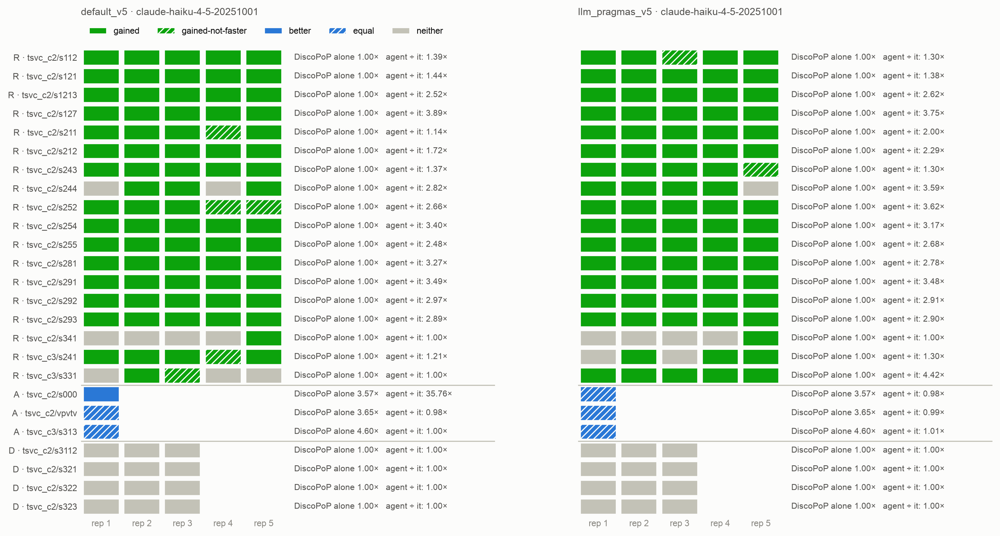
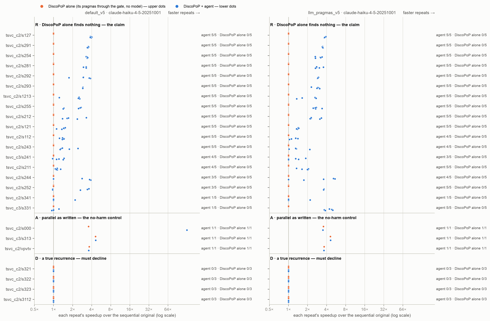

# E3 — who writes the pragma: DiscoPoP from its analysis of the rewritten code, or the model in the same edit

*Generated by `agent/tools/campaign.py reports` from `results/campaign.json` and the experiment record (`agent/THESIS_EXPERIMENTS.md`). Edit those, then regenerate — not this file.*

**Status:** done

## The question

Does letting the model write the pragma with its rewrite — judged by the gate — give more verified faster programs than DiscoPoP writing it, and does it cost any wrong program? (RQ5, C1, C2) Two setups of one agent on E1's whole set (18 + 4 + 3 loops, 105 trials per setup), a full re-profile in both; DiscoPoP alone run again on the same cells; the models alone are E1-v6's runs. As the author decided it on 9 Oct; the fast refresh is E4.

## Result in one paragraph

Read out 10 Oct (315 trials, no failed model call, every changed program race-clean). On the 18 loops that need restructuring the agent is race-free FASTER in 81 of 90 trials where the model writes the pragma and in 76 of 90 where DiscoPoP writes it; the difference is not established (one-sided p 0.142; four of the five trials are `s331`, 5 of 5 against 1 of 5 — a loop DiscoPoP does not recognise as written). Neither setup ships an unusable program in 105 trials; on the four true recurrences neither ships anything — the gate refused all 144 rewrites that carried the model's pragma. Kept pragmas where the model may write: 150 the model's, 9 DiscoPoP's. Cost $175.03 ($84.49 and $90.54). To read with it: the pooled speed-up figures include one control program (`s000`, DiscoPoP writes, 127.70×) that runs the loop once instead of in every repetition — not a parallel speed-up; seven of the model's FASTER programs open one parallel region around the repetition loop; `s341`'s one win per setup computes the positions once in front of the repetition loop. The rule for E4's pragma author is the author's to approve. CORRECTED 10 Oct (`analysis/corrected/`): `s341` run again on data in which the positions move between repetitions (packaging v8, `e3c_v8_s341`, race check `e3c_v8_race_check`) is 0 of 5 in both setups (was 1 and 1: each had computed the positions once in front of the repetitions) — the model writes 80 of 90, DiscoPoP writes 75; one-sided p 0.125, not established; the lead stays five. WORDING corrected the same day: this headline called `s331` 'a pragma DiscoPoP cannot write'; DiscoPoP has a max reduction and does not recognise the loop as written (THESIS_EXPERIMENTS §6, "Correction, DiscoPoP's reductions").

## Figures

## What is in this folder

- [`analysis/`](analysis/) — the read-out: [`corrected/discopop_writes/figures.md`](analysis/corrected/discopop_writes/figures.md), [`corrected/discopop_writes/main_comparison_stats.md`](analysis/corrected/discopop_writes/main_comparison_stats.md), [`corrected/discopop_writes/vs_discopop_alone.md`](analysis/corrected/discopop_writes/vs_discopop_alone.md), [`corrected/e3_tests.md`](analysis/corrected/e3_tests.md), [`corrected/figures.md`](analysis/corrected/figures.md), [`corrected/main_comparison_stats.md`](analysis/corrected/main_comparison_stats.md), [`corrected/model_writes/figures.md`](analysis/corrected/model_writes/figures.md), [`corrected/model_writes/main_comparison_stats.md`](analysis/corrected/model_writes/main_comparison_stats.md), [`corrected/model_writes/vs_discopop_alone.md`](analysis/corrected/model_writes/vs_discopop_alone.md), [`corrected/vs_discopop_alone.md`](analysis/corrected/vs_discopop_alone.md), [`discopop_writes/figures.md`](analysis/discopop_writes/figures.md), [`discopop_writes/main_comparison_stats.md`](analysis/discopop_writes/main_comparison_stats.md), [`discopop_writes/vs_discopop_alone.md`](analysis/discopop_writes/vs_discopop_alone.md), [`e3_descriptive.md`](analysis/e3_descriptive.md), [`e3_tests.md`](analysis/e3_tests.md), [`figures.md`](analysis/figures.md), [`main_comparison_stats.md`](analysis/main_comparison_stats.md), [`model_writes/figures.md`](analysis/model_writes/figures.md), [`model_writes/main_comparison_stats.md`](analysis/model_writes/main_comparison_stats.md), [`model_writes/vs_discopop_alone.md`](analysis/model_writes/vs_discopop_alone.md), [`repetition_loop.md`](analysis/repetition_loop.md), [`vs_discopop_alone.md`](analysis/vs_discopop_alone.md)
- [`runs/`](runs/) — 10 archived run(s): the evidence
- [`checks/`](checks/) — 2 verification(s) made during the read-out
- [`preflight/`](preflight/) — 5 smoke run(s) before the launch

## Runs

| run | where | what it is | status | trials | outcomes |
|---|---|---|---|---:|---|
| `e3_pilot_s331` | [`preflight/e3_pilot_s331/`](preflight/e3_pilot_s331/) | E3 pilot, never counted: `tsvc_c3/s331` × 1, Haiku — the setup in which the model writes the pragma (`llm_pragmas_v5`, prompt version 5, arbitration off) beside DiscoPoP alone (`discopop_gate_v5`, no model); the loop the agent of the main comparison never won (0 of 5: four unchanged, one parallel and not faster), and the one class-R loop whose request shows a loop DiscoPoP already reports parallel | valid | 2 | FASTER 1, no-change 1 |
| `e3_pilot_s341` | [`preflight/e3_pilot_s341/`](preflight/e3_pilot_s341/) | E3 pilot, never counted: `tsvc_c2/s341` × 1, Haiku — the setup in which the model writes the pragma (`llm_pragmas_v5`, prompt version 5, arbitration off) beside DiscoPoP alone (`discopop_gate_v5`, no model); a loop the agent of the main comparison won 4 times of 5 (one trial ended unchanged) | valid | 2 | FASTER 1, no-change 1 |
| `e3_pilot_s321` | [`preflight/e3_pilot_s321/`](preflight/e3_pilot_s321/) | E3 pilot, never counted: `tsvc_c2/s321` × 1, Haiku — the setup in which the model writes the pragma (`llm_pragmas_v5`, prompt version 5, arbitration off) beside DiscoPoP alone (`discopop_gate_v5`, no model); a true recurrence, on which a plain pragma is wrong | valid | 2 | no-change 2 |
| `e3_pilot_pair` | [`preflight/e3_pilot_pair/`](preflight/e3_pilot_pair/) | E3 pilot, never counted: `tsvc_c2/s1213` and `tsvc_c2/s254` × 2, Haiku — BOTH setups in one run (`llm_pragmas_v5`: the model writes the pragma, arbitration off; `default_v5`: DiscoPoP writes it; prompt version 5) beside DiscoPoP alone (`discopop_gate_v5`, no model); two loops the agent of the main comparison wins 5 times of 5 — does the other setup lose them? — and `s254` is a loop of the 8 Oct finding, to read the corrected blocker note in a real request | valid | 12 | FASTER 8, no-change 4 |
| `e3_pilot_race_check` | [`preflight/e3_pilot_race_check/`](preflight/e3_pilot_race_check/) | race_check.py (server, no model) over the pilot's finished programs — the gate's ThreadSanitizer build and schedule matrix on each file the harness verified: the six parallel programs of the setup in which the model writes the pragma (`llm_pragmas_v5`) and, as the positive control, the four of the setup in which DiscoPoP writes it (`default_v5`) | valid | 0 |  |
| `e3_r_1` | [`runs/e3_r_1/`](runs/e3_r_1/) | E3, class R × 5, Haiku: `tsvc_c2` s112 s121 s1213 s127 s211 — `default_v5` (DiscoPoP writes the pragma), `llm_pragmas_v5` (the model writes it) and `discopop_gate_v5` (DiscoPoP alone, no model) | valid | 75 | FASTER 48, no-change 25, parallel-not-faster 2 |
| `e3_r_2` | [`runs/e3_r_2/`](runs/e3_r_2/) | E3, class R × 5, Haiku: `tsvc_c2` s212 s243 s244 s252 and `tsvc_c3` s241 — `default_v5` (DiscoPoP writes the pragma), `llm_pragmas_v5` (the model writes it) and `discopop_gate_v5` (DiscoPoP alone, no model) | valid | 75 | FASTER 41, no-change 30, parallel-not-faster 4 |
| `e3_r_3` | [`runs/e3_r_3/`](runs/e3_r_3/) | E3, class R × 5, Haiku: `tsvc_c2` s254 s255 s281 s291 — `default_v5` (DiscoPoP writes the pragma), `llm_pragmas_v5` (the model writes it) and `discopop_gate_v5` (DiscoPoP alone, no model) | valid | 60 | FASTER 40, no-change 20 |
| `e3_r_4` | [`runs/e3_r_4/`](runs/e3_r_4/) | E3, class R × 5, Haiku: `tsvc_c2` s292 s293 s341 and `tsvc_c3` s331 — `default_v5` (DiscoPoP writes the pragma), `llm_pragmas_v5` (the model writes it) and `discopop_gate_v5` (DiscoPoP alone, no model) | valid | 60 | FASTER 28, no-change 31, parallel-not-faster 1 |
| `e3_d_1` | [`runs/e3_d_1/`](runs/e3_d_1/) | E3, class D × 3 (a true recurrence), Haiku: `tsvc_c2/s321` — `default_v5` (DiscoPoP writes the pragma), `llm_pragmas_v5` (the model writes it) and `discopop_gate_v5` (DiscoPoP alone, no model) | valid | 9 | no-change 9 |
| `e3_d_2` | [`runs/e3_d_2/`](runs/e3_d_2/) | E3, class D × 3 (a true recurrence), Haiku: `tsvc_c2/s322` — `default_v5` (DiscoPoP writes the pragma), `llm_pragmas_v5` (the model writes it) and `discopop_gate_v5` (DiscoPoP alone, no model) | valid | 9 | no-change 9 |
| `e3_d_3` | [`runs/e3_d_3/`](runs/e3_d_3/) | E3, class D × 3 (a true recurrence), Haiku: `tsvc_c2/s323` — `default_v5` (DiscoPoP writes the pragma), `llm_pragmas_v5` (the model writes it) and `discopop_gate_v5` (DiscoPoP alone, no model) | valid | 9 | no-change 9 |
| `e3_d_4` | [`runs/e3_d_4/`](runs/e3_d_4/) | E3, class D × 3 (a true recurrence), Haiku: `tsvc_c2/s3112` — `default_v5` (DiscoPoP writes the pragma), `llm_pragmas_v5` (the model writes it) and `discopop_gate_v5` (DiscoPoP alone, no model) | valid | 9 | no-change 9 |
| `e3_a` | [`runs/e3_a/`](runs/e3_a/) | E3, class A × 1 (DiscoPoP alone parallelizes them), Haiku: `tsvc_c2` s000 vpvtv and `tsvc_c3` s313 — `default_v5` (DiscoPoP writes the pragma), `llm_pragmas_v5` (the model writes it) and `discopop_gate_v5` (DiscoPoP alone, no model) | valid | 9 | FASTER 9 |
| `e3_race_check` | [`checks/e3_race_check/`](checks/e3_race_check/) | race_check.py (server, no model) over every changed program of E3's two setups — the gate's ThreadSanitizer build and schedule matrix on each finished file | valid | 0 |  |
| `e3c_v8_s341` | [`runs/e3c_v8_s341/`](runs/e3c_v8_s341/) | E3 corrected for `s341` (packaging v8: data in which the positions move between repetitions): `tsvc_c4/s341` × 5, Haiku — `default_v5` (DiscoPoP writes the pragma), `llm_pragmas_v5` (the model writes it) and `discopop_gate_v5` (DiscoPoP alone, no model); replaces the `tsvc_c2/s341` cells of `e3_r_4` in the corrected read-out | valid | 15 | no-change 15 |
| `e3c_v8_race_check` | [`checks/e3c_v8_race_check/`](checks/e3c_v8_race_check/) | race_check.py (server, no model) over the changed programs of `e3c_v8_s341` | valid | 0 |  |

## Change-log rows that name these runs (§6)

| Date | Repo | Change | Why |
|---|---|---|---|
| 2026-10-10 | result | **`s341` on data that move (packaging v8, the author's decision of today): no setup of the Haiku agent wins it; Opus and Fable alone win it 5 of 5. E1-v6 corrected a third time — the agent 75 of 90 (registered 73; corrected 76, then 79) — and E3 corrected — 80 against 75 of 90 (registered 81 against 76). No verdict of either experiment's tests changes.** **Runs (all valid):** `e1v6c_v8_agent` (E1-v6's agent and DiscoPoP alone), `e1v6c_v8_bare_haiku`, `e1v6c_v8_bare_sonnet`, `e1v6c_v8_bare_opus`, `e1v6c_v8_bare_fable`, `e1v6c_v8_race_check`; `e3c_v8_s341` (E3's two setups and DiscoPoP alone), `e3c_v8_race_check`. 45 trials, 35 with model calls, no failed model call; $30.84 (estimated $29). **On `tsvc_c4/s341`, each × 5:** the agent of E1-v6 — no change in 5 (60 model calls); E3's setup in which DiscoPoP writes — no change in 5 (59 calls); in which the model writes — no change in 5 (63 calls); DiscoPoP alone — no change. Haiku alone — no FASTER program: three parallel and slower (0.43× to 0.68×), two that do not compile. Sonnet alone — two FASTER (2.31×, 1.64×), one parallel and slower (0.60×), two BROKEN: both crash at six threads in the harness's final run, both use OpenMP's `scan` directive, and one also changes the output; whether the crash is the program's fault or the compiler's implementation of `scan` was not examined. Opus alone — five FASTER (2.31× to 2.40×). Fable alone — five FASTER (2.25× to 2.37×). The race check finds every FASTER program clean. **The form that wins** (Opus's, read): in EVERY repetition, the positives counted per block in parallel, the block offsets by a short sequential pass, each block scattered in parallel from its offset — the reference's form (2.37×, T0.19). Every program counted FASTER reproduces the original's output on data whose positions move between repetitions, which the form of the earlier wins — the positions computed once in front of the repetitions — does not (T0.19: it differs by 0.89). **Why the agent does not win** (the agents' logs and candidate records). With DiscoPoP writing, in the two runs: 88 of the model's rewrites passed the checks; DiscoPoP found no parallel loop in 38 of them and one in 50; of those 50, 36 were not faster than the program before the rewrite once DiscoPoP's pragmas were in, and in 14 DiscoPoP's pragma failed the checks. With the model writing: 63 candidates, none kept — 29 refused by the speed check, 10 by the race detector, 6 by the schedule stress, 18 did not compile. The agent ships nothing — no unusable program — where Haiku alone ships five that are slower or do not compile. **E1-v6, corrected a third time** (`analysis/corrected_3/build.sh`: the `tsvc_c2/s341` cells of `e1v6_r_4` and of the four model-alone runs dropped, the `tsvc_c4/s341` cells in their place; everything else as `corrected_2`). Class R, race-free FASTER of 90: DiscoPoP alone 0; the agent 75 (81 verified parallel), 0 unusable; Haiku alone 37 with 51 unusable; Sonnet alone 77 with 11; Opus alone 89 with 0; Fable alone 89 with 1. The nine tests, verdicts as before: T1 (the agent faster than DiscoPoP alone) rejected, Holm 0.00014; T2 (fewer unusable than Haiku alone) rejected, 0.0016; T6 (more reach than Haiku alone) rejected, 0.028 (the agent ahead on 14 loops, Haiku alone on 2; before: 15 and 2, Holm 0.019); T3 to T5 and T7 to T9 not rejected. **E3, corrected** (`analysis/corrected/build.sh`, the same replacement in `e3_r_4` and in Haiku alone's column): the model writes 80 of 90, DiscoPoP writes 75; E3-1 one-sided p 0.125 (registered 0.142) — not established; E3-2 not refuted (80 against Haiku alone's 37). The lead stays five; `s341` is now 0 of 5 in both setups. **Said before the run, and what came:** the agent's 79 would probably fall to about 75 — the cell fell from 4 to 0 of 5, 79 to 75. What the stronger models alone would do was not predicted — Opus and Fable win all five, Sonnet two. **Reading:** on this loop the gap between the Haiku agent and the strongest models alone is real, and the earlier 4 of 5 had hidden it: the form that has to be found is beyond what Haiku finds in its attempts, inside the agent or alone, and the agent's part is that it ships nothing where Haiku alone ships a slower or broken program. The registered tables stay in the record; the thesis gives the corrected ones with the reason. | Result, `s341` on packaging v8 |
| 2026-10-10 | decision | **E3b and the re-run of `s341`: the author's OK — "ok" — and what is fixed with it before the first trial.** Put to him with the files a model will read (`docs/CONTRAST_SET_LOOPS.html`, published), the composition (six loops under test and one control instead of the eight first named; `s3111` taken out after the no-model measurement, said to him as a change to my own rule), the cost (about $115, between $75 and $145, of which about $29 for `s341`; 140 model trials; about 6 hours) and one finding with a recommendation (the gate's exact output check refuses a correct parallel sum where the six builds of the original agree exactly — leave it as it is for this run and state the limit). His answer: "ok". **Read as:** the OK for the 140 model trials as pre-registered, and — the recommendation standing in the same message — the output check unchanged for this run. Nothing in `discopop_agent/` changes: the agent, its texts and its gate are E3's. **Fixed before the first trial:** (1) the test's script, `tools/e3b_tests.py` — E3's `analyse` with E3b's one test and the family's size 53 — checked on E3's own read-outs, where it returns E3's numbers (81 against 76 of 90, one-sided p 0.142, seven loops that differ); the read-out's commands in `results/E03b_contrast_set/analysis/build.sh`. (2) The registry: group E3b and its runs, and the `s341` runs under E1-v6 and E3, registered. (3) A smoke before the counted trials, never counted (`e3b_smoke`: `s314` × 1 in each setup, about $2): the first model call on a package of the new suite; the queue goes on only if both model trials end with all their model calls. (4) The queue (Mac side, unattended): one chain of jobs per 12-core group, so that no group waits for another — `e3b_smoke` → `e3b_1` → `e1v6c_v8_bare_sonnet` → `e1v6c_v8_bare_opus` → `e1v6c_v8_bare_fable`; `e3b_2` → `e3b_bare_haiku`; `e3b_3` → `e1v6c_v8_agent` → `e1v6c_v8_bare_haiku`; `e3b_4` → `e3c_v8_s341`. Every launch after PARITY OK; nothing is committed while a launch is pending. (5) The race checks are NOT in the queue: they run after the runs are fetched, archived, committed and synced (E3's deviation of this morning). A trial whose model call failed is run again and never counted. (6) The author exported this session to `evaluation/history.txt`, inside the checkout: the file is his, stays where it is, and is ignored locally (`.git/info/exclude`) — it is not committed (the repository is public) and does not make a launch's parity check fail. | Decision (author), E3b launch |
| 2026-10-10 | plan | **E3b pre-registered — the contrast set: who writes the pragma, on loops chosen because DiscoPoP has no pragma for them; and `s341` run again on data that move. Written before any trial; put to the author with the files a model will read and the cost; NOTHING is launched before his OK.** **What it can tell that the runs in hand cannot.** E3 found the setup in which the model writes ahead by five trials of 90, four of them on one loop, `s331`, the only loop of the main set that needs a pragma DiscoPoP cannot write and that either setup can win. One loop is a case. E3b asks whether it is a class: on six more loops that DiscoPoP alone leaves unchanged and whose reference is one or a few directives away, does the model's pragma win where DiscoPoP's cannot — and does anything wrong get through? **It is not E3 again and does not replace it.** E3 is the comparison on the main comparison's set, chosen without regard to the question. E3b's loops are chosen WHERE a difference is expected (the rule and its exclusions: the plan row of today; the class of each loop measured without a model: T0.19). A difference here says the mechanism is real; it says nothing about how often such loops occur in programs. `s331`, which prompted the set, is not in it and is reported beside it with its E3 trials. **Design.** The two setups of E3 unchanged — `default_v5` (DiscoPoP writes the pragma) and `llm_pragmas_v5` (the model writes it; DiscoPoP adds its own to a loop it finds parallel that carries none; the arbitration off) — with `discopop_gate_v5` (DiscoPoP alone) in every run, Haiku 4.5, prompt version 5, budget 3, the speed check on, a full re-profile, threads 6 and 12, 5 timing repeats: the agent, the texts and the gate of E3 (`8297abb28`'s; nothing changed since in `discopop_agent/`). Beside them Haiku alone (`bare_llm_v4`) on the same loops, for the three-way table. **Loops (suite `tsvc_c4`), each × 5:** under test — `s314`, `s316`, `s3113`, `s315`, `s318`, `s319`; control — `s311`. (The rule of the plan row, with one amendment made after T0.19 and before any model call: `s3111`, which the rule's letter puts under test, is left out — the result row of T0.19 says why.) 35 trials per setup: 70 trials of the agent, 35 of Haiku alone, 35 of DiscoPoP alone (no model). **Runs:** `e3b_1` (`s314`, `s316`), `e3b_2` (`s3113`, `s319`), `e3b_3` (`s315`, `s311`), `e3b_4` (`s318`) on the four 12-core groups at once; then `e3b_bare_haiku` (the seven loops, `bare_llm_v4`); then, when the runs are fetched, archived, committed and synced — the order the queue of E3 got wrong — `e3b_race_check` over every changed program of the two setups and of Haiku alone. **The test — one, a new member of the campaign's family (M = 53; the bound is p × 53):** on the six loops under test, race-free verified FASTER where the model writes against where DiscoPoP writes: Cochran–Mantel–Haenszel stratified by loop, one-sided in the direction of E3's H6 (the model's setup ahead), the exact conditional test beside it, α 0.05. Refuted, as H6 was registered, if the setup in which the model writes ships more unusable programs over its 35 trials. **Descriptive, fixed now:** the three-way table (DiscoPoP alone · the agent in each setup · Haiku alone) per loop; the control; for every kept pragma its author and its form (a reduction clause, a lock, a parallel region around the repetition loop — E1-v6's instrument with the tag of 10 Oct); the gate's refusals by stage, the dependence stage and the exact output check named; calls and cost per trial; the programs of `s315` and `s318` read one by one for the index they return on equal values. **Expectations, written before any trial.** (a) Where the model writes: the three one-clause loops won in nearly every trial at the first call; `s319` won (the gate's floor allows a reordered sum there); `s315` and `s318` open — a pair of value and index has no clause, and a `reduction(max:…)` with the index written beside it is a race the detector should refuse. (b) Where DiscoPoP writes: a win needs a rewrite in which DiscoPoP sees independent iterations — partial results per block, then a short sequential pass — and T0.19's ceiling says the reference's own form is not one; expected well below the other setup, how far below is the result. `s319` may be won by splitting the sum off. (c) The control equal in both setups, at DiscoPoP alone's level or above. (d) No unusable program in either setup; Haiku alone ships some. A result against (a)–(b) — the two setups equal on the six loops — would say the model finds the detour as readily as the clause, and E3's reading of `s331` would be withdrawn. **`s341` again, on `tsvc_c4` (the author's decision of today), in every setup that has a cell for it:** `e1v6c_v8_agent` (`default_v4`, `discopop_gate_v4` — E1-v6's agent, on today's DiscoPoP and gate as its other corrected cells), `e1v6c_v8_bare_haiku`, `e1v6c_v8_bare_sonnet`, `e1v6c_v8_bare_opus`, `e1v6c_v8_bare_fable` (`bare_llm_v4`), and `e3c_v8_s341` (`default_v5`, `llm_pragmas_v5`, `discopop_gate_v5`), each × 5; then `e1v6c_v8_race_check`. 35 model trials. The read-outs they correct: E1-v6's table a third time (`analysis/corrected_3/`: `--drop` of the `tsvc_c2/s341` cells of `e1v6_r_4` and of the four model-alone runs, `--same-loop tsvc_c2/s341=tsvc_c4/s341`) and E3's (`analysis/corrected/`, the same for `e3_r_4`). Its nine tests and E3's two are run again on the corrected tables and reported beside the registered ones; the registered ones stay in the record. *Expected:* the form that computes the positions once is now refused by the output check wherever it is tried; the right form (count per block, offsets, scatter, in every repetition) is long and the reference reaches only 2.37×, so few wins in any setup — E1-v6's agent cell, 4 of 5, most likely falls, the main comparison's 79 toward 75. What the stronger models alone do on the new data is not predicted. **Cost and time, from E3's per-trial costs on the nearest loops** (`s331`: $1.85 where DiscoPoP writes, $0.13 where the model writes; `s341`: $1.66 and $1.93; the three class-A loops: $0.74 and $0.09; the models alone $0.09 to $0.26): the contrast set about $84 — DiscoPoP writes $59, the model writes $22 if the two index loops cost what `s341` did, Haiku alone $3; `s341` about $29. **About $115 in all, between $75 and $145; 140 model trials; about 6 hours on the server, unattended.** **Limits said now:** the loops are chosen where a difference is expected; six loops of one suite, all extreme-value or sum loops; five trials per loop; one model; the two setups are not symmetric — the one in which the model writes keeps DiscoPoP's pragmas as a fallback; `s3111` is left out for the gate's exact comparison (T0.19). | Plan, E3b pre-registration |
| 2026-10-10 | result | **E3 read out — who writes the pragma (the registered script `results/E03_who_writes_the_pragmas/analysis/build.sh`, unchanged in its tests; 315 trials, no failed model call; race check: every changed program of both setups clean). Race-free FASTER on the 18 class-R loops: 81 of 90 where the model writes the pragma, 76 of 90 where DiscoPoP writes it — H6's half on the pragma's author is NOT established (one-sided p 0.142); H6b is not refuted (81 against Haiku alone's 38 of 90, nothing BROKEN). Neither setup ships an unusable program in its 105 trials; on the four true recurrences neither ships anything. The rule for E4's pragma author is still the author's to approve.** **Runs (all valid):** `e3_r_1`, `e3_r_2`, `e3_r_3`, `e3_r_4` (class R × 5), `e3_d_1`, `e3_d_2`, `e3_d_3`, `e3_d_4` (class D × 3), `e3_a` (class A × 1) — each with `default_v5`, `llm_pragmas_v5` and `discopop_gate_v5`, Haiku 4.5; and `e3_race_check` (server, no model, at `715ed49a0`, 10 Oct 05:27–05:31 UTC, after the archive was synced — the deviation row below). **Race check:** where DiscoPoP writes, 84 changed programs clean and 21 unchanged; where the model writes, 86 clean and 19 unchanged; no race in either. FASTER by the harness is therefore race-free FASTER in every trial. **The two tests** (`analysis/e3_tests.md`; both members of the campaign's family since September, bound p × 52 = 1 for both). *E3-1, H6 (the pragma's author):* class R, the model writes 81 of 90, DiscoPoP writes 76 of 90; Cochran–Mantel–Haenszel stratified by loop, one-sided in the registered direction, with continuity correction p = 0.142 (without 0.090), exact conditional p = 0.140; Mantel–Haenszel odds ratio 2.0 (95 % 0.70–5.68); 8 informative loops, 7 on which the setups differ; Holm over E3's two tests 0.283 — **not established**. Its refutation clause (more unusable programs where the model writes, over 105 trials): 0 against 0 — not refuted. *E3-2, H6b:* the model writing reaches 81 of 90 against Haiku alone's 38 of 90 (E1-v6, corrected table), ahead on 15 loops and behind on none, no BROKEN trial; p in the refuting direction 0.9997 — **not refuted**; the verdict is on the raw p and the BROKEN count (Holm's value, 1, decides nothing here). **Said before the run, and what came.** The best case computed before the launch (p 0.057) took the setup in which DiscoPoP writes at E1-v6's 79 and both `s331` and `s341` won by the model; the first came to 76 and `s341` was not won — the test had even less to work with than said. (a) *DiscoPoP writes, within noise of E1-v6's 79 except `s331`:* 76 — `s341` 4 → 1, `s244` 5 → 3, `s241` 5 → 4, `s121` 4 → 5, `s252` 2 → 3, `s331` 0 → 1, the other twelve loops equal. `default_v5` is not `default_v4` (the texts of version 5; DiscoPoP repaired on 7 and 8 Oct; the gate's repair of 9 Oct), so this is not a replication, and the two larger moves are not attributed to a cause; a move of three on one loop is larger than the noise the pre-registration named (`s341`, below). (b) *The model writes, at or above it, any gain on `s331` and `s341`:* 81; `s331` 5 of 5 against 1 of 5; `s341` 1 of 5 in both — no gain there. (c) *Class D — the model writes wrong pragmas and the gate refuses them:* 144 rewrites carrying the model's pragma on the four recurrences, every one refused — the output check 65, the race detector 24, the schedule stress 1, 42 that do not compile or break a clause rule (28 + 13 + 1), and 12 that are correct and race-clean but not faster (5 below 1.10× against themselves on one thread; 7 slower than the program before the rewrite by the paired timing, 0.74×–0.86×); 5 rewrites without a pragma passed and showed DiscoPoP no pattern. Nothing shipped in 12 of 12 trials, as where DiscoPoP writes (12 of 12; Haiku alone in E1-v6: wrong or unverifiable in 11 of 12). (d) *Class D costs more where the model writes:* $44.45 against $30.53 ($3.70 against $2.54 per trial). **Where the two setups differ** (per loop in `analysis/e3_tests.md`): the model's setup is ahead on `s331` (+4), `s252` (+2), `s211` and `s244` (+1 each); DiscoPoP's on `s112`, `s241` and `s243` (+1 each); eleven loops equal, ten of them at 5 of 5. Four of the five trials of difference are `s331`'s. **`s331`, program by program.** *The model writes:* five FASTER, four of them at the first model call ($0.13 per trial; median 4.42×): `parallel for` with a `critical` around `if (i > j) j = i` (rep1, rep3), `parallel for reduction(max:j)` (rep2), a parallel region with a thread-local index merged in a `critical` (rep4 after three refusals — dependence check, clause check, race detector — and rep5). *DiscoPoP writes:* 11 or 12 calls per trial ($1.85 per trial); the one form its analysis takes is two passes — a parallel loop that fills a flag array, then the sequential search — kept once as FASTER (1.22×), once parallel but not faster (the array allocated inside the repetition loop), and in three trials nothing was kept (each rewrite that passed the checks either showed DiscoPoP no pattern or was not faster as it would ship). This is the loop that needs a pragma DiscoPoP cannot write, and the difference is what the pre-registration named as the thing to look for. E1-v6's cell for `s331` (0 of 5) was measured before DiscoPoP's repair of 8 Oct; within E3 both setups ran on the same DiscoPoP. **`s341`, program by program.** One FASTER trial in each setup, and it is the same program in both: the positions are computed once in front of the repetition loop and every repetition does only the parallel scatter (2.19× and 2.20×). Every rewrite that keeps the position pass inside the repetition loop was refused as not faster (the model writes: 31 refusals by the speed check in five trials; DiscoPoP writes: 36 'not faster as it would ship'). E1-v6's four FASTER programs on `s341` are this same form (read today — the finding row above). The form is right on the two inputs tested and is not equivalent to the original for every input: it takes the set of positive elements of `b` as fixed across repetitions, while `dummy` — whose body the model does not see — adds 0.25 to one element of `b` per call and 0.125 to its last; with the harness's data (magnitudes 0.75 to 1.25, signs kept by the perturbation) the output is the original's on both inputs at the sizes tested. The gate verifies by execution, and this is a case where that is all the verification there is; the cells are counted as the registered measure counts them and the limit is stated. **Work moved out of the repetition loop** (`analysis/repetition_loop.md` — E1-v6's instrument on E3's 210 programs; one tag, a loop of the kernel in front of or behind the repetition loop, was ADDED TODAY after the programs had been read, and is run on E1-v6's programs as well). *DiscoPoP writes:* class R, 90 programs, the repetition loop and `dummy` as they are in all 90, one with a loop outside (`s341` rep5). Class A: the program for `s000` runs the kernel's loop ONCE, after all the `dummy` calls but one (`dummy=2`, a loop outside) — 127.70×, with the original's output because `s000` is one of the loops whose repetitions the output does not force (`E01v6…/analysis/repetitions_necessary.md`, 5 Oct); it is not a parallel speed-up. A control trial, in no test and in no class-R count, but in the pooled figures of the group's root read-out (`fig_speedups`) — as `s313`'s 164× was in E1-v6. *The model writes:* class R, 83 of 90 as they are; 7 FASTER programs open ONE `#pragma omp parallel` region in front of the repetition loop, with worksharing loops inside and `dummy` in a `single` — `s112` rep1, rep2, rep4; `s121` rep3, rep4, rep5; `s212` rep5. All repetitions run, in order; the thread team is created once instead of in every repetition. DiscoPoP's pragmas never take this form (0 of 90). The other setup is FASTER on these three loops in 15 of 15 trials, so no trial of the comparison turns on it; the speed-ups of these seven are not comparable with a `parallel for` per repetition. One program with a loop outside (`s341` rep5). **Who wrote each kept pragma** (`analysis/e3_descriptive.md`). *DiscoPoP writes:* 126 kept pragmas, all DiscoPoP's (class R: 123 on 81 kept rewrites). *The model writes:* 159 kept — 150 the model's and 9 DiscoPoP's: in eight class-R trials DiscoPoP added its own pragma to a loop the model had left without one (`s1213` rep1, rep3; `s211` rep3, rep4, rep5; `s212` rep2; `s243` rep3; `s244` rep1), and on `s313` the floor shipped DiscoPoP's own program. One more of DiscoPoP's pragmas passed the checks and was dropped when the program with it crashed at the timing size (`s244` rep4, 'unsafe at size'). The floor (D32) in class A: `s000` — DiscoPoP writes: the agent's program (the one that runs the loop once); the model writes: the same program as DiscoPoP's own; `vpvtv` — DiscoPoP's own, and the agent's; `s313` — DiscoPoP's own in both. In the other 102 trials of each setup DiscoPoP alone keeps nothing and the floor is the original. **The gate's verdicts, class R.** *The model writes:* 294 rewrites, each with the model's pragma: 85 passed; refused — the speed check 85, compile 53, the race detector 29, the output check 18, OpenMP compile 17, the schedule stress 4, the clause check 2, the dependence check 1: 51 wrong or racy pragma-carrying rewrites stopped before anything was kept. *DiscoPoP writes:* 320 rewrites without a pragma: 227 passed (67 did not compile, 26 changed the output); 36 showed DiscoPoP no pattern; of the 191 that did, judged as they would ship: 81 kept, 94 not faster, 16 lost the pattern; DiscoPoP's own pragmas at the end: 123 passed, 4 refused by the race detector. **Cost and calls.** $175.03 (estimate about $178, between $139 and $186): DiscoPoP writes $84.49 — class R $51.75, D $30.53, A $2.21 (E1-v6: $78.37); the model writes $90.54 — R $45.80, D $44.45, A $0.28 (projected about $99). Per class-R trial $0.57 against $0.51, per FASTER class-R trial $0.68 against $0.57; model calls 465 against 446 (class R 320 against 294). **Speed-ups** (median of a loop's FASTER trials, against the original; per loop in `e3_descriptive.md`): the larger differences are `s331` 1.22× against 4.42×, `s211` 1.14× against 2.00×, `s212` 1.72× against 2.29×, `s244` 3.70× against 4.36×, and the other way `s281` 3.27× against 2.78×; the remaining loops within about a tenth of each other. **The rule proposed for E4's pragma author — proposed before the run, NOT approved by the author — and what the result is under it:** (i) no unusable program in the 105 trials of the setup in which the model writes: met; (ii) race-free FASTER in at least 5 more of the 90 class-R trials: met exactly, 81 − 76 = 5. Under the rule as proposed the model writes the pragma from E4 on. It is put to the author with the result and with both cases; approving a rule after its result is known is his decision and is recorded as such. Nothing in the agent is changed before his answer. *Not in the proposed rule, and said to the author with it:* E4 tests the fast refresh, which can show an effect only where the refreshed profile decides. In the setup in which the model writes, 441 of its 446 rewrites carried the model's pragma and were judged by the gate before the program was ever profiled again: no model call followed a kept rewrite in any trial, so the gate's dependence stage — the one stage that reads DiscoPoP's profile — read the first, full profile throughout. (It refused one candidate, `s331` rep4: `reduction(max:j)` on the unchanged loop, against the observed write–write on `j` that this clause resolves — a right pragma refused by that stage; the model then wrote another form. Noted for the agent; nothing is changed.) A profile made after a rewrite was read for 14 judgments: 5 rewrites without a pragma (class D) and the 9 pragmas of phase B. Where DiscoPoP writes, such a profile judged 285 rewrites (every one that passed the checks) and 131 pragmas of phase B. My recommendation to him for that reason, not for the count: DiscoPoP keeps writing in E4, and the pragma's author for the experiments after it is decided when E4 is read out; the case for following the rule as proposed (written before the run, met by the result; E4 would then shrink to a cost measurement on the large code and `--llm-recon` would not be needed) is given beside it. The omission in the rule is mine. **Limits.** Five trials per loop and one model; the difference sits on few loops (four of five trials on `s331`) and is not established by the test; the setup in which DiscoPoP writes moved by three against E1-v6 on the same loops; `s341`'s cells rest on a form that is verified by execution only; seven of the model's FASTER programs take their parallel region out of the repetition loop; the arbitration between two pragmas for one loop was off (the author's to undo); `tsvc_c2` does not force every repetition on nine loops (known since 5 Oct). **Files:** `analysis/e3_tests.md` and `.json`, `analysis/e3_descriptive.md`, `analysis/repetition_loop.md`, `analysis/discopop_writes/`, `analysis/model_writes/` (the three-way read-out per setup), and the group's root read-out `analysis/main_comparison_stats.md` (the two setups pooled against DiscoPoP alone). The two descriptive scripts (`e3_descriptive.py`, `rep_loop_readout.py`) were written today and added to `build.sh`; they read the archive and test nothing. | Result, E3 |
| 2026-10-10 | deviation | **E3: all 315 trials ran to their end (9 Oct 17:30 UTC – 10 Oct 05:16 UTC), every one with all its model calls; the race check the queue was to run last did NOT run — an order error in my queue script, no trial touched — and is run now, after the archive is on the server, with the same command. Recorded before the runs are fetched and before the check is started again.** **The queue** (`e3_queue.sh`, Mac side, its log read at 05:17 UTC): the 18 class-R loops 17:30–01:45 UTC (`e3_r_1` … `e3_r_4`), the four class-D loops 01:46–04:27 UTC (`e3_d_1` … `e3_d_4`), the three class-A loops 04:27–05:16 UTC (`e3_a`); every launch after PARITY OK at `8297abb28`; credential sweep after the queue: clean. 11 h 46 min in all: the 9–10 hours I gave the author at the launch were too short (each class-R job ran both setups one after the other and I had counted one) — corrected to him at 20:00 UTC from the trials finished by then. **Read on the server at 05:18 UTC, before any fetch:** 315 trial records in the nine runs, each `status: done`, none with a scaffold problem; `llm_call_failures` 0 in every one (911 model calls) — no trial is to be re-run; cost $175.03 against the estimate of about $178 (DiscoPoP writes the pragma: $84.49; the model writes it: $90.54). **What did not run.** The queue's last step started `race_check.py --runs e3_r_1,…,e3_a --arm default_v5` and then `--arm llm_pragmas_v5` on the server; each exited at once with `run e3_r_1 is not in the archive` (`RACE_EXIT 1` in `_launcher/e3_race.log`; no `results.jsonl` was written, no program was looked at). `race_check.py` finds a run through `campaign.find_run`, i.e. in the tracked archive `agent/results/`, and the queue started it while the runs were still only under `agent/runs/` on the server: the pilot's check had run after its runs were fetched, archived, committed and synced, and the queue left that step out. The mistake is the script's order — mine; the trials, their programs and the check itself are as registered. **What is done instead, in this order:** `server.sh fetch` of the nine runs (archives them under `results/E03_who_writes_the_pragmas/runs/`); one commit with this row and the archive; push; `server.sh sync` (no job is running; PARITY OK before the check); then the queue's two commands unchanged — same nine runs, arm `default_v5` into `runs/e3_race_check/discopop_writes`, arm `llm_pragmas_v5` into `runs/e3_race_check/model_writes`, cores 24–35, nothing else running — with the log `_launcher/e3_race2.log` (the first log holds the failed start's mark); then `server.sh fetch e3_race_check` and the read-out by the registered script (`analysis/build.sh`). **What was seen before the race check, and said to the author as provisional (07:18 his time):** by the harness's outcome, FASTER in 79 of 105 trials where DiscoPoP writes the pragma and in 84 of 105 where the model writes it (class R: 76 and 81 of 90; class D: no change in all 12 trials of either setup; class A: 3 of 3 in both and for DiscoPoP alone). These are not the counted measure (race-free and FASTER) and no test has been run; the read-out's commands were fixed and smoke-tested before the first trial (`ae3f71fa9`, `8297abb28`) and are run as they stand. The gap of five on class R equals the threshold of the rule proposed for E4's pragma author — a rule the author has not approved; nothing is concluded from it here. | Deviation, E3 |
| 2026-10-09 | decision | **E3: the author's go — "Go for the 210 trials" — and what is fixed with it before the first trial: the tests' commands, one restatement said as such, what the first test can reach, and the launch. Written before the launch.** **What the go covers:** the 210 trials as pre-registered in the row below, at the cost told to him (about $178, between $139 and $186). **What it does not answer:** the rule by which E3's result picks the pragma's author for E4 — put to him in the same message and not mentioned in his reply. It stays as proposed, written down before the run; nothing in E3 depends on it, and it is asked again with the read-out's announcement. The arbitration stays off (his to undo; not undone). **The tests' commands, fixed now** (the row below named the tests without them): `results/E03_who_writes_the_pragmas/analysis/build.sh` — `main_comparison_stats.py` once per setup (`--arm`/`--three-way` `default_v5`, then `llm_pragmas_v5`; `--baseline-arm discopop_gate_v5`; Haiku alone from E1-v6's corrected table: `e1v6_bare_haiku` and `e1v6c_v7_bare_haiku` with `--drop` of the old `s331` and `s313` and `--same-loop tsvc_c2/s241=tsvc_c3/s241`; `--races` of `e3_race_check` and of E1-v6's race checks for Haiku alone) into `analysis/discopop_writes/` and `analysis/model_writes/`, then the new `tools/e3_tests.py --analysis …` (family 52). `e3_tests.py` takes the per-loop counts from the two read-outs and the statistics from `e2b1_stats.py` (the Cochran–Mantel–Haenszel test with the continuity correction, as E2-B1's and E2-v6b's tests; the Mantel–Haenszel odds ratio with its interval; the exact conditional test) and SciPy's Wilcoxon for the per-loop comparison with Haiku alone, with E1's rule that fewer than six non-zero pairs is no test. Tried before the launch on the pilot's four runs (a smoke of the tool chain, no result): both read-outs build, the tests' file is written; the first try found a pairing error in the new tool (a loop the agent has no trial on was paired with Haiku alone's) — corrected; mypy clean on the harness (60 files). **One restatement, said as such:** H6 was registered on 14 Sep as refuted by "more BROKEN with model pragmas"; the row below reads "more unusable programs" (BROKEN, slower than the original, racy, not compiling) — E1-v6's definition of a program nobody can use, wider than BROKEN and so harder on the setup in which the model writes. A restatement of 9 Oct, before any trial; the BROKEN counts are reported beside it. **What the first test can reach — said before the run:** fed E1-v6's own counts for the setup in which DiscoPoP writes (79 of 90) and the best case one can expect for the other (the same, with `s331` and `s341` won 5 of 5: 85 of 90), `e3_tests.py` returns a one-sided p of 0.057 (exact 0.054; odds ratio 3.1, 95 % 0.9–10.8) — not below 0.05, and far from the family's bound. So unless the setups differ on more loops than those two, H6's half will be reported as not established whatever happens on `s331`, and E3's result is its tables: the per-loop counts, what is shipped on the recurrence loops, who wrote each pragma, the cost. Five trials per loop is E1's N; raising it for two loops after seeing where the difference sits would be choosing the sample by the result. The author is told this with the launch. **Launch** (one unattended queue on the Mac, `detach.py` and `caffeinate`; all jobs pinned to their 12-core group; nothing is committed while a launch is pending): wave 1 — `e3_r_1` (0.0), `e3_r_2` (0.1), `e3_r_3` (1.0), `e3_r_4` (1.1), each `--arms default_v5,llm_pragmas_v5,discopop_gate_v5 --models claude-haiku-4-5-20251001 --trials 5 --threads 6,12 --repeats 5`; when all four have ended, wave 2 — `e3_d_1` … `e3_d_4`, `--trials 3`; then `e3_a`, `--trials 1` (0.0); then `e3_race_check` over the nine runs, once per agent arm, into `discopop_writes/` and `model_writes/`; then the credential sweep. **The server's other load, looked at before the launch:** two processes of another user at 100 % of a core each, running for 27 days and free to move over all 48 cores (affinity 0–47) — there since before E1-v6, so E3's timings are taken under the conditions of the main comparison's; nothing to steer around. | Decision (author), E3 launch |
| 2026-10-09 | plan | **E3 pre-registered — who writes the pragma. Written before any of its 210 trials; put to the author with the pilot's result; NOTHING is launched before his go.** **What it can tell that the runs in hand cannot.** In hand: with DiscoPoP writing the pragma the agent is race-free FASTER in 79 of 90 class-R trials and changes nothing on the four recurrence loops (E1-v6); no run of today's agent has the model writing it, apart from the pilot's seven trials. E3 tells (1) whether letting the model write the pragma wins trials the other setup loses — above all on `s331` and `s341`, which need a pragma DiscoPoP cannot write; (2) whether it ships anything wrong, above all on the four true recurrences, where Haiku alone was wrong or unverifiable in 11 of 12 trials; (3) what it costs; (4) what the setup in which DiscoPoP writes does on today's DiscoPoP and texts — `s331`'s cell of E1-v6 was measured before DiscoPoP's repair of 8 Oct. **Design** (the author, 9 Oct: the question alone, split from the fast refresh; E1's whole set). Two setups of one agent, Haiku 4.5 (`claude-haiku-4-5-20251001`), prompt version 5, budget 3, the speed check on, a full re-profile after every kept rewrite, threads 6 and 12, 5 timing repeats — as E1-v6 in everything but the prompt version and today's DiscoPoP and gate: `default_v5` (DiscoPoP writes the pragma from its analysis of the rewritten code) and `llm_pragmas_v5` (the model writes it in the same edit and the gate judges; DiscoPoP adds its own to a loop it finds parallel that carries none; the arbitration between two pragmas for one loop off). The arms differ in `llm_pragmas` alone (`test_arms.py`, block `E3-v6`). Beside them in every run `discopop_gate_v5` — DiscoPoP alone, no model. **Population** — E1-v6's, each loop on the packaging of its cell in E1-v6's corrected table: class R × 5 — `s112`, `s121`, `s1213`, `s127`, `s211`, `s212`, `s243`, `s244`, `s252`, `s254`, `s255`, `s281`, `s291`, `s292`, `s293`, `s341` (`tsvc_c2`), `s241`, `s331` (`tsvc_c3`); class D × 3 — `s321`, `s322`, `s323`, `s3112` (`tsvc_c2`); class A × 1 — `s000`, `vpvtv` (`tsvc_c2`), `s313` (`tsvc_c3`). 105 trials per setup: **210 Haiku trials**, and 105 of DiscoPoP alone. **Runs** (registered; arms `default_v5,llm_pragmas_v5,discopop_gate_v5` in each; the four 12-core groups): first `e3_r_1` (`s112 s121 s1213 s127 s211`), `e3_r_2` (`s212 s241 s243 s244 s252`), `e3_r_3` (`s254 s255 s281 s291`), `e3_r_4` (`s292 s293 s331 s341`) — E1-v6's grouping; when all four have ended `e3_d_1` (`s321`), `e3_d_2` (`s322`), `e3_d_3` (`s323`), `e3_d_4` (`s3112`); then `e3_a` (`s000 vpvtv s313`); then `e3_race_check` (`race_check.py`, no model) over every changed program of the two setups. Launched from the Mac by one unattended queue; nothing is committed while a launch is pending. A trial whose model call failed is run again and never counted. **Outcome per trial, as E1-v6:** race-free verified FASTER (the harness's FASTER and the race check clean); unusable = BROKEN, slower than the original, racy, or not compiling. **Tests — both are members of the campaign's family already (no new member; the bound is p × 52):** **H6, its half on the pragma's author (registered 14 Sep: "model-written pragmas accept more correct changes than DiscoPoP re-discovery"; refuted by more BROKEN with model pragmas)** — class R, 90 trials per setup: race-free FASTER where the model writes against where DiscoPoP writes, Cochran–Mantel–Haenszel stratified by loop, one-sided in the registered direction, the exact conditional test beside it, α 0.05; refuted as registered if the setup in which the model writes ships more unusable programs than the other over its 105 trials. H6's other half (the fast refresh) is E4's. **H6b (registered 23 Sep), restated for today's agent** — on class R `llm_pragmas_v5` reaches at least Haiku alone's race-free FASTER rate (E1-v6, corrected table: 38 of 90) with no BROKEN trial; refuted if lower (per-loop paired Wilcoxon, one-sided) or if any of its trials is BROKEN. The models alone are E1-v6's runs (decided 9 Oct: no DiscoPoP and no gate in their path; no text of theirs changed with version 5 — the prompt manifest). H12 (the twins) is not tested in E3 (decided 9 Oct). **Said before the run about the first test:** the setup in which DiscoPoP writes stood at 79 of 90, and the 11 trials it did not win sit on five loops (`s331` 5, `s252` 3, `s121`, `s211`, `s341` 1 each); a difference between the setups can come from few loops only, so the stratified test may have little to work with. A result that is not significant is reported as not established, with the table. **Descriptive, fixed now:** the three-way table per setup (DiscoPoP alone · the agent · Haiku alone), per loop and per class; classes D and A per setup (what was shipped on the recurrences); who wrote each kept pragma; the gate's refusals by stage; model calls and cost per trial and per FASTER trial; the speed-ups per loop; `s331` and `s341` program by program; work moved out of the repetition loop, with E1-v6's instrument. **Expectations, written before the run:** (a) the setup in which DiscoPoP writes within noise of E1-v6's 79 of 90 — except `s331`, where DiscoPoP's report changed on 8 Oct: not predicted; (b) the setup in which the model writes at or above it, any gain on `s331` and `s341` (the pilot won both, one trial each); (c) on class D the model writes wrong pragmas and the gate refuses them (pilot: 12 of 12 on `s321`) — a wrong program shipped there would be the result that counts most against the setup; (d) class D costs more where the model writes (pilot: $4.99 against $2.67). **The rule by which E3's result picks the pragma's author for E4 and what follows — proposed, the author's to approve:** the model writes the pragma from E4 on only if its setup (i) ships no unusable program in its 105 trials and (ii) is race-free FASTER in at least 5 more of the 90 class-R trials than the other setup; otherwise DiscoPoP keeps writing it, the agent as it is. Why 5: it is one loop's cell — a smaller difference is what a single loop's five trials can move between two runs of the same setup (`s341` 4 of 5, `s252` 2 of 5 in E1-v6); and the tie goes to the agent that every finished experiment ran with. **Cost and time** (from the pilot's read-out): about $178, between $139 and $186; about 9–10 hours on the server in three waves. **Limits said now:** five trials per loop; one model (Haiku); the population is at its ceiling for one of the setups (79 of 90), so E3 can show a gain only on the loops where that setup fails, and a loss anywhere. | Plan, E3 pre-registration |
| 2026-10-09 | result | **E3's pilot read out — nothing stops the experiment: no failed model call, the model writes its pragmas and the gate judges them, every text is version 5's, no wrong program shipped. Never counted.** Runs `e3_pilot_s331`, `e3_pilot_s341`, `e3_pilot_pair`, `e3_pilot_s321` (15:28–16:10 UTC, 18 trials: 11 with Haiku, 7 of DiscoPoP alone) and `e3_pilot_race_check`; read-out `results/E03_who_writes_the_pragmas/preflight/pilot_readout.py` → `.txt`. Against the four points written before it ran: **(i)** every trial ended with an outcome; failed model calls: 0 of 18; scaffold intact in 18 of 18; DiscoPoP alone: no change in 7 of 7. **(ii)** Where the model writes the pragma (7 trials): `s1213` FASTER 2.55× and 2.56×, `s254` 3.50× and 2.76×, `s331` 4.53×, `s341` 2.24× — six of six on the class-R loops, every kept pragma the model's (kept pragmas, DiscoPoP's + the model's: 0+2, 0+2, 0+1, 0+1, 0+1, 0+4); `s321` (a true recurrence) unchanged. Its rewrites arrived with a pragma in 29 of 30 candidates and went through the gate: on `s341` eleven were refused before the twelfth was kept (compile 3, OpenMP compile 1, race detector 1, schedules 1, speed 5 — three of the five by the paired timing against the program before the rewrite, at 0.18×, 0.60× and 0.43×); on `s321` all twelve with a pragma were refused (race detector 4, output 4, compile 2, OpenMP compile 2) and the thirteenth, a rewrite without a pragma, was reverted when DiscoPoP found no pattern in it. Where DiscoPoP writes it (4 trials, `s1213` and `s254`): FASTER 2.61×, 1.80×, 3.50×, 3.45×, every pragma DiscoPoP's (2+0, 3+0, 1+0, 1+0). **(iii)** The instructions and requests archived with the eleven trials are version 5's in all eleven: none of the removed sentences, every new one present; the corrected blocker note stands in the requests of `s254` (both setups) and `s341`. **Not shown: the passage on loops DiscoPoP already reports parallel.** It was expected in `s331`'s request and is not there: in E1-v6 (7 Oct) DiscoPoP called that loop's inner loop parallel and the request said so; since the repair of 8 Oct (B19) it names the write of `j` as what blocks it ("WAW on `j` … the write that comes last in the original order must survive"). So the passage, and with it the setting of the arbitration, concerns the three class-A loops today, and no pilot trial read it. **(iv)** Cost: $7.96 against the $6.76 estimated (model writes: 7 trials, $6.76; DiscoPoP writes: 4 trials, $1.20) — `s321` $4.99 where the estimate was $2.67, `s331` $0.13 where it was $1.94. **The two findings that would have stopped the 210:** a wrong program shipped where the model writes — none: no trial BROKEN, and the race check over the finished programs is clean on all six parallel programs of that setup and on the four of the other (the positive control); no pragma of the model's anywhere — the opposite. **What the pilot does not show:** which setup is better. In particular `s331`, which the agent of the main comparison never won (0 of 5), was won here at the first attempt with a pragma DiscoPoP cannot write (`reduction(max:j)` and a flag) — but DiscoPoP's report on that loop changed between the two (above), and the setup in which DiscoPoP writes was not run on it; the experiment runs both. **Seen in the shipped programs, for the read-out of the 210:** on `s341` the model moved the index computation out of the repetition loop (done once, not 48 times) and put the repetition loop inside one parallel region — the output check passed and the program is race-clean; how much of its 2.24× is the hoisting is read with E1-v6's instrument for the repetition loop (`analysis/repetition_loop.md`), as there. **Cost of the 210, restated:** about $178 — the setup in which DiscoPoP writes as in E1-v6 ($78), the other about $99 (class R $34, class D $64 at the one pilot trial's ratio of 1.87, class A $1); between $139 and $186. The $157 named on 9 Oct assumed E1-v6's costs in both. | Result, E3 pilot |
| 2026-10-09 | plan | **E3's pilot ran (15:28–16:10 UTC, four runs side by side, 40 minutes; the server swept clean) and is archived; its race check is registered before it is launched.** All 18 trials ended with an outcome and no failed model call (`preflight/pilot_readout.txt`); the read-out row follows the race check. `e3_pilot_race_check`: `race_check.py` on the server, no model, over the finished programs of `e3_pilot_s331`, `e3_pilot_s341`, `e3_pilot_pair` and `e3_pilot_s321` — arm `llm_pragmas_v5` (the six parallel programs the model's pragmas are in; the pilot's row names a race in a shipped program as one of the two findings that stop the 210) and arm `default_v5` on `e3_pilot_pair` (four programs, the positive control: DiscoPoP's pragmas passed the same gate during the run). Third 12-core group, nothing else running. | Plan, E3 pilot race check |
| 2026-10-09 | plan | **E3's pilot — registered before launch; 11 Haiku trials in four runs, never counted, about $7; the author's go: "ok go with your recommendation and continue", confirmed on my reading of it ("ok i agree").** **Built first** (one commit before the launch): prompt version 5 (`llm/prompts.py`, `llm/request.py`, `llm/render.py`; `types.GateFacts.min_speedup`; `args.py`: `--prompt-version 5`); the arms `default_v5` (DiscoPoP writes the pragma), `llm_pragmas_v5` (the model writes it; `--llm-pragmas --no-pragma-arbitration`) and `discopop_gate_v5` (DiscoPoP alone, budget 0) with the comparisons `E3-v6` (the two agent arms differ in `llm_pragmas` alone) and `E3-v6-floor` (budget alone) in `config/arms.json`; the feature check `prompt-v5`; the registry group `E3`. **Verified before the launch:** the prompt manifest names exactly the three new arms as added and no registered arm's text as changed — not `default_v4`, no twin, not the model alone (`prompt_manifest.py diff --expect default_v5,llm_pragmas_v5,discopop_gate_v5`: OK; rebuilt); `test_arms.py` ALL PASS; `test_prompt_v2.py` ALL PASS; feature checks `prompt-truth`, `prompt-ablation`, `bare-llm`, `bare-speed-off`, `twin-prompt`, `shipped-prompt` and the new `prompt-v5` pass (the new one fails when either tag is taken out of version 5); mypy clean on the agent (64 files) and the harness (59); `test_integrity.py` ALL PASS, `test_scaffold.py` FAILURES: 0. Version 4 → 5, read back: where DiscoPoP writes the pragma the instructions change in the legend of the blocker origins only; where the model writes it, in the legend, the last sentence of the ask, the first rule of the contract, step 6 and the sentence after the steps; the task line of the model-writes mode; in a request the blocker note and the digest's line on scalars. **The pilot** (Haiku `claude-haiku-4-5-20251001`, `--threads 6,12 --repeats 5` as E1-v6, each loop on the packaging of its cell in E1-v6's corrected table, DiscoPoP alone beside the agent arm in every run): `e3_pilot_s331` — `tsvc_c3/s331` × 1, `llm_pragmas_v5` (lane 0.0); `e3_pilot_s341` — `tsvc_c2/s341` × 1, `llm_pragmas_v5` (lane 0.1); `e3_pilot_pair` — `tsvc_c2/s1213` and `tsvc_c2/s254` × 2, BOTH setups (`llm_pragmas_v5` and `default_v5`) in one run (lane 1.0); `e3_pilot_s321` — `tsvc_c2/s321` × 1, `llm_pragmas_v5` (lane 1.1). Eleven trials (seven in the model-writes setup, four in the other), all four runs launched together — no launch is left pending, so the checkout is free while they run. **The design differs from the nine trials of the proposal, the cost does not:** on these loops' own costs in E1-v6 (`analysis/corrected_2/trials.csv`, mean per trial: `s331` $1.94, `s341` $1.16, `s1213` $0.20, `s321` $2.67, `s254` $0.04) the proposal's nine (two each on `s331` and `s341`) would cost about $9.35, not the $7 named to the author — the $7 was computed on the class means, and the pilot takes the two most expensive class-R loops on purpose. One trial each on those two, and both setups twice on the two cheap loops, comes to about $6.76: within what he approved, and with the two setups side by side on two loops. **Why these loops:** `s331` and `s341` are where a gain could come from (6 of the 11 class-R trials the agent of the main comparison did not win), and `s331`'s request is the one class-R request that shows a loop DiscoPoP already reports parallel; `s1213` and `s254` are loops the agent wins 5 times of 5 (does the other setup lose them?), and `s254` is a loop of the 8 Oct finding: its request shows the corrected blocker note in both setups; `s321` is a true recurrence (does the model write a wrong pragma, and what does the gate do with it?). **What the pilot has to show, written before it runs:** (i) every trial ends with an outcome and `llm_call_failures` = 0 — a trial whose model call failed is run again, never counted; (ii) the variable varies: in the model-writes trials rewrites arrive with pragmas of the model's and go through the clause, race, schedule, output and speed stages, and the trial record says who wrote each kept pragma; (iii) the archived requests carry version 5's sentences — none of the removed ones, the corrected note on `s254`, the "already parallel" passage on `s331`; (iv) the cost per trial, from which the 210's cost is restated. **What it cannot show:** which setup is better — eleven trials, never counted. **What stops the 210:** a wrong program shipped by the agent in a model-writes trial (BROKEN, or a race in the shipped program) — a defect of the gate on this path, traced before anything else runs; or no pragma of the model's in any trial — then the setup's variable does not vary and the author is told before any go is asked for. **Also placed:** the count behind the split from the fast refresh, `results/E03_who_writes_the_pragmas/preflight/profile_time.py` and its output (0.082 % of the agent's time; the script and the numbers of the 9 Oct finding). | Plan, E3 pilot |

