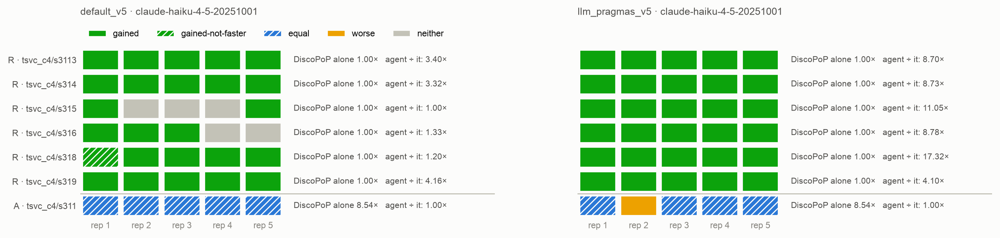
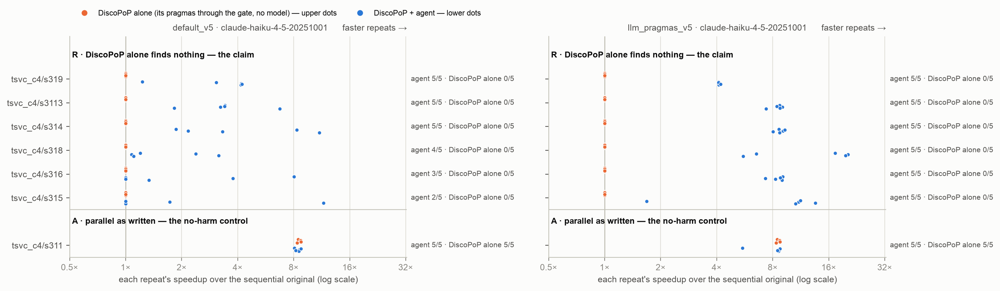

# E3b — the contrast set: who writes the pragma, on loops DiscoPoP does not recognise as written

*Generated by `agent/tools/campaign.py reports` from `results/campaign.json` and the experiment record (`agent/THESIS_EXPERIMENTS.md`). Edit those, then regenerate — not this file.*

**Status:** done

## The question

On six loops that DiscoPoP alone leaves unchanged and whose reference is one or a few directives away — chosen where a difference between the two setups is expected — does the agent ship more race-free verified faster programs where the model writes the pragma than where DiscoPoP writes it, and does anything wrong get through? One control loop DiscoPoP parallelizes itself. (RQ5; reported beside E3, not instead of it)

## Result in one paragraph

Read out 10 Oct (140 trials, 105 with model calls, no failed model call; every changed program of the agent race-clean). On the six loops under test the agent is race-free FASTER in 30 of 30 trials where the model writes the pragma and in 24 of 30 where DiscoPoP writes it — supported as a single test (exact one-sided p 0.0093, CMH 0.0135; three loops differ: `s315`, `s316`, `s318`), not established within the campaign's family (bound 0.49 from the exact p, 0.715 from the CMH p). Neither setup ships an unusable program in 35 trials; Haiku alone 27 of 30 with 3 unusable; DiscoPoP alone 0 of 30; the control 5 of 5 everywhere. What the count does not show: where DiscoPoP writes, the model mostly finds a form DiscoPoP recognises (`x = fmax(x, a[i])`, on which DiscoPoP itself writes `reduction(max:x)`, or an array filled in parallel and reduced afterwards) — with 179 model calls against 52, $29.59 against $6.03, and on four of the six loops less than half the speed (medians 3.32× against 8.73× on `s314`, 1.79× against 17.32× on `s318`). TO READ WITH IT: the premise the set was chosen on — that DiscoPoP has no pragma for a maximum — was wrong (it writes one on the `fmax` form; it does not recognise the loop as TSVC writes it; title corrected, the pre-registration in the record is not); a DiscoPoP defect found in these trials (B23: a minimum reported as a maximum, not repaired) fired in four of the five trials on `s316`, was refused by the gate each time, and can have cost at most one trial; the data hold no two equal largest values, so the position a program returns on a tie is not tested. Cost $38.11 (estimated $84).

## Figures

## What is in this folder

- [`analysis/`](analysis/) — the read-out: [`discopop_writes/figures.md`](analysis/discopop_writes/figures.md), [`discopop_writes/main_comparison_stats.md`](analysis/discopop_writes/main_comparison_stats.md), [`discopop_writes/vs_discopop_alone.md`](analysis/discopop_writes/vs_discopop_alone.md), [`e3b_descriptive.md`](analysis/e3b_descriptive.md), [`e3b_tests.md`](analysis/e3b_tests.md), [`figures.md`](analysis/figures.md), [`main_comparison_stats.md`](analysis/main_comparison_stats.md), [`model_writes/figures.md`](analysis/model_writes/figures.md), [`model_writes/main_comparison_stats.md`](analysis/model_writes/main_comparison_stats.md), [`model_writes/vs_discopop_alone.md`](analysis/model_writes/vs_discopop_alone.md), [`repetition_loop.md`](analysis/repetition_loop.md), [`vs_discopop_alone.md`](analysis/vs_discopop_alone.md)
- [`runs/`](runs/) — 5 archived run(s): the evidence
- [`checks/`](checks/) — 1 verification(s) made during the read-out
- [`preflight/`](preflight/) — 1 smoke run(s) before the launch

## Runs

| run | where | what it is | status | trials | outcomes |
|---|---|---|---|---:|---|
| `e3b_smoke` | [`preflight/e3b_smoke/`](preflight/e3b_smoke/) | E3b smoke, never counted: `tsvc_c4/s314` × 1 — `default_v5` (DiscoPoP writes the pragma), `llm_pragmas_v5` (the model writes it) and `discopop_gate_v5` (DiscoPoP alone, no model), Haiku: the first model call on a package of the new suite, checked before the 140 counted trials start | valid | 3 | FASTER 1, no-change 2 |
| `e3b_1` | [`runs/e3b_1/`](runs/e3b_1/) | E3b, × 5, Haiku: `tsvc_c4` s314 s316 — `default_v5` (DiscoPoP writes the pragma), `llm_pragmas_v5` (the model writes it) and `discopop_gate_v5` (DiscoPoP alone, no model) | valid | 30 | FASTER 18, no-change 12 |
| `e3b_2` | [`runs/e3b_2/`](runs/e3b_2/) | E3b, × 5, Haiku: `tsvc_c4` s3113 s319 — `default_v5` (DiscoPoP writes the pragma), `llm_pragmas_v5` (the model writes it) and `discopop_gate_v5` (DiscoPoP alone, no model) | valid | 30 | FASTER 20, no-change 10 |
| `e3b_3` | [`runs/e3b_3/`](runs/e3b_3/) | E3b, × 5, Haiku: `tsvc_c4` s315 and the control s311 — `default_v5` (DiscoPoP writes the pragma), `llm_pragmas_v5` (the model writes it) and `discopop_gate_v5` (DiscoPoP alone, no model) | valid | 30 | FASTER 22, no-change 8 |
| `e3b_4` | [`runs/e3b_4/`](runs/e3b_4/) | E3b, × 5, Haiku: `tsvc_c4` s318 — `default_v5` (DiscoPoP writes the pragma), `llm_pragmas_v5` (the model writes it) and `discopop_gate_v5` (DiscoPoP alone, no model) | valid | 15 | FASTER 9, no-change 5, parallel-not-faster 1 |
| `e3b_bare_haiku` | [`runs/e3b_bare_haiku/`](runs/e3b_bare_haiku/) | E3b, Haiku alone: `bare_llm_v4` on the seven loops of the contrast set × 5 (`tsvc_c4` s314 s316 s3113 s315 s318 s319 s311) | valid | 35 | BROKEN 2, FASTER 33 |
| `e3b_race_check` | [`checks/e3b_race_check/`](checks/e3b_race_check/) | race_check.py (server, no model) over every changed program of E3b's two setups and of Haiku alone — the gate's ThreadSanitizer build and schedule matrix on each finished file | valid | 0 |  |
| `e3bc_s316` | not archived yet | E3b corrected for DiscoPoP B23 (a minimum reported as a maximum, repaired 10 Oct): `tsvc_c4/s316` × 5, Haiku — `default_v5` (DiscoPoP writes the pragma), `llm_pragmas_v5` (the model writes it) and `discopop_gate_v5` (DiscoPoP alone, no model), as `e3b_1`, on the repaired DiscoPoP; replaces the `tsvc_c4/s316` cells of `e3b_1` in the corrected read-out. Launched only after the regression of group B23 is read | registered |  |  |
| `e3bc_race_check` | not archived yet | race_check.py (server, no model) over the changed programs of `e3bc_s316` | registered |  |  |

## Change-log rows that name these runs (§6)

| Date | Repo | Change | Why |
|---|---|---|---|
| 2026-10-10 | process | **No answer on B24 before the regression ended: the 15 trials of `s316` start on the DiscoPoP with B23 repaired, as announced; B24 stays open.** The message of 20:33 UTC put B24 to the author — repair it too (my recommendation: the standing rule, the same place, the same regression) or leave it and list it — and said what happens without an answer when the check ends. None came by 22:35 UTC. The 15 trials themselves are covered by his "Ok" of this evening; B24 was the only new question, and the default is the one that changes nothing. `e3bc_s316` is launched after this commit is synced and `campaign.py check` has run (expected to name only what is registered and not yet run). If he decides for the repair of B24 afterwards, DiscoPoP's later version differs from the one of these 15 trials only where a stored call is neither a minimum nor a maximum; that is then said with the table. | Process, B24 default |
| 2026-10-10 | result | **DiscoPoP B23 repaired: the regression is read — passed. On all 84 packages every class is as before the repair, no reduction clause differs and no reduction file holds another operation. The repair acts where it aims and nowhere else in the benchmark sets.** **Runs (all valid, no model):** `t0_11_c3_b23_a`, `t0_11_c3_b23_b`, `t0_11_c3_b23_c` (the 44 `tsvc_c3` packages), `t0_11_c4_b23_a`, `t0_11_c4_b23_b`, `t0_11_c4_b23_c` (the 9 `tsvc_c4` packages), `t0_11_b23_apps_a`, `t0_11_b23_apps_b`, `t0_11_b23_apps_c` (the 31 packages outside TSVC) — 252 trials, 0 model calls, 20:30 to 22:35 UTC, every launch after PARITY OK at `c89952852`; sweep clean. **Before the server was touched** (`results/T0_instruments/B23_min_as_max/analysis/mac_checks.md`; the Mac, LLVM 19): the file of thirteen loops — the maximum `max`, the three minima `min` in either order of the entries, every other line as before; the new end-to-end test passes and fails with the explorer's half taken out; DiscoPoP's 37 end-to-end tests, the profiler's 184 unit tests and eight feature checks of the agent pass; on the rewrite of E3b's trial `e3b_1` rep1 DiscoPoP reports `min:x` where it wrote `reduction(max:x)`; `tsvc_c4/s316` and `s314` as packaged are still left unchanged. **On the server** (LLVM 20.1.2, the profiler rebuilt from `c89952852`, the wrappers re-installed): the same file gives `>` six times before the rebuild and `>`, `<`, `<`, `<`, `>`, `>` after it, with `reduction(min:x)` on the three minima; the new test and all 37 end-to-end tests pass. **The regression** (`analysis/b23_readout.md`, against the last draws before the repair — `t0_11_c3_b19r_a` to `_c`, `t0_11_c4_a` to `_c`, `t0_11_b19r_apps_a` to `_c`). `tsvc_c3`: classes A 10, D 5, R 29 before and after; no package with another class, another outcome or number of kept directives in any draw, another directive offered, or another reduction clause. `tsvc_c4`: A 1, R 8 before and after; the same four zeros. Outside TSVC: A 22, R 9 before and after; no class differs and no reduction clause differs. One package keeps another number of directives in one draw (`polybench/mvt`: before, draw a had one of its two directives refused by the gate's dependence stage and draws b and c kept both; after, all three keep both), and in twelve the loops DiscoPoP offers differ in some draw. Nine of the twelve hold a single operation in their reduction file and cannot be reached by either half of the repair; the other three (`burkardt/md`, `polybench/adi`, `polybench/lu`) carry the same reduction clauses before and after. The differences are loops offered in one draw and not in another, in the draws before the repair as in those after it — `seidel-2d`, `floyd-warshall` and `bicg` with everything or nothing, which is B21 as measured on 8 Oct. **The complete account of where the repair can act** (`analysis/reduction_files_before.txt` and `_after.txt`, the first draw of each set): 84 packages, none with other operations after the repair, none with a minimum entry; the maximum entries are where they were (`s293` one, `adi` six, `lu` one — stores the heuristic reads as a maximum, B24's kind; no pattern comes of them). **Reading.** No package of ours stores a minimum call, and no reduction DiscoPoP reports on them belonged to another entry of its file, so the repair changes nothing that has been measured: E1-v6, E3 and E3b's other cells stand as they are. `s316`'s cell of E3b is the one place it acts, on the model's rewrites. **What the regression cannot show:** programs the model writes with reductions of different operations in one file — there the explorer's half gives each its own operation from now on. | Result, B23 regression |
| 2026-10-10 | decision | **DiscoPoP B23: the author's go-ahead — "Ok" — to repair it before the fast-refresh experiment and to run `s316`'s cell of E3b again; what is fixed before the repair is written and before the first trial.** His "Ok" answers the message that reported E3b and put one decision to him with my recommendation: repair the defect before E4 and run only that loop again (15 trials, about $8); the case for leaving it (half a day of rebuild and regression for one trial at most) was in the same message. Read as the go-ahead for the recommendation; his to change. **(1) What the defect is, measured before any change** (the installed DiscoPoP on the Mac, LLVM 19, a file of thirteen loops, `scratch b23/repro/mm.c`, kept with the read-out): the profiler's heuristic fires on a store `x = f(x, …)` whose value is a call — `x = fmax(x, a[i])` is reported with the operation `>` and DiscoPoP writes `reduction(max:x)` (right); `x = fmin(x, a[i])`, `x = fminf(x, …)` and `x = fmin(a[i], x)` are reported with `>` too and get `reduction(max:x)` (B23). The compiler hands the pass `llvm.maxnum` and `llvm.minnum` for these calls. It does NOT fire on a maximum or minimum written with `?:` (the compiler makes a branch of it) or with `if` — none of the seven such loops in the file is reported. **(2) The scope of the repair: the direction, and nothing else.** Where the heuristic writes `>` today, the operation is read from what is stored: a call of a minimum function (`fmin`, `fminf`, `fminl`, the intrinsics `llvm.minnum`, `llvm.minimum`, `llvm.minimumnum`, `llvm.smin`, `llvm.umin`) one of whose arguments is the loaded value of the variable gives `<`, which the explorer already turns into `min`; everything else is reported exactly as before. So the only output of DiscoPoP that can change, on any program, is the operation of a reduction whose stored value is such a minimum call. **Not done, and why.** (a) No new form is recognised: TSVC's `if (a[i] > x) x = a[i];` stays unrecognised. Recognising it would let DiscoPoP alone parallelize three loops of the contrast set and change classes measured in T0.19 — an extension of DiscoPoP, not this repair, and not decided. (b) A second weakness of the same heuristic, measured with the same file and NOT repaired here: any other call of the variable is reported as a maximum as well — `x = hypot(x, a[i])` and `x = fabs(x - a[i])` both get `reduction(max:x)`, the second on a loop that is no reduction at all. Entered in the bug list as B24, put to the author; a repair of it ('report nothing where the direction cannot be read') would be a second change of behaviour that he has not been asked about. **(3) What must hold before the server is touched** (the Mac, no model): the file of thirteen loops after the rebuild — the maximum still `max`, the three minima `min`, every other line as before; a new end-to-end test with one `fmax` loop and one `fmin` loop that checks the OPERATION, not only the line; DiscoPoP's existing end-to-end tests and the profiler's unit tests; on the archived rewrite of `s316` on which it wrote `reduction(max:x)` (E3b, `e3b_1` rep1) DiscoPoP writes `reduction(min:x)`; on the original `tsvc_c4/s316` it still writes nothing. **(4) The regression, no model, registered as group B23 before the first job:** DiscoPoP alone in three draws on the 44 `tsvc_c3` packages (`t0_11_c3_b23_a`, `t0_11_c3_b23_b`, `t0_11_c3_b23_c`), on the 9 `tsvc_c4` packages (`t0_11_c4_b23_a`, `t0_11_c4_b23_b`, `t0_11_c4_b23_c`) and on the 31 packages outside TSVC (`t0_11_b23_apps_a`, `t0_11_b23_apps_b`, `t0_11_b23_apps_c`) — as after B19 and B18. It passes if every package has the class it had before the repair (against `t0_11_c3_b19r_a` to `_c`, `t0_11_c4_a` to `_c`, `t0_11_b19r_apps_a` to `_c`; outside TSVC with the known all-or-none draws of B21 read as before). Beside it, the complete account of where the repair can act at all: every `reduction.txt` of those 84 packages searched for a line with the operation `>` — expected none or few, each read. **(5) The re-run, after the regression is read:** `e3bc_s316` — `tsvc_c4/s316` × `default_v5`, `llm_pragmas_v5`, `discopop_gate_v5` × 5, Haiku, as `e3b_1` — on the repaired DiscoPoP in all three; `e3bc_race_check` after its archive is synced. Haiku alone is not run again (no DiscoPoP in it). About $8 by E3b's per-trial costs ($1.43 and $0.19). **(6) How it is reported:** E3b's registered result stays the registered one. Beside it `analysis/corrected/` (`--drop e3b_1:tsvc_c4/s316`, the new cell in its place, `e3b_tests.py` on it; the same test on corrected data, so the family stays 53), with the sentence that the table then holds trials on two DiscoPoP versions. Both cells are given. **(7) Expected, written now:** where DiscoPoP writes, `s316` comes out as `s314` did — DiscoPoP's own `reduction(min:x)` in most final programs, fewer model calls than 9.2 a trial. The count is a new draw of rewrites, not the old trials replayed: anywhere from 3 to 5 of 5 is possible, 4 or 5 expected (the old trials bound the defect's own share at one trial). Where the model writes: 5 of 5 as before. The test's verdict does not depend on it. **(8) From here on** E4 and every later experiment run on the repaired DiscoPoP; E1-v6, E3 and E3b's other cells are not run again (the repair cannot act on a program without a minimum call stored into a loop-carried scalar; the scan in (4) is the check for the originals). | Decision (author), B23 repair |
| 2026-10-10 | result | **E3b read out — the contrast set (the registered script `results/E03b_contrast_set/analysis/build.sh`; 140 trials on seven loops, 105 of them with model calls, no failed model call; the race check after the archive was synced). On the six loops under test the agent is race-free FASTER in 30 of 30 trials where the model writes the pragma and in 24 of 30 where DiscoPoP writes it — the registered test is supported at the experiment's level (exact one-sided p 0.0093), not within the campaign's family. Neither setup ships an unusable program. Two things qualify it: my premise that DiscoPoP has no pragma for a maximum was WRONG (the correction row below), and a DiscoPoP defect found in these trials sits on one of the three loops that differ (the finding row below).** **Runs (all valid):** `e3b_1`, `e3b_2`, `e3b_3`, `e3b_4` (the two setups and DiscoPoP alone, × 5), `e3b_bare_haiku` (Haiku alone, × 5), `e3b_race_check`; the smoke `e3b_smoke` (pre-flight, three trials, never counted; 12:50–13:13 UTC). The queue ran 12:50–18:26 UTC, every launch after PARITY OK at `cb921121f`; sweep clean. **Race check** (server, no model, at `d8a58e999`): where DiscoPoP writes, 30 changed programs clean and 5 unchanged; where the model writes, 35 clean; Haiku alone: 32 clean, one FASTER program racy (`s315` rep2), two BROKEN. **The test, E3b-1** (`analysis/e3b_tests.md`; a new member of the family, M = 53): the model writes 30 of 30, DiscoPoP writes 24 of 30; three loops differ — `s315` 5 against 2, `s316` 5 against 3, `s318` 5 against 4 — and no loop goes the other way (Mantel–Haenszel odds ratio infinite). The registered statistic, CMH with continuity correction, gives one-sided p = 0.0135; with three informative loops the normal approximation does not hold (Mantel–Fleiss), so the exact conditional test registered beside it is the one to read: p = 0.0093. **Supported at α 0.05 as a single test by either; not established within the campaign's family — the bound p × 53 is 0.49 with the exact p and 0.715 with the CMH p, the number `e3b_tests.md` prints.** The refutation clause: 0 against 0 unusable programs of 35. **The three-way table, loops under test:** DiscoPoP alone 0 of 30; the agent where DiscoPoP writes 24 (25 verified parallel), 0 unusable; where the model writes 30, 0 unusable; Haiku alone 27 of 30 with 3 unusable (2 BROKEN, 1 racy). Control `s311`: 5 of 5 in every setup, DiscoPoP alone included. **Expectations, as written before the run.** (a) *The model's setup wins the one-clause loops at the first call, `s319` too; the two index loops open:* held and more — 30 of 30, 20 of them at the first call, 1.0 to 1.8 calls a trial; `reduction(max:…)` on `s314` and `s3113`, `reduction(min:…)` on `s316`, `reduction(+:…)` on `s319`, in 5 of 5 each; on `s315` and `s318` a pair per thread merged under a lock, or the value by a reduction and its position by a second loop. (b) *Where DiscoPoP writes, well below:* WRONG in size — 24 of 30, and 5 of 5 on `s314`, `s3113` and `s319`. In most trials the model found a form DiscoPoP's analysis recognises: `x = fmax(x, a[i])`, on which DiscoPoP itself writes `reduction(max:x)` (its directive in 8 final programs — `s314` 3, `s3113` 4, `s318` 1 — and in 16 candidates the gate judged, all passed); one statement for the sum, on which it writes `reduction(+:sum)` (`s319`, 4 of 5); or an array filled by a loop with independent iterations and reduced afterwards, on which it writes a plain `parallel for` (13 final programs: `s314` 2, `s3113` 1, `s316` 3, `s315` 2, `s318` 4, `s319` 1). T0.19's ceiling had only said that DiscoPoP writes nothing on the reference's own form. The clause that would have withdrawn E3's reading of `s331` — the two setups equal on the six loops — is not met over the six; the two setups ARE equal on three of them (`s314`, `s3113`, `s319`). (c) *The control equal:* held (5 of 5 everywhere; medians 8.52× and 8.54×, DiscoPoP alone 8.54×). (d) *No unusable program in either setup; Haiku alone ships some:* held (0, 0, and 3). **Where the difference is, beyond the count** (`analysis/e3b_descriptive.md`; the per-trial forms read from the final programs). *Speed* — median of a loop's FASTER trials, DiscoPoP writes against the model writes: `s314` 3.32× against 8.73×, `s316` 3.77× against 8.78×, `s3113` 3.40× against 8.70×, `s315` 6.65× against 11.05×, `s318` 1.79× against 17.32×, `s319` 4.16× against 4.10×. By form, where DiscoPoP writes: the `fmax` form with DiscoPoP's reduction 1.8× to 3.4× (eight programs; why it gains less than the model's own `reduction(max:…)` on the comparison was not examined); a parallel loop over blocks, each block reduced inside it, 3.8× to 11.6× (six programs: `s314` two, `s3113`, `s315`, `s316` two); an array filled element by element in parallel and then searched or summed sequentially, 1.1× to 2.4× (seven programs, one of them not faster). *Attempts and cost* — 179 model calls and $29.59 where DiscoPoP writes, 52 calls and $6.03 where the model writes (35 trials each); per trial on the six loops 1.8 to 9.2 calls against 1.0 to 1.8; one of DiscoPoP's 24 wins came at the first call, 20 of the model's 30. Haiku alone: $2.49. E3b in all $38.11 (estimated $84: the model's setup cost $6 against the $22 projected, the other $30 against $59). **`s316` and the DiscoPoP defect** (the finding row below; `DISCOPOP_BUG_REPORTS.md` B23): on this loop, a minimum, DiscoPoP wrote `reduction(max:x)` on the model's rewrite in four of the five trials (9 candidates), and the output check refused each. Three of those four trials were won all the same, through arrays (3.77×, 8.02×, 1.33×); of the two trials lost, the defect fired in one (rep4) and not in the other (rep5, where no `fmin` form was judged). A right `reduction(min:x)` could therefore have changed at most one trial of the count (24 to 25); what it would have done to the attempts on this loop — 9.2 calls a trial, the most of any — is not known. The cell is reported as measured and marked; a repair and a re-run of the cell are the author's decision. Without `s316` the two setups differ on two loops (`s315` 5 against 2, `s318` 5 against 4). **Other read-outs fixed in the pre-registration.** *The repetition loop* (`analysis/repetition_loop.md`): all 70 programs of the two setups keep the repetition loop and the `dummy` call as they are (seven of E3's had opened a parallel region around the repetitions); one control program computes the sum once in front of the loop and after `dummy` inside it — the same work plus one pass. *The gate:* where the model writes, 61 candidates — refused: the race detector 5, the output check 6, the clause check 5, compile 2, the speed check 2; where DiscoPoP writes, 278 — 14 rewrites changed the output, 21 did not compile, and 11 candidates carrying DiscoPoP's own directives were refused by the output check, all on `s316` (the 9 above, one `lastprivate`, one task construct). *Equal values on the two index loops:* the data hold no two equal largest values (as TSVC's own), so the output check cannot tell a program that returns the FIRST position from one that returns another. Of the model's ten programs on `s315` and `s318`, at least three merge with a strict comparison under a lock and would return whichever thread merges last (`s315` rep1, rep3; `s318` rep1); where DiscoPoP writes, one program (`s318` rep5) finds the position by a second loop that does not stop at the first match and would return the last. A limit of the data I chose, stated. *The floor on the control:* DiscoPoP's own program shipped in 3 of 5 trials where DiscoPoP writes and in 1 of 5 where the model writes (in two more of the model's the finished program was DiscoPoP's own). **Reading.** What E3b adds to E3: on loops whose reference is one clause, the model writing the pragma wins every trial, two in three at the first attempt, at the reference's speed; with DiscoPoP writing, the agent still wins four trials in five — because the model finds a form DiscoPoP recognises — with three and a half times the model calls, five times the cost, and on four of the six loops less than half the speed. The count alone (30 against 24) understates the difference in what is delivered, and a 'missing pragma' explains less of it than I had written. Haiku alone does nearly as well here as the agent (27 of 30) and ships three unusable programs. **Limits.** Six loops of one suite, chosen where a difference was expected, on a premise that was wrong; `s3111` left out after the no-model measurement (the amendment); five trials per loop, one model; `s316` under a DiscoPoP defect; the equal-values limit; the test not established within the family. **Files:** `analysis/e3b_tests.md` and `.json`, `analysis/e3b_descriptive.md` (script written after the trials; it reads the archive and tests nothing), `analysis/repetition_loop.md`, `analysis/discopop_writes/`, `analysis/model_writes/`, the root read-out `analysis/main_comparison_stats.md`. | Result, E3b |
| 2026-10-10 | decision | **E3b and the re-run of `s341`: the author's OK — "ok" — and what is fixed with it before the first trial.** Put to him with the files a model will read (`docs/CONTRAST_SET_LOOPS.html`, published), the composition (six loops under test and one control instead of the eight first named; `s3111` taken out after the no-model measurement, said to him as a change to my own rule), the cost (about $115, between $75 and $145, of which about $29 for `s341`; 140 model trials; about 6 hours) and one finding with a recommendation (the gate's exact output check refuses a correct parallel sum where the six builds of the original agree exactly — leave it as it is for this run and state the limit). His answer: "ok". **Read as:** the OK for the 140 model trials as pre-registered, and — the recommendation standing in the same message — the output check unchanged for this run. Nothing in `discopop_agent/` changes: the agent, its texts and its gate are E3's. **Fixed before the first trial:** (1) the test's script, `tools/e3b_tests.py` — E3's `analyse` with E3b's one test and the family's size 53 — checked on E3's own read-outs, where it returns E3's numbers (81 against 76 of 90, one-sided p 0.142, seven loops that differ); the read-out's commands in `results/E03b_contrast_set/analysis/build.sh`. (2) The registry: group E3b and its runs, and the `s341` runs under E1-v6 and E3, registered. (3) A smoke before the counted trials, never counted (`e3b_smoke`: `s314` × 1 in each setup, about $2): the first model call on a package of the new suite; the queue goes on only if both model trials end with all their model calls. (4) The queue (Mac side, unattended): one chain of jobs per 12-core group, so that no group waits for another — `e3b_smoke` → `e3b_1` → `e1v6c_v8_bare_sonnet` → `e1v6c_v8_bare_opus` → `e1v6c_v8_bare_fable`; `e3b_2` → `e3b_bare_haiku`; `e3b_3` → `e1v6c_v8_agent` → `e1v6c_v8_bare_haiku`; `e3b_4` → `e3c_v8_s341`. Every launch after PARITY OK; nothing is committed while a launch is pending. (5) The race checks are NOT in the queue: they run after the runs are fetched, archived, committed and synced (E3's deviation of this morning). A trial whose model call failed is run again and never counted. (6) The author exported this session to `evaluation/history.txt`, inside the checkout: the file is his, stays where it is, and is ignored locally (`.git/info/exclude`) — it is not committed (the repository is public) and does not make a launch's parity check fail. | Decision (author), E3b launch |
| 2026-10-10 | plan | **E3b pre-registered — the contrast set: who writes the pragma, on loops chosen because DiscoPoP has no pragma for them; and `s341` run again on data that move. Written before any trial; put to the author with the files a model will read and the cost; NOTHING is launched before his OK.** **What it can tell that the runs in hand cannot.** E3 found the setup in which the model writes ahead by five trials of 90, four of them on one loop, `s331`, the only loop of the main set that needs a pragma DiscoPoP cannot write and that either setup can win. One loop is a case. E3b asks whether it is a class: on six more loops that DiscoPoP alone leaves unchanged and whose reference is one or a few directives away, does the model's pragma win where DiscoPoP's cannot — and does anything wrong get through? **It is not E3 again and does not replace it.** E3 is the comparison on the main comparison's set, chosen without regard to the question. E3b's loops are chosen WHERE a difference is expected (the rule and its exclusions: the plan row of today; the class of each loop measured without a model: T0.19). A difference here says the mechanism is real; it says nothing about how often such loops occur in programs. `s331`, which prompted the set, is not in it and is reported beside it with its E3 trials. **Design.** The two setups of E3 unchanged — `default_v5` (DiscoPoP writes the pragma) and `llm_pragmas_v5` (the model writes it; DiscoPoP adds its own to a loop it finds parallel that carries none; the arbitration off) — with `discopop_gate_v5` (DiscoPoP alone) in every run, Haiku 4.5, prompt version 5, budget 3, the speed check on, a full re-profile, threads 6 and 12, 5 timing repeats: the agent, the texts and the gate of E3 (`8297abb28`'s; nothing changed since in `discopop_agent/`). Beside them Haiku alone (`bare_llm_v4`) on the same loops, for the three-way table. **Loops (suite `tsvc_c4`), each × 5:** under test — `s314`, `s316`, `s3113`, `s315`, `s318`, `s319`; control — `s311`. (The rule of the plan row, with one amendment made after T0.19 and before any model call: `s3111`, which the rule's letter puts under test, is left out — the result row of T0.19 says why.) 35 trials per setup: 70 trials of the agent, 35 of Haiku alone, 35 of DiscoPoP alone (no model). **Runs:** `e3b_1` (`s314`, `s316`), `e3b_2` (`s3113`, `s319`), `e3b_3` (`s315`, `s311`), `e3b_4` (`s318`) on the four 12-core groups at once; then `e3b_bare_haiku` (the seven loops, `bare_llm_v4`); then, when the runs are fetched, archived, committed and synced — the order the queue of E3 got wrong — `e3b_race_check` over every changed program of the two setups and of Haiku alone. **The test — one, a new member of the campaign's family (M = 53; the bound is p × 53):** on the six loops under test, race-free verified FASTER where the model writes against where DiscoPoP writes: Cochran–Mantel–Haenszel stratified by loop, one-sided in the direction of E3's H6 (the model's setup ahead), the exact conditional test beside it, α 0.05. Refuted, as H6 was registered, if the setup in which the model writes ships more unusable programs over its 35 trials. **Descriptive, fixed now:** the three-way table (DiscoPoP alone · the agent in each setup · Haiku alone) per loop; the control; for every kept pragma its author and its form (a reduction clause, a lock, a parallel region around the repetition loop — E1-v6's instrument with the tag of 10 Oct); the gate's refusals by stage, the dependence stage and the exact output check named; calls and cost per trial; the programs of `s315` and `s318` read one by one for the index they return on equal values. **Expectations, written before any trial.** (a) Where the model writes: the three one-clause loops won in nearly every trial at the first call; `s319` won (the gate's floor allows a reordered sum there); `s315` and `s318` open — a pair of value and index has no clause, and a `reduction(max:…)` with the index written beside it is a race the detector should refuse. (b) Where DiscoPoP writes: a win needs a rewrite in which DiscoPoP sees independent iterations — partial results per block, then a short sequential pass — and T0.19's ceiling says the reference's own form is not one; expected well below the other setup, how far below is the result. `s319` may be won by splitting the sum off. (c) The control equal in both setups, at DiscoPoP alone's level or above. (d) No unusable program in either setup; Haiku alone ships some. A result against (a)–(b) — the two setups equal on the six loops — would say the model finds the detour as readily as the clause, and E3's reading of `s331` would be withdrawn. **`s341` again, on `tsvc_c4` (the author's decision of today), in every setup that has a cell for it:** `e1v6c_v8_agent` (`default_v4`, `discopop_gate_v4` — E1-v6's agent, on today's DiscoPoP and gate as its other corrected cells), `e1v6c_v8_bare_haiku`, `e1v6c_v8_bare_sonnet`, `e1v6c_v8_bare_opus`, `e1v6c_v8_bare_fable` (`bare_llm_v4`), and `e3c_v8_s341` (`default_v5`, `llm_pragmas_v5`, `discopop_gate_v5`), each × 5; then `e1v6c_v8_race_check`. 35 model trials. The read-outs they correct: E1-v6's table a third time (`analysis/corrected_3/`: `--drop` of the `tsvc_c2/s341` cells of `e1v6_r_4` and of the four model-alone runs, `--same-loop tsvc_c2/s341=tsvc_c4/s341`) and E3's (`analysis/corrected/`, the same for `e3_r_4`). Its nine tests and E3's two are run again on the corrected tables and reported beside the registered ones; the registered ones stay in the record. *Expected:* the form that computes the positions once is now refused by the output check wherever it is tried; the right form (count per block, offsets, scatter, in every repetition) is long and the reference reaches only 2.37×, so few wins in any setup — E1-v6's agent cell, 4 of 5, most likely falls, the main comparison's 79 toward 75. What the stronger models alone do on the new data is not predicted. **Cost and time, from E3's per-trial costs on the nearest loops** (`s331`: $1.85 where DiscoPoP writes, $0.13 where the model writes; `s341`: $1.66 and $1.93; the three class-A loops: $0.74 and $0.09; the models alone $0.09 to $0.26): the contrast set about $84 — DiscoPoP writes $59, the model writes $22 if the two index loops cost what `s341` did, Haiku alone $3; `s341` about $29. **About $115 in all, between $75 and $145; 140 model trials; about 6 hours on the server, unattended.** **Limits said now:** the loops are chosen where a difference is expected; six loops of one suite, all extreme-value or sum loops; five trials per loop; one model; the two setups are not symmetric — the one in which the model writes keeps DiscoPoP's pragmas as a fallback; `s3111` is left out for the gate's exact comparison (T0.19). | Plan, E3b pre-registration |

