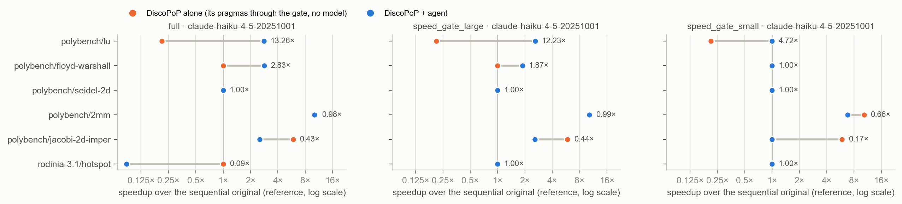

# E10 — does the speed check keep unnecessary changes out?

*Generated by `agent/tools/campaign.py reports` from `results/campaign.json` and the experiment record (`agent/THESIS_EXPERIMENTS.md`). Edit those, then regenerate — not this file.*

**Status:** done

## The question

With the speed check timed at a size where speed is measurable, are correct-but-not-faster changes kept out without lowering the delivered speedup? (H10, H10b) Decided D22.

## Result in one paragraph

The speed check ON at the kernel's timing size is the only configuration with no unsafe acceptance and nothing below DiscoPoP alone (D22).

## Figures

## What is in this folder

- [`analysis/`](analysis/) — the read-out: [`README.md`](analysis/README.md), [`figures.md`](analysis/figures.md), [`vs_discopop_alone.md`](analysis/vs_discopop_alone.md)
- [`exhibits/`](exhibits/) — 8 case studies, below
- [`runs/`](runs/) — 3 archived run(s): the evidence

## Runs

| run | where | what it is | status | trials | outcomes |
|---|---|---|---|---:|---|
| `e10` | [`runs/e10/`](runs/e10/) | the speed check: full · speed_gate_large · speed_gate_small × 6 kernels × 3 | valid | 54 | BROKEN 1, FASTER 21, no-change 27, parallel-not-faster 5 |
| `e10_dp_alone` | [`runs/e10_dp_alone/`](runs/e10_dp_alone/) | DiscoPoP alone on five of E10's kernels (the main comparison, D19) | valid | 15 | FASTER 6, no-change 9 |
| `e10_lu_fix84` | [`runs/e10_lu_fix84/`](runs/e10_lu_fix84/) | lu, all four arms, after Fix 84 | valid | 12 | FASTER 6, no-change 3, parallel-not-faster 3 |

## Exhibits

- [`2mm_annotated_faster`](exhibits/2mm_annotated_faster/) — Pragmas only on 2mm, 7.5× at 12 threads; DiscoPoP alone was timed on another setup, so no ratio.  
  **not-comparable** vs DiscoPoP alone (10.31× → 7.46×) · polybench/2mm, `full`, e10 rep 1 · pictures: `before_after.png`, `console.png`
- [`floyd_restructured_peeling`](exhibits/floyd_restructured_peeling/) — With the speed check on: a restructuring of floyd-warshall kept at 9.6× (12 threads); DiscoPoP alone reaches nothing.  
  **gained** vs DiscoPoP alone (1.00× → 9.56×) · polybench/floyd-warshall, `speed_gate_large`, e10 rep 1 · pictures: `before_after.png`, `rejected_attempt.png`, `console.png`
- [`floyd_stack_array_broken`](exhibits/floyd_stack_array_broken/) — E10's one unsafe result: a stack array sized by the problem — correct at the dump size, it crashes at the verification size with 6 threads. The contract now states the memory limit.  
  **unsafe** vs DiscoPoP alone (1.00× → 1.00×) · polybench/floyd-warshall, `full`, e10 rep 1 · pictures: `before_after.png`, `console.png`
- [`hotspot_correct_but_12x_slower`](exhibits/hotspot_correct_but_12x_slower/) — Speed check off: a correct parallel hotspot that is not faster (0.97×/0.95×) — the kind of change the speed check exists to keep out.  
  **gained-not-faster** vs DiscoPoP alone (1.00× → 0.97×) · rodinia-3.1/hotspot, `full`, e10 rep 1 · pictures: `before_after.png`, `rejected_attempt.png`, `console.png`
- [`lu_annotated_after_fix84`](exhibits/lu_annotated_after_fix84/) — After Fix 84: pragmas on lu, 2.72× where DiscoPoP alone gives 0.21×.  
  **better** vs DiscoPoP alone (0.21× → 2.72×) · polybench/lu, `full`, e10_lu_fix84 rep 1 · pictures: `before_after.png`, `console.png`
- [`lu_inner_pragma_correct_but_5x_slower`](exhibits/lu_inner_pragma_correct_but_5x_slower/) — Speed check off: correct pragmas on lu's inner loop, 5× slower (0.21×/0.16×).  
  no DiscoPoP-alone trial to pair with · polybench/lu, `full`, e10 rep 1 · pictures: `before_after.png`, `rejected_attempt.png`, `console.png`
- [`lu_with_speed_check_faster`](exhibits/lu_with_speed_check_faster/) — Speed check on, at the timing size: one pragma kept on lu, 2.4× at 12 threads.  
  no DiscoPoP-alone trial to pair with · polybench/lu, `speed_gate_large`, e10 rep 1 · pictures: `before_after.png`, `console.png`
- [`seidel2d_correctly_declined`](exhibits/seidel2d_correctly_declined/) — A true recurrence declined: 12 attempts, 8 rejected for wrong output and 4 for races.  
  **neither** vs DiscoPoP alone (1.00× → 1.00×) · polybench/seidel-2d, `full`, e10 rep 1 · pictures: `before_after.png`, `rejected_attempt.png`, `console.png`

## From the experiment record (§7 run log)

### `e10_dp_alone`, `e10_lu_fix84` — 2026-09-20, server, **E10 completed by the main comparison (D19)**

- **Why.** E10 measured the agent's three arms against the SEQUENTIAL original. The author's rule
  (D19) makes DiscoPoP alone the comparison, and E10 had no such arm; `lu` additionally ran with
  the misplaced Phase-B pragma (Fix 84).
- **Setup.** `e10_dp_alone`: `discopop_gate`, no model, the five other E10 kernels × 3, node 1.
  `e10_lu_fix84`: `lu` × all four arms × 3, Haiku, node 0, agent `58d959f2` (with Fix 84). Same
  sizes, threads (6/12) and repeats as E10. Host load 197–5,279 (median ≈ 1,400).
- **The main comparison**, 21 agent trials per arm against DiscoPoP alone on the same benchmark
  (`analysis/e10_e10_dp_alone_e10_lu_fix84/vs_discopop_alone.md`, `fig_vs_discopop_alone`):

  | arm | gained | better | equal | worse | **lost** | neither | unsafe | median agent ÷ DiscoPoP alone |
  |---|---:|---:|---:|---:|---:|---:|---:|---:|
  | `full` | 1 | 4 | 5 | 5 | **0** | 4 | **1** | 0.99× |
  | `speed_gate_large` | 2 | 6 | 2 | 4 | **0** | 7 | 0 | 1.00× |
  | `speed_gate_small` | 0 | 0 | 0 | 2 | **10** | 9 | 0 | 1.00× |

  Per benchmark (12 threads, median over repeats): `lu` DiscoPoP alone **0.21×** vs agent 2.6–2.8×
  → **better ×10**; `floyd-warshall` DiscoPoP alone `no-change` vs agent 1.9–2.8× → **gained ×3**
  (the only restructuring in the set); `2mm` 10.3× vs 10.2× → equal; `jacobi-2d` DiscoPoP alone
  **5.9×** vs agent **2.5×** → **worse ×6**; `seidel-2d` neither (both decline, correct);
  `hotspot` DiscoPoP alone `no-change`, `full` leaves a correct program at **0.09×** → worse.

- **What the new baseline changes.**
  1. **D8 is confirmed, and for a stronger reason.** `speed_gate_large` is the only arm with no
     unsafe acceptance AND no `lost`, the most `better`/`gained`, and the best worst case.
  2. **`speed_gate_small` is not merely wasteful, it is destructive: 10 of 21 trials `lost`** —
     DiscoPoP alone reaches a verified parallel program and the agent's arm does not. Cause read
     from the logs: Phase B applies the speed check to **DiscoPoP's own pragmas** at a size where
     the kernel runs in milliseconds, measures `marginal 0.00× — costs more than it saves`, and
     drops them (`lu`, all three repeats). A speed check at the wrong size does not only block the
     model; it deletes the analysis tool's correct suggestions. This is a thesis result in its own
     right (H10b, sharpened).
  3. **The agent is NOT better than DiscoPoP alone on this set** (median 1.00×) — as it should be:
     five of the six kernels are class A. Here the agent must do no harm, and `speed_gate_large`
     nearly manages that (0 lost, 0 unsafe); the exception is `jacobi-2d`, below. C1 is carried by
     class R, which this set contains only once (`floyd-warshall`, where the agent gains).
  4. **DiscoPoP alone varies by profile draw.** On `lu` the server draw gives an innermost-loop
     Do-All and **0.21×** (all three repeats, one profile); the Mac draw of the same kernel gave
     3.4×. Repeats within a run share one profile, so they are not independent draws: T0.11 must
     profile separately per repeat.
  5. **Classification fixed** (`figures.py`): a correct parallel program that runs ≥ 1.1× SLOWER
     than what DiscoPoP alone leaves is counted `worse`, even where DiscoPoP alone changed
     nothing — `hotspot` at 0.09× was being reported as `gained-not-faster`.

- **The `jacobi-2d` regression → Fix 85 (agreed with the author, to build before E1).** DiscoPoP
  claims the two inner stencil loops; the agent defers them to Phase B, correctly. But the
  *enclosing function* is also a candidate, has no pattern of its own, and goes to the model —
  which, with `--llm-pragmas`, writes `collapse(2)` on those same loops from inside the rewrite.
  Phase B then finds "no applicable pattern" (the loops are annotated) and DiscoPoP's own
  `parallel for private(j)`, twice as fast here, is never measured. Fix: (a) the prompt names the
  loops inside the region that DiscoPoP has already claimed and reserves their pragmas for Phase B;
  (b) where a model pragma sits on a claimed loop anyway, Phase B measures DiscoPoP's version
  against it and keeps the faster. Feature check required.
- **Archives.** `results/E10_speed_check/runs/e10_dp_alone/` (15 trials), `results/E10_speed_check/runs/e10_lu_fix84/` (12 trials).

### `e10` — 2026-09-19/20, server, **E10: the speed check** (full · speed_gate_large · speed_gate_small × 6 kernels × 3, Haiku 4.5) — decides D8

- **Question (pre-registered, H10/H10b).** With speed unjudged (`full`) the agent keeps every
  change that is correct, including ones that make the program slower. Does a speed check timed
  at a size where the kernel runs long enough (`speed_gate_large`, T0.1 sizes) stop those without
  costing successes — and does the same check at the agent's small size (`speed_gate_small`)
  reject nearly everything?
- **Setup.** 54 trials, node 0, threads 6/12, repeats 5, agent `6eefbdf0` (Fixes 80–82, BEFORE
  Fix 84), one DiscoPoP profile per kernel. Stated deviation (D15): `hotspot` added. 12 h 35 min
  wall; host load at trial start 108 / **1,374** / 3,608 (min / median / max) from other users —
  outcome classes are usable, speedup magnitudes are not (lu 2.4× / 1.4× / 9.7× in one cell).
  Package integrity clean before and after every trial; credential sweep clean.
- **Result** (F = FASTER, pnf = correct and parallel but not faster, nc = no change):

  | kernel | `full` | `speed_gate_large` | `speed_gate_small` |
  |---|---|---|---|
  | 2mm | F F F (7.5, 11.1, 10.2×) | F F F (10.4, 8.1, 10.2×) | F F nc (6.8, 7.6×) |
  | floyd-warshall | **BROKEN**, F (4.7×), nc | F F nc (9.6, 1.9×) | nc nc nc |
  | jacobi-2d-imper | F F F (2.5, 5.7, 2.5×) | F F F (2.6, 1.4, 2.6×) | nc nc nc |
  | lu | **pnf pnf** (0.20, 0.20×), F (10.7×) | F F F (2.4, 1.4, 9.7×) | nc nc nc |
  | seidel-2d | nc nc nc | nc nc nc | nc nc nc |
  | hotspot | **pnf pnf pnf** (0.97, 0.09, 0.08×) | nc nc nc | nc nc nc |

  | arm | FASTER | slower-or-not-faster kept | BROKEN | no change | model calls | performance-stage rejections | agent min (total) | cost (USD-equivalent) |
  |---|---:|---:|---:|---:|---:|---:|---:|---:|
  | `full` | 8 | **5** | **1** | 4 | 60 | 0 | 165 | 6.98 |
  | `speed_gate_large` | **11** | **0** | **0** | 7 | 70 | 3 | 241 | 8.52 |
  | `speed_gate_small` | 2 | 0 | 0 | 16 | 107 | 29 | 276 | 11.36 |

- **Reading.** H10 holds descriptively: the check at a proper size kept NO slower program
  (`full` kept five: on `lu` the model put `parallel for` on the innermost `j` loop — a
  parallel region per (k, i) — 5× slower, twice; on `hotspot` DiscoPoP's own inner-loop pragma,
  12× slower) and lost no success (11 FASTER against 8; on `lu` 3 of 3 against 1 of 3). H10b
  holds: at the small size the check rejected 29 changes and left 16 of 18 trials unchanged,
  at the highest cost. The one unsafe result of the run is in `full` (`floyd-warshall` rep1: a
  stack array that overflows at the verification size, `final_run_failed` → BROKEN by the rule
  of 19 Sep); the timed builds of `speed_gate_large` run at that size, so that arm cannot keep
  such a program — 0 BROKEN in 18, which n = 3 per cell does not prove.
- **Decision D8 (as pre-registered: the winner is E1's agent arm): `speed_gate_large`.**
- **What this run does NOT show, and what is owed (D19).** It has no `discopop_gate` arm: the
  main comparison — DiscoPoP alone against the agent — is missing for these six kernels and is
  added as a no-model run on the same server once the agent there carries Fix 84. `lu` ran with
  the misplaced DiscoPoP pragma in Phase B (its three `speed_gate_small` trials each show one
  `openmp_compile` failure there; after Fix 84 DiscoPoP alone reaches FASTER on `lu`) → the `lu`
  row is re-run. Every kernel here except `floyd-warshall` is class A (parallel as written):
  E10 measures the speed check, not restructuring.
- **Exhibits.** `results/E10_speed_check/exhibits/lu_inner_pragma_correct_but_5x_slower`,
  `results/E10_speed_check/exhibits/lu_with_speed_check_faster`. Archive: `results/E10_speed_check/runs/e10/` (1,201 files).

## Change-log rows that name these runs (§6)

| Date | Repo | Change | Why |
|---|---|---|---|
| 2026-09-20 | repositories | **D20 — one repository.** The harness moves into the agent repository as `evaluation/` (`agent/`, `shared/run_store.py`, `benchmarks/` = the SOURCES of the suites it uses: PolyBench 3.2, NPB, RepoOMP's NPB-C, TSVC-2, LULESH, `md`, Rodinia `nw`/`pathfinder`/`hotspot`). Left behind: the group's three harnesses and GUI, 4 GB of reference outputs and data files nothing here reads. Copied from `new_benchmark_harness@1514ceb` (tracked files only, 5,350 files, 42 MB); relative paths unchanged, so every `agent/...` path in this record still holds under `evaluation/`. **Proof the move changed nothing:** a FRESH CLONE (53 MB) regenerates all 70 packages byte-identical to the old ones (every file, every metadata field, every `output_sha256`) — the clone test caught what the working copy hid: the root `.gitignore`'s `data*/` swallowed PolyBench's `datamining/` kernels, and `prepare_polybench.py` discovered kernels through the old harness's per-kernel config directories (now: PolyBench's own layout, same 30 kernels); integrity test 30/30, scaffold test 0 failures; a no-model smoke run (`move_smoke`, `atax`) reproduces `dp_alone_fix84_mac`'s outcome. Code changes: only how the agent repository is located (`cli.py`, `profile_stability.py`, the three shell scripts) and `server.sh sync` (one `git` fast-forward instead of `git` + `rsync`). The repository is a PUBLIC fork (GitHub cannot make a fork private) and the author chose to publish: the server's address and account were moved out of the tracked files into the untracked `agent/tools/server.local` first; a scan found no credential, token value or address left. Old repository frozen and tagged: archived runs up to `e10` record ITS commit hashes | the author: one place; and the old repository is 4 GB and cannot be cloned in full from GitLab, which a reader of the thesis would have to do |
| 2026-09-20 | plan + agent | **The main comparison for E10 exists (§7 `e10_dp_alone`, `e10_lu_fix84`): D8 confirmed, and `speed_gate_small` shown to be destructive — 10 of 21 trials `lost` because the speed check at the agent's small size deletes DiscoPoP's OWN pragmas (`marginal 0.00×`).** Agent vs DiscoPoP alone, median 1.00× on this class-A set (no harm, as intended); `lu` better ×10, `floyd-warshall` gained, `jacobi-2d` worse (→ Fix 85). Classification fixed: correct-but-slower-than-doing-nothing counts as `worse`, not `gained-not-faster` | D19; the author's question "how is this even possible?" about a loop carrying both a model pragma and a DiscoPoP suggestion |
| 2026-09-20 | plan | **D8 decided by E10: `speed_gate_large` is E1's agent arm** — 11 FASTER / 0 slower programs kept / 0 BROKEN, against `full` 8 / 5 / 1 and `speed_gate_small` 2 / 0 / 0 (16 of 18 unchanged, 29 performance rejections) | pre-registered rule of D8; §7 `e10` |
| 2026-09-19 | plan | **E10 launched first (D8), with one stated deviation:** Rodinia `hotspot` is added to the five timeable PolyBench core kernels (2mm, jacobi-2d-imper, floyd-warshall, lu, seidel-2d). The plan named PolyBench kernels only; `hotspot` has a timing size (STANDARD) and is where pilot3 and pilot4 both showed the effect E10 asks about — DiscoPoP's own inner-loop pragma kept at 0.08×. Arms `full`, `speed_gate_large`, `speed_gate_small` × 6 benchmarks × 3 repeats = 54 trials, Haiku, run `e10`. `full` is run here rather than reused from E1 because E10 now precedes E1. Results are reported with and without `hotspot` | the author left the choice to the analysis ("do what is best"); decided before any E10 trial ran |

