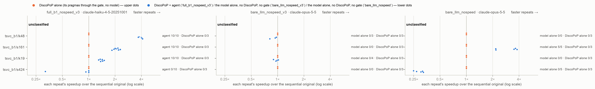

# E12 — a small model inside the pipeline against stronger models alone

*Generated by `agent/tools/campaign.py reports` from `results/campaign.json` and the experiment record (`agent/THESIS_EXPERIMENTS.md`). Edit those, then regenerate — not this file.*

**Status:** running

## The question

Does the Haiku agent with DiscoPoP's evidence match or beat Opus 5.5 and Fable 5.1 used alone, and ship fewer unsafe programs? On ORDER-2 X, does a stronger model alone find the hidden order?

## Result in one paragraph

Stronger models alone match the Haiku agent on the real loops (s161 all faster; s424 Opus/Fable 5/5 correct vs agent 1/10, nobody faster), but on the hidden-order kernels only the agent with DiscoPoP's evidence is faster (10/10 vs 0 for Opus and Fable, Fisher p ≤ 0.0035), and only the agent ships no unsafe program (0 vs Opus 4, Fable 3 + 3 harness edits). N = 5 per strong-model cell.

## Figures

## What is in this folder

- [`analysis/`](analysis/) — the read-out: [`figures.md`](analysis/figures.md), [`main_comparison_stats.md`](analysis/main_comparison_stats.md), [`vs_discopop_alone.md`](analysis/vs_discopop_alone.md)
- [`runs/`](runs/) — 12 archived run(s): the evidence

## Runs

| run | where | what it is | status | trials | outcomes |
|---|---|---|---|---:|---|
| `e12_opus_v3` | [`runs/e12_opus_v3/`](runs/e12_opus_v3/) | E12: claude-opus-5-5 alone on tsvc_b1/k19, k48 × bare_llm_nospeed_v3 × 5 (E2-V3's packages and prompt version) | valid | 10 | BROKEN 3, parallel-not-faster 7 |
| `e12_opus_b1` | [`runs/e12_opus_b1/`](runs/e12_opus_b1/) | E12: claude-opus-5-5 alone on tsvc_b1/s424, s161 × bare_llm_nospeed × 5 (E2-B1's packages and model-alone prompt) | valid | 10 | FASTER 5, parallel-not-faster 5 |
| `e12_fable_v3` | [`runs/e12_fable_v3/`](runs/e12_fable_v3/) | E12: claude-fable-5-1 alone on tsvc_b1/k19, k48 × bare_llm_nospeed_v3 × 5 (E2-V3's packages and prompt version) | valid | 10 | BROKEN 3, SCAFFOLD_MODIFIED 3, parallel-not-faster 4 |
| `e12_fable_b1` | [`runs/e12_fable_b1/`](runs/e12_fable_b1/) | E12: claude-fable-5-1 alone on tsvc_b1/s424, s161 × bare_llm_nospeed × 5 (E2-B1's packages and model-alone prompt) | valid | 10 | FASTER 5, parallel-not-faster 5 |
| `e12_haiku_v3` | [`runs/e12_haiku_v3/`](runs/e12_haiku_v3/) | E12 CLI control: claude-haiku-4-5-20251001 alone on tsvc_b1/k19, k48 × bare_llm_nospeed_v3 × 5 with the upgraded SDK (bundled CLI 2.1.285) | valid | 10 | BROKEN 9, FASTER 1 |
| `e12_haiku_b1` | [`runs/e12_haiku_b1/`](runs/e12_haiku_b1/) | E12 CLI control: claude-haiku-4-5-20251001 alone on tsvc_b1/s424, s161 × bare_llm_nospeed × 5 with the upgraded SDK | valid | 10 | BROKEN 5, FASTER 4, VERIFY_FAILED 1 |
| `e12_agent_v3` | [`runs/e12_agent_v3/`](runs/e12_agent_v3/) | E12: the Haiku agent with evidence (full_b1_nospeed_v3) on tsvc_b1/s424, s161 × 10 — the comparison point for the strong models alone on these loops (the E2-B1 agent ran the v1 wording) | valid | 20 | FASTER 10, no-change 8, parallel-not-faster 2 |
| `e12_sonnet_v3` | [`runs/e12_sonnet_v3/`](runs/e12_sonnet_v3/) | E12 completion (§6 3 Oct): claude-sonnet-5 alone on tsvc_b1/k48, s1213, s211 × bare_llm_nospeed_v3 × 5, threads 6/12, repeats 5, the fixed commit (Fix 103) | valid | 15 | BROKEN 5, FASTER 10 |
| `e12_sonnet_b1` | [`runs/e12_sonnet_b1/`](runs/e12_sonnet_b1/) | E12 completion: claude-sonnet-5 alone on tsvc_b1/s424, s161 × bare_llm_nospeed × 5 (E12's model-alone arm on E2-B1's packages), Fix 103 | valid | 10 | FASTER 3, parallel-not-faster 7 |
| `e12_opus_v3b` | [`runs/e12_opus_v3b/`](runs/e12_opus_v3b/) | E12 completion: claude-opus-5-5 alone on tsvc_b1/s1213, s211 × bare_llm_nospeed_v3 × 5, Fix 103 | valid | 10 | FASTER 10 |
| `e12_fable_v3b` | [`runs/e12_fable_v3b/`](runs/e12_fable_v3b/) | E12 completion: claude-fable-5-1 alone on tsvc_b1/s1213, s211 × bare_llm_nospeed_v3 × 5, Fix 103 | valid | 10 | FASTER 10 |
| `e12_fable_redo` | [`runs/e12_fable_redo/`](runs/e12_fable_redo/) | E12 completion: Fable's 3 harness-edit trials of e12_fable_v3 redone (Fix 103; the author 3 Oct): tsvc_b1/k19 × 2, k48 × 1, bare_llm_nospeed_v3 | valid | 3 | BROKEN 1, parallel-not-faster 2 |
| `e12c_race_check` | not archived yet | race_check.py over E12's completion runs (e12_sonnet_v3, e12_sonnet_b1, e12_opus_v3b, e12_fable_v3b, e12_fable_redo), no model | registered |  |  |

## From the experiment record (§7 run log)

### `e12_opus_v3`, `e12_opus_b1`, `e12_fable_v3`, `e12_fable_b1`, `e12_haiku_v3`, `e12_haiku_b1`, `e12_agent_v3` — 2026-09-30, server, **E12: the Haiku agent with evidence against Opus 5.5 and Fable 5.1 alone** (20 Opus, 20 Fable, 20 Haiku-alone and 20 Haiku-agent trials)

- **Setup.** Pre-registered §6 30 Sep. The first Opus launch (07:04) refused by the old bundled Claude Code (2.1.220); the SDK upgraded to 0.2.162 (Claude Code 2.1.285) on both machines, Opus relaunched 07:16 with a Haiku-alone control on the new version; a full disk on the shared server (07:29) cut three jobs, resumed without double counting; Fable 08:38 → 13:00 (its ORDER-2 programs often hung in verification until the 30-minute limit); the Haiku agent re-run on s424/s161 with prompt v3 (the author) 09:42. 0 failed model calls; sweep clean; race checks on the server.
- **Result.** §6 30 Sep (E12 read out): only the Haiku agent with evidence is faster on ORDER-2 (10/10 on X and Y; Opus and Fable alone 0 faster); s161 all strong setups 5/5–10/10 faster; s424 the strong models alone 5/5 correct, the agent 1/10, nobody faster; unsafe: the agent 0, Opus 4, Fable 3 (+3 harness edits).

## Change-log rows that name these runs (§6)

| Date | Repo | Change | Why |
|---|---|---|---|
| 2026-09-30 | deviation | **E12: the Claude Agent SDK upgraded 0.2.128 → 0.2.162 (bundled CLI 2.1.220 → 2.1.285) on the Mac and the server — recorded before the relaunch.** The first Opus launch (07:04 UTC) failed on every call: "Claude Code 2.1.220 does not support this model; version 2.1.280 or newer is required" — 20 trials, no model output; both runs set aside on the server (`~/discarded/e12_opus_*_cli_2.1.220_refused`) and relaunched under their ids. The upgrade applies to every later run; the feature checks that exercise the SDK (workspace confinement, request log, bare-LLM, twin prompt, prompt truth) pass with it, and parity holds (the SDK version is one of its fields). **Because every earlier Haiku result ran with CLI 2.1.220, E12 adds a Haiku-alone control on the same set with the new CLI** (runs `e12_haiku_v3`, `e12_haiku_b1`; 20 Haiku trials): the Haiku-alone rates before and after the upgrade are reported side by side, so a CLI effect is visible rather than hidden in the model comparison | Deviation |
| 2026-09-30 | plan | **E12: the Haiku agent re-run on s424 and s161 with prompt version 3 (the author: "yes rerun the haiku agent on s424 and s161") — written 09:42 UTC, before the launch; entered in this log after the pending Opus resume launched (a commit before it would break the launch's parity).** Run `e12_agent_v3`: `tsvc_b1/s424`, `s161` × `full_b1_nospeed_v3` × 10, Haiku. Reason: E12 compares strong models alone with the Haiku agent, and on these two loops the only Haiku agent result was E2-B1's, run with the v1 wording that harmed; the comparison is made against this v3 run (the E2-B1 numbers stay beside it). Same packages, settings and read-out as E12 (Fisher's exact per loop against each model alone, race check, FASTER beside the primary outcome) | Plan, pre-registered |
| 2026-09-30 | deviation | **E12: the shared server's disk filled at 07:29 UTC** (another user's 59 GB in /tmp; ours 11 GB): `e12_opus_b1`, `e12_haiku_v3` and `e12_haiku_b1` crashed writing a trial record (`No space left on device`). The three trials whose record was cut were moved to their run's `_invalid_disk_full/` (Opus s424 rep 3, Haiku k48 rep 4, Haiku s424 rep 5) and every missing trial resumed under its run id (the Haiku control at 09:31, Opus at 12:22 — started before Fable ended, because Fable's remaining trials sat in verification timeouts and made no model calls). No trial counted twice, none lost | Deviation |
| 2026-10-03 | plan | **E12 completed for the graph — every model alone on the agent's six loops (the author: "yes do both, start with the 48 trials"); pre-registered before any of its trials.** E12 ran Opus and Fable alone on four loops and Sonnet alone on one (the usage limit, 29 Sep). To show every setup on every loop the Haiku agent ran in E2-V3/E12 (ORDER-2 X `k19`, Y `k48`, `s1213`, `s211`, `s424`, `s161`), with E2-V3/E12's own settings (speed check off; `bare_llm_nospeed_v3` on the E2-V3 packages, `bare_llm_nospeed` on `s424`/`s161`; ×5; threads 6/12, repeats 5) and the fixed commit (Fix 103): Sonnet 5 alone on `k48`, `s1213`, `s211` (`e12_sonnet_v3`) and `s424`, `s161` (`e12_sonnet_b1`) — 25; Opus 5.5 alone on `s1213`, `s211` (`e12_opus_v3b`) — 10; Fable 5.1 alone on `s1213`, `s211` (`e12_fable_v3b`) — 10; Fable's 3 harness-edit trials redone (`e12_fable_redo`: `k19` × 2, `k48` × 1) — 3. **48 model-alone trials.** Haiku alone already covers all six (E2-V3 ×10, E2-B1 ×10). Judged as E12 (`e2b1_stats.judge`, the race check on every parallel program); read out with `e12_stats.py` extended to six loops; descriptive, outside the campaign family, as E12. Run after E1-final's agent runs end (the server is synced only between runs); Opus and Fable never at the same time | Plan, pre-registered |

