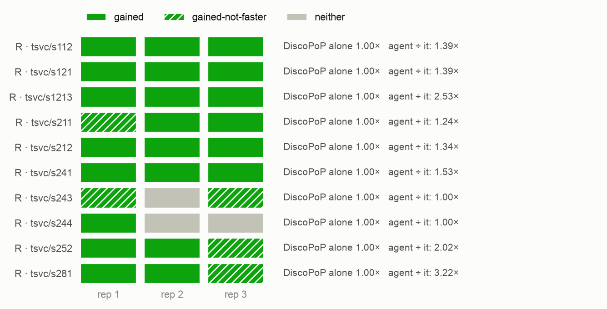
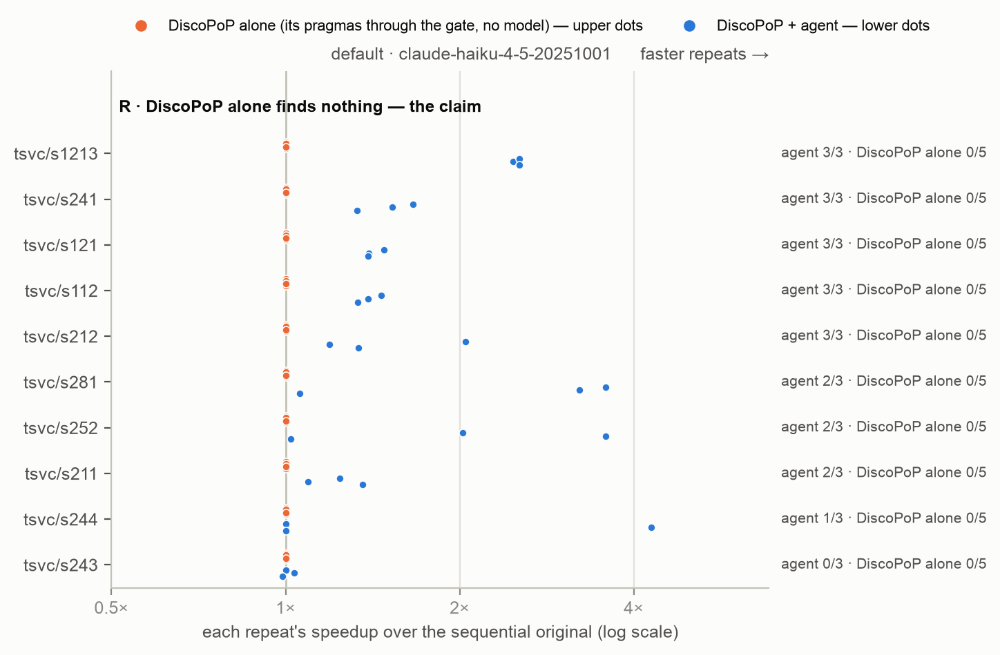

# Agent v3 pilot (D40) — the speed verdict inside the model's budget

*Generated by `agent/tools/campaign.py reports` from `results/campaign.json` and the experiment record (`agent/THESIS_EXPERIMENTS.md`). Edit those, then regenerate — not this file.*

**Status:** done

## The question

Does D40 — a kept rewrite's pragmas judged in Phase A (safety, then timed against the program before it) with the failure fed back while the region's budget lasts, and the prompt stating the deciding comparison — raise the race-free FASTER rate on the ten class-R loops where v2's results varied? And, with it, does DiscoPoP's evidence start to matter (default vs no_evidence)? Decides whether E1c's and E2's agent arms are rerun under v3.

## Result in one paragraph

Agent v3 above its v2 baseline in both arms: default 22/30 (73 %) vs 21/50 (42 %), no_evidence 26/30 (87 %) vs 25/50 (50 %), 0 unusable; D40 turned Settle's after-the-fact losses (28 in v2) into retries (calls 1.7→2.7, 1.2→2.2). no_evidence still leads default: on TSVC the evidence does not help under v3 either. Reruns: the author's decision (D34 amended).

## Figures

## What is in this folder

- [`analysis/`](analysis/) — the read-out: [`README.md`](analysis/README.md), [`figures.md`](analysis/figures.md), [`main_comparison_stats.md`](analysis/main_comparison_stats.md), [`no_evidence/figures.md`](analysis/no_evidence/figures.md), [`no_evidence/vs_discopop_alone.md`](analysis/no_evidence/vs_discopop_alone.md), [`vs_discopop_alone.md`](analysis/vs_discopop_alone.md), [`why_trials_fail_v2_baseline.md`](analysis/why_trials_fail_v2_baseline.md), [`why_trials_fail_v3.md`](analysis/why_trials_fail_v3.md)
- [`runs/`](runs/) — 4 archived run(s): the evidence

## Runs

| run | where | what it is | status | trials | outcomes |
|---|---|---|---|---:|---|
| `v3_pilot_1` | [`runs/v3_pilot_1/`](runs/v3_pilot_1/) | D40 pilot, lane 0.0: s112 s121 s1213 x default, no_evidence (agent v3), Haiku x3, threads 6,12, repeats 5 — paused 26 Sep ~01:50 at the author's request (usage limit), resumed 05:33 UTC (server clock; 07:33 CEST) under the same run id at 3c0ea170 (agent and harness code byte-identical to 701bf895; the run's manifest keeps 701bf895); the in-flight trial was moved to runs/_interrupted_2026-09-26/ and rerun from scratch | valid | 18 | FASTER 18 |
| `v3_pilot_2` | [`runs/v3_pilot_2/`](runs/v3_pilot_2/) | D40 pilot, lane 0.1: s211 s212 s241 x default, no_evidence (agent v3), Haiku x3, threads 6,12, repeats 5 — paused 26 Sep ~01:50 at the author's request (usage limit), resumed 05:33 UTC (server clock; 07:33 CEST) under the same run id at 3c0ea170 (agent and harness code byte-identical to 701bf895; the run's manifest keeps 701bf895); the in-flight trial was moved to runs/_interrupted_2026-09-26/ and rerun from scratch | valid | 18 | FASTER 15, parallel-not-faster 3 |
| `v3_pilot_3` | [`runs/v3_pilot_3/`](runs/v3_pilot_3/) | D40 pilot, lane 1.0: s243 s244 x default, no_evidence (agent v3), Haiku x3, threads 6,12, repeats 5 — paused 26 Sep ~01:50 at the author's request (usage limit), resumed 05:33 UTC (server clock; 07:33 CEST) under the same run id at 3c0ea170 (agent and harness code byte-identical to 701bf895; the run's manifest keeps 701bf895); the in-flight trial was moved to runs/_interrupted_2026-09-26/ and rerun from scratch | valid | 12 | FASTER 6, no-change 4, parallel-not-faster 2 |
| `v3_pilot_4` | [`runs/v3_pilot_4/`](runs/v3_pilot_4/) | D40 pilot, lane 1.1: s252 s281 x default, no_evidence (agent v3), Haiku x3, threads 6,12, repeats 5 — finished before the pause (12/12) | valid | 12 | FASTER 9, parallel-not-faster 3 |

## From the experiment record (§7 run log)

### `v3_pilot_1`, `v3_pilot_2`, `v3_pilot_3`, `v3_pilot_4` — 2026-09-25/26, server, **the V3 pilot: agent v3 (D40) on the ten class-R loops where v2 varied** (60 Haiku trials)

- **Setup.** Agent `701bf895` (v3, `--judge-as-shipped`); `s112`, `s121`, `s1213`, `s211`, `s212`, `s241`, `s243`, `s244`, `s252`, `s281` × `default`, `no_evidence` × Haiku × 3; threads 6/12, repeats 5; lanes 0.0/0.1/1.0/1.1. 25 Sep 22:42 UTC → paused ≈ 23:50 UTC at the author's request (usage limit; 41 of 60 finished, the in-flight trials lost) → resumed 26 Sep 05:33 UTC under the same run ids at `3c0ea170` (agent and harness code byte-identical to `701bf895`; the harness skips finished trials; the three interrupted trial folders moved to the server's `runs/_interrupted_2026-09-26/` and rerun from scratch) → 07:50 UTC. Pre-registered baseline (record §6, 26 Sep): v2 on the same loops, `default` 21 of 50 (E1c), `no_evidence` 25 of 50 (E2), recomputed from the archive before the read-out.
- **Result — both v3 arms above their v2 baseline, as expected** (descriptive, a pilot; FASTER counts as race-free for agent arms, which passed TSan):

  | arm | v2 (baseline) | v3 (pilot) | model calls per trial v2 → v3 | output tokens per trial (mean) v2 → v3 |
  |---|---:|---:|---:|---:|
  | `default` | 21/50 = 42 % (Wilson 29–56 %) | **22/30 = 73 %** (56–86 %) | 1.70 → 2.73 | 32.9k → 45.4k |
  | `no_evidence` | 25/50 = 50 % (37–63 %) | **26/30 = 87 %** (70–95 %) | 1.20 → 2.20 | 13.8k → 27.2k |

  No BROKEN or unusable program in either version. Median agent time per trial 8.3 → 8.7 min (`default`), 5.1 → 8.4 min (`no_evidence`).
- **Mechanism (`tools/failure_funnel.py`, `analysis/why_trials_fail_v3.md` vs `why_trials_fail_v2_baseline.md`).** v2 lost 28 of its 100 trials to Settle (the finished program slower than the original, median 0.69×) and 14 more to Phase B dropping every pragma; v3 lost 1 to Settle and none to Phase B. D40 returned 17 (`default`) and 15 (`no_evidence`) `not_faster` and 7 / 2 `pattern_broken` verdicts inside the model's budget, and the retries recovered most of them: the unused budget of E2 (why_trials_fail.md, 25 Sep) is now used. What still stops trials: 3 `default` trials ended on a D40 revert (s243 ×1, s244 ×2); 8 trials (5 / 3) shipped a parallel program the harness measured below 1.1× — D40 keeps at Settle's noise threshold (≈ 0.99×), the harness calls FASTER at 1.1×.
- **Evidence (the pilot's second question).** `no_evidence` still leads `default` (26 vs 22), and `default`'s rewrites broke DiscoPoP's pattern more often (7 vs 2 `pattern_broken`); per loop the arms differ most on `s243` (0/3 vs 3/3). On TSVC, v3 does not make the evidence help — consistent with the diagnosis that the deciding dependences there are in the loop text.
- **Caveats.** 3 trials per cell against 5 in the baseline; the baseline ran on other days under v2 (same machine, same lanes, same sizes); per-loop numbers at N = 3 are not interpretable one by one.
- **What it decides.** The registered rule (§6, 26 Sep): v3 better → E1c's `default` (+ the A/D controls) and E2's agent arms rerun under v3. Per D34 as amended, the author decides arm by arm; open with it: D40.1/D41 (approved, not built — D41 changes Phase B in `default`) before or after the reruns, and the benchmark review's argument against rerunning E2 A+B (its E2-B1 is where RQ4 can move). v3 costs about 1.4× (`default`) to 2× (`no_evidence`) the model tokens per trial of v2.

## Change-log rows that name these runs (§6)

| Date | Repo | Change | Why |
|---|---|---|---|
| 2026-09-26 | plan | **D40 — approved by the author and built: agent v3.** The author (26 Sep): "yes build D40 and run the pilot". What changes (Fix 98): when DiscoPoP writes the pragmas, a kept rewrite is judged the way it will ship WHILE the model can still act — DiscoPoP's pragmas for the loops it exposed through the safety gate (outermost first; the gate's verdicts cached for Phase B), the safe ones staged together as TEXT and gated as a set, then the program with them timed against the program before the rewrite with Settle's paired measurement and threshold; a failure (`pattern_broken`, `not_faster` with the ratio and what the rewrite added) takes the existing revert path and is charged. Chosen for the data (record §6, 25 Sep): the lost trials were correct rewrites lost on speed after the attempts, and of the 39 whose pragmas Phase B dropped, 32 dropped them for SAFETY (tsan 34, correctness 10) — so the check covers safety too, as the pre-22-Aug code did. The real file never holds a pragma in Phase A (the line-number constraint the two-phase design exists for; the author, 25 Sep: "adding the pragmas mid-run … is shifting the lines"). Settle's threshold, so no rewrite Settle would keep is reverted. The prompt, under the same flag (`--judge-as-shipped`, default on), states the deciding comparison in the twins' words. **Deviation from the proposal, stated:** the proposal also put the cost advice ("extra passes are paid on every repetition; copy only what a dependence forces") into the prompt; built, it reaches the model as FEEDBACK after a slow attempt — the gate's channel, which the model-only arms lack by design — because a sentence in the agent's prompt alone would be a new asymmetry against the model-only arms, whose prompts D37/D38 keep word for word (all 292 v2 texts verified byte-identical under the new code). Also Fix 99 (the exposure check without Phase B's clause repair — chart audit, finding 5) and every request logged. D34 applies: E1c and E2 ran v2; `--no-judge-as-shipped` reproduces v2. Verified: feature suite 52 of 52 (five new D40 checks, `twin-prompt` extended). **Pilot, pre-registered before any trial** (`v3_pilot_1`–`4`, registry group `V3-pilot`): the ten class-R loops where v2 varied (s112, s121, s1213, s211, s212, s241, s243, s244, s252, s281) × `default` and `no_evidence` × Haiku × 3 = 60 trials; baseline v2 on the same loops: `default` 21 of 50 race-free FASTER (E1c), `no_evidence` 25 of 50 (E2); expected: both v3 arms above their baseline; read-out descriptive (a pilot): rate per arm, D40 verdicts, calls per trial, and whether no_evidence still leads — it decides whether E1c's and E2's agent arms are rerun under v3 | The data of 25 Sep and the author's approval; the author's rule "if something we got wrong in an experiment we should repeat that part after the fix" is applied after the pilot, not assumed before it |

