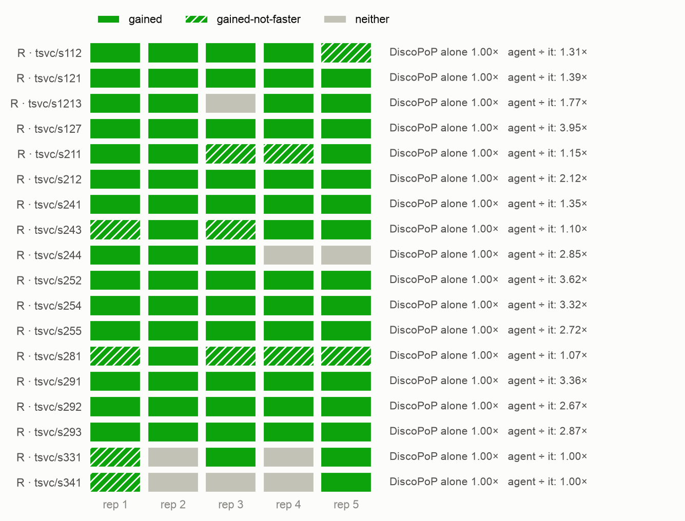
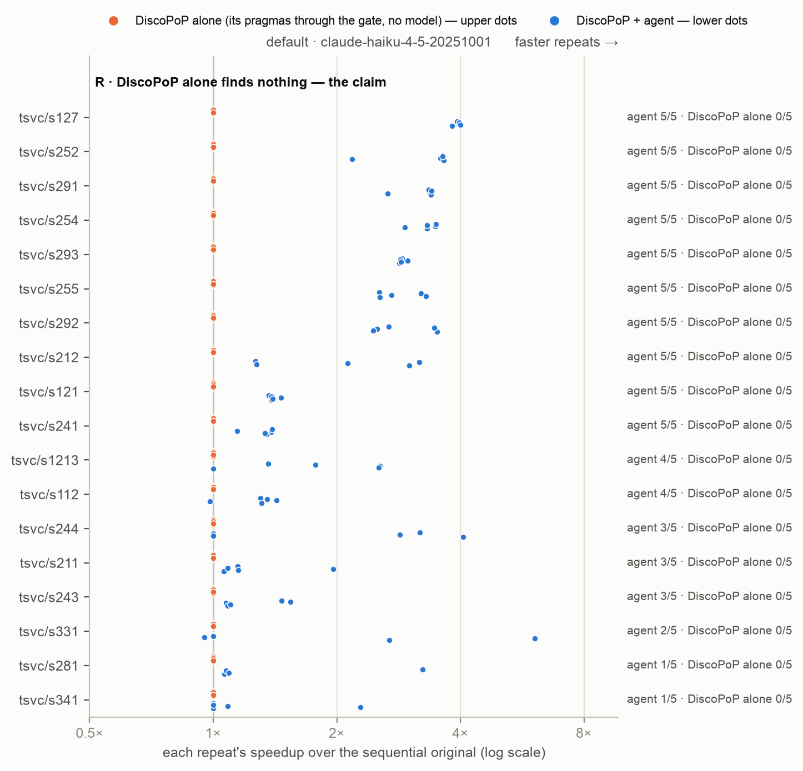

# E1c's agent arm rerun on agent v3.1 — the three-way main comparison on the final agent

*Generated by `agent/tools/campaign.py reports` from `results/campaign.json` and the experiment record (`agent/THESIS_EXPERIMENTS.md`). Edit those, then regenerate — not this file.*

**Status:** done

> **Not the current result.** This question is answered by [E1-v6 — the headline three-way comparison on clean files in TSVC's own form (packaging v6, prompt version 4)](../../E01v6_clean_files_three_way/REPORT.md); this folder is kept as history. See [`results/README.md`](../../README.md).

## The question

On E1c's population (TSVC class R, 18 loops × 5; controls class A ×1, class D ×3) with agent v3.1 (D40, D40.1, D41, the re-queue): the agent's (`default`) race-free FASTER rate and unusable programs, in the three-way comparison with E1c's DiscoPoP alone and model alone — arms no agent version changes.

## Result in one paragraph

Class R, 90 trials each: DiscoPoP alone 0 race-free FASTER; the agent on v3.1 71 (79 %, Wilson 69–86 %) with 0 unusable programs; the model alone 39 with 46 unusable. Every expectation held: above v2's 51 (ahead on 10 loops, behind on 0, p = 0.0023); H13 p = 0.00044; reach against the model alone now significant (12 v 2 loops, p = 0.0041). Class A equal to DiscoPoP alone; class D 11 of 11 valid trials declined, one harness edit (s3112, its own row). The gain is D40's: 16 of the 20 extra trials are on loops where the re-queue fired never or once.

## Figures

## What is in this folder

- [`analysis/`](analysis/) — the read-out: [`README.md`](analysis/README.md), [`controls/main_comparison_stats.md`](analysis/controls/main_comparison_stats.md), [`figures.md`](analysis/figures.md), [`main_comparison_stats.md`](analysis/main_comparison_stats.md), [`v31_vs_v2.md`](analysis/v31_vs_v2.md), [`vs_discopop_alone.md`](analysis/vs_discopop_alone.md), [`why_trials_fail_v31.md`](analysis/why_trials_fail_v31.md)
- [`runs/`](runs/) — 6 archived run(s): the evidence

## Runs

| run | where | what it is | status | trials | outcomes |
|---|---|---|---|---:|---|
| `e1c31_r_1` | [`runs/e1c31_r_1/`](runs/e1c31_r_1/) | E1c rerun on agent v3.1 (lane 0.0): s112 s121 s1213 s127 s211 x default, Haiku x5, threads 6,12, repeats 5 — agent v3.1 at commit 5935bded | valid | 25 | FASTER 21, no-change 1, parallel-not-faster 3 |
| `e1c31_r_2` | [`runs/e1c31_r_2/`](runs/e1c31_r_2/) | E1c rerun on agent v3.1 (lane 0.1): s212 s241 s243 s244 s252 x default, Haiku x5, threads 6,12, repeats 5 — agent v3.1 at commit 5935bded | valid | 25 | FASTER 21, no-change 2, parallel-not-faster 2 |
| `e1c31_r_3` | [`runs/e1c31_r_3/`](runs/e1c31_r_3/) | E1c rerun on agent v3.1 (lane 1.0): s254 s255 s281 s291 x default, Haiku x5, threads 6,12, repeats 5 — agent v3.1 at commit 5935bded | valid | 20 | FASTER 16, parallel-not-faster 4 |
| `e1c31_r_4` | [`runs/e1c31_r_4/`](runs/e1c31_r_4/) | E1c rerun on agent v3.1 (lane 1.1): s292 s293 s331 s341 x default, Haiku x5, threads 6,12, repeats 5 — agent v3.1 at commit 5935bded | valid | 20 | FASTER 13, no-change 5, parallel-not-faster 2 |
| `e1c31_a` | [`runs/e1c31_a/`](runs/e1c31_a/) | E1c rerun on agent v3.1, class A (no-harm): s000 vpvtv s313 x default x1 (s313's harness-edit trial is repeated here) — agent v3.1 at commit 5935bded; launched 26 Sep on lane 0.0 while lane 0.1 of the R runs finished, from a Mac worktree at 5935bded (PARITY OK against the server): the Mac repository is ahead (records, B8's profiler source, B9's explorer fix, a feature check) and the server is deliberately NOT synced, so A and D run the same code and the same pre-B8/B9 DiscoPoP as the R runs | valid | 3 | FASTER 3 |
| `e1c31_d` | [`runs/e1c31_d/`](runs/e1c31_d/) | E1c rerun on agent v3.1, class D (must-decline): s321 s322 s323 s3112 x default x3 — agent v3.1 at commit 5935bded; launched 26 Sep on lane 1.0, same conditions as e1c31_a (Mac worktree at 5935bded, PARITY OK, server not synced: the R runs' code and DiscoPoP) | valid | 12 | SCAFFOLD_MODIFIED 1, no-change 11 |

## From the experiment record (§7 run log)

### `e1c31_r_1`, `e1c31_r_2`, `e1c31_r_3`, `e1c31_r_4`, `e1c31_a`, `e1c31_d` — 2026-09-26/27, server, **E1c-v3.1: E1c's agent arm rerun on the final agent (v3.1)** (105 Haiku trials)

- **Setup (as registered, group E1c-v3.1).** Agent v3.1 at `5935bded` (D40, D40.1, D41, the re-queue; every change behind its own flag, all on in `default`), Haiku, threads 6/12, repeats 5; E1c's 18 class-R loops × 5 on four 12-core lanes (E1c's split), trials 26 Sep 13:25 → 20:10 (server clock, as the trial records hold it); class A (`s000`, `vpvtv`, `s313`) × 1 and class D (`s321`, `s322`, `s323`, `s3112`) × 3 launched 26 Sep 18:35 on lanes 0.0 and 1.0 when three lanes were free (A finished 19:14, D 27 Sep 00:50) — **from a Mac `git worktree` at `5935bded`** (PARITY OK against the server) because the Mac repository was ahead by records, B8's profiler source and B9's explorer fix; the server was deliberately not synced, so all six runs used the same code and the same pre-B8/B9/B4 DiscoPoP (registry roles; the manifests record `5935bded`, clean). Fetched and archived 27 Sep, credential sweep clean. Baselines no agent version changes, from E1c: `discopop_gate`, `bare_llm` (the mirror, byte-identical under v3.1) and E1c's race checks.
- **Result — class R, the three-way (`analysis/main_comparison_stats.md`):**

  | vs the sequential original, 90 trials each | DiscoPoP alone | DiscoPoP + agent (v3.1) | model alone |
  |---|---:|---:|---:|
  | FASTER and race-free | 0 (0 %) | **71 (79 %, Wilson 69–86 %)** | 39 (43 %, 34–54 %) |
  | verified parallel program | 0 | 82 | 64 |
  | unusable programs (BROKEN, racy, slower, not compiling) | 0 | **0** | 46 |

  **Every pre-registered expectation holds.** (1) Above E1c's v2 51 of 90: **71 of 90**; paired by loop v3.1 is ahead on 10 loops, behind on none, tied on 8 (one-sided Wilcoxon p = 0.0023, `analysis/v31_vs_v2.md`). (2) **0 unusable** programs (H2); H13 against the model alone: the agent ships fewer unusable programs on 14 loops, the model alone on 0 (p = 0.00044). H1 against DiscoPoP alone: gained on 18 of 18 loops, median agent ÷ DiscoPoP alone 1.95× (bootstrap 1.23–2.86×), p = 1.5 × 10⁻⁵. Reach against the model alone is now significant: race-free FASTER ahead on 12 loops, behind on 2 (p = 0.0041; E1c v2: 10 v 4, p = 0.13). Median speedup of the FASTER trials 2.69× (model alone 2.84×).
- **Controls (`analysis/controls/`).** Class A: 3 of 3 FASTER, equal to DiscoPoP alone (3.64× v 3.67×; ratio 0.99×) — no harm. Class D: **11 of 11 valid trials declined**; the twelfth, `s3112` rep1, is a **harness edit** (SCAFFOLD_MODIFIED — its own row, never counted): the model peeled the LAST repetition off the repetition loop, computed only the sum (a parallel reduction) in every earlier repetition and wrote the prefix sum `b[]` only in the last — output identical, but `pb_mix` moved, which the integrity check refuses. The expectation "all 12 declined" therefore holds for the 11 measurable trials and the twelfth is reported as what it is (the same family as E1c's `s313`: the model restructuring around the repetition loop). The model alone on class D: 9 unusable programs of 12 (6 BROKEN).
- **Where the gain comes from.** The re-queue (Fix 101) fired in 47 of the 90 trials — almost all on B9's false Do-All of the repetition loop (all 5 trials of `s127`, `s252`, `s254`, `s255`, `s291`, `s292`, `s293`, `s331`, `s341`; once on `s112`, `s243`): 39 of 47 FASTER (83 %) against 32 of 43 (74 %) where it did not fire. But of the 20 extra race-free FASTER trials over v2, 16 are on loops where the re-queue fired never or once (`s112` +4, `s121` +3, `s244` +3, `s1213` +2, `s212` +2, `s241` +1, `s243` +1) and 4 on loops where it fired every time (`s331` +2, `s252` +1, `s341` +1) — the gain is D40's (the speed verdict inside the model's budget), as the V3 pilot showed, not the re-queue's. Funnel (`analysis/why_trials_fail_v31.md`): every trial's rewrite passed the gate, DiscoPoP found parallelism in 83, a safe pragma existed in 83, 82 stayed parallel, 71 FASTER; the 19 others: 6 reverted by D40 as not faster, 1 as pattern-broken, 1 lost at Settle, 11 shipped parallel but below 1.1× (none below 0.91×).
- **Cost.** Model calls per trial 1.40 → 2.60 and output tokens 22.2k → 41.7k (v2 → v3.1); median agent time unchanged (4.5 min).
- **Caveats.** (1) The pre-B9/B4 DiscoPoP: B9's false Do-All sent the repetition loop to the re-queue on nine loops, and B4 made which inner loops arrived as Tier 1 a per-draw matter (one profile per run, shared by its trials); both fixes came after this run by design (§6, 26 Sep). DiscoPoP alone's 0 of 90 is unaffected (the gate rejects every false Do-All). (2) v2's cells ran on other days (same machine, lanes, sizes). (3) The funnel tool under-counted "a safe pragma existed" for v3.1 (D41's log line) — fixed 27 Sep before this read-out; the V3 pilot's funnel is unchanged by the fix.
- **What it decides.** E1's headline is v3.1's: DiscoPoP alone 0, the agent 71 race-free FASTER with 0 unusable, the model alone 39 with 46 unusable — the agent both reaches more than the model alone and ships nothing unusable. E1c's v2 numbers stay in the record as the first measurement.

